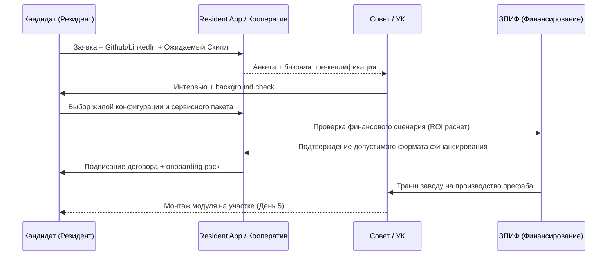

# ⚙️ Примеры бизнес-процессов кластера v6.0 (Pilot-First)

| Версия | Дата | Статус |
| :--- | :--- | :--- |
| **v6.0 PILOT-FIRST** | 2026-03-08 | ✅ Актуально |

> *Пошаговые процессы взаимодействия внутри экосистемы DeepTech-Хаба. Фокус на pilot-first исполнение, resident protocol, сервисные контуры Ядра, Node Zero и эксплуатационную дисциплину. Для практического контура ПРП ONN эти процессы читаются как инструкции для живого узла с уже существующими объектами, а не только как схема будущего greenfield-кластера.*

## 0. Обязательные процессы пилота

До масштабирования проект должен иметь как минимум 8 работающих процессов:

1. отбор и онбординг резидента;
2. подключение резидента к Ядру и сервисам;
3. заявка на инфраструктуру и сервисные мощности;
4. аварийное реагирование и helpdesk;
5. биллинг и сервисная отчетность;
6. ежемесячный pilot review с обновлением Evidence Matrix;
7. постановка общих активов ONN на сервисный баланс;
8. запуск и остановка платной услуги без серой зоны по деньгам и ответственности.

---

## 1. Процесс онбординга и подключения к жилому и сервисному контуру

Этот процесс заменяет абстрактную «покупку мечты» на управляемый resident protocol с понятными точками допуска. Семейный дом и участок не предполагаются как обязательная подписочная услуга: сервисность относится к Ядру, технике и инфраструктуре общего пользования.

**KPI процесса:**

- Одобрение пилотного комитета < 5 рабочих дней.
- Полный цикл от заявки до ключей от модуля < 14 дней.
- Снижение порога входа для резидента за счёт поэтапного входа и сервисов Ядра, а не за счёт отказа от собственности.

**Артефакты Evidence Matrix:** анкета, протокол интервью, решение комитета, договор, пакет онбординга.

> Для ONN этот процесс может быть легче: входной точкой часто становится договор доступа к сервисам, правила пользования общими объектами и тест-драйв проживания или участия.

---

## 2. Процесс доступа к Ядру и Node Zero

| Шаг | Действие | Артефакт | KPI |
| :--- | :--- | :--- | :--- |
| 1 | Резидент получает пакет доступа | Onboarding checklist | 100% завершение в день запуска |
| 2 | Назначаются роли доступа | Role matrix | Нет неавторизованных доступов |
| 3 | Подключается resident app и helpdesk | Аккаунт и журнал доступа | До 1 рабочего дня |
| 4 | Подключается базовая телеметрия | Паспорт объекта | Нет пропусков критических датчиков |
| 5 | Подтверждается SLA | Карточка сервиса | SLA опубликован и понятен |

## 2.1. Процесс постановки актива ONN на сервисный баланс

| Шаг | Действие | Артефакт | KPI |
| :--- | :--- | :--- | :--- |
| 1 | Идентифицируется объект: клубный дом, мастерская, техника, площадка, участок | Паспорт актива ONN | 100% объектов с владельцем и оператором |
| 2 | Проверяется правовой статус и ограничения | Выписка / схема / регламент | Нет запуска объектов с неясным статусом |
| 3 | Назначается ответственный за исправность и бронирование | Матрица ролей | Один ответственный на объект |
| 4 | Утверждаются тариф, окно доступности и SLA | Карточка услуги | Нет «ручных» исключений вне регламента |
| 5 | Объект включается в биллинг и журнал инцидентов | Карточка в helpdesk / реестр | Каждая операция учитывается |

## 3. Процесс запуска платной услуги в ПРП ONN

| Шаг | Действие | Артефакт | KPI |
| :--- | :--- | :--- | :--- |
| 1 | Формулируется услуга и ее клиент | Карточка услуги и сегмент клиента | Услуга описана в 1 странице |
| 2 | Проверяется правовой и налоговый режим | Чек-лист legal/finance go-live | Нет приема денег без выбранного режима |
| 3 | Считается pilot P&L v1 | Шаблон P&L по услуге | Порог окупаемости понятен |
| 4 | Запускается тест продаж на ограниченный объем | Календарь бронирований / лиды | Первые 5-10 платных транзакций |
| 5 | Собираются обратная связь и фактическая себестоимость | Отчет pilot review | Решение: масштабировать / доработать / остановить |

**Подходит для:** гостевых сценариев, эксплуатации территории, мастерской, малых агроуслуг, мероприятий, техники по бронированию.

---

## 4. Процесс запуска R&D стартапа внутри кластера (Venture Builder)

Любой резидент может не только работать на "удалёнке", но и создать локальный бизнес с инвестициями от кластера.

| Шаг | Действие | Инструмент/Технология | Срок |
| :--- | :--- | :--- | :--- |
| 1 | **Идея и Питч** | Резидент оформляет заявку на платформе (SuperApp) и проводит 5-минутный питч перед Advisory Board. | 1 день |
| 2 | **Решение инвестиционного комитета** | Резиденты и управляющий контур рассматривают проект по правилам пилота. При достижении критериев, Синдикат выделяет транш. | 3 дня |
| 3 | **Предоставление мощностей (MaaS / сервисные производственные модули)** | Синдикат выдает стартапу доступ к 5-осевому ЧПУ в FabLab или заказывает тепличный B2B-модуль. | 2-7 дней |
| 4 | **Выпуск прототипа (MVP)** | Разработка продукта в периметре Ядра. | 30-90 дней |
| 5 | **Off-take контракт / Сбыт** | Управляющая Компания помогает реализовать продукт (b2b-рестораны, корпорации). | Постоянно |
| 6 | **Распределение прибыли** | Договорная логика делит выручку: % Автору, % Инвесторам (ЗПИФ), % в Резервный фонд. | По регламенту |

**KPI процесса:**

- Time-to-market для hardware-стартапа в 3 раза быстрее, чем в городе.
- Процент выживаемости стартапов >40% за счет шеринга оборудования (нет сжигания бюджета на CAPEX).

---

## 5. Процесс разрешения конфликтов и офбординга

Кластер использует многоуровневый протокол деэскалации вместо судов.

1. **P2P Медиация:** Автоматизированная попытка снять претензии через resident app и helpdesk.
2. **Медиатор или Совет:** Если быстро не решено, подключается назначенный медиатор или совет кооператива.
3. **Экономический пенальти по договору:** При нарушении дизайн-кода или регламента применяются меры, заранее прописанные в договоре и правилах среды.
4. **Офбординг:** Ограничение доступа к премиальным сервисам, расторжение договоров и выкуп или вывод модуля по прописанной процедуре.

---

## 6. Ежемесячный pilot review

| Блок | Что проверяется |
| :--- | :--- |
| Земля и инженерия | Статус ТУ, CAPEX, инциденты |
| Node Zero | Uptime, пропуски телеметрии, backlog |
| Резиденты | Воронка, онбординг, churn-risk |
| Коммерция | LoI, резервы, тарифы, загрузка Ядра |
| Право и данные | Договоры, политики, конфликты, отклонения |
| Финансы ONN | Pilot P&L, кассовые разрывы, маржа по услугам, просрочки |
| Матрица ролей | Нет ли смешения собственника, оператора и подрядчика |
| Evidence Matrix | Какие тезисы подтверждены, какие ещё нет |
