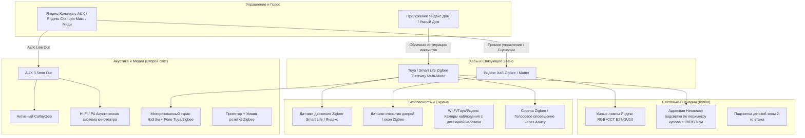
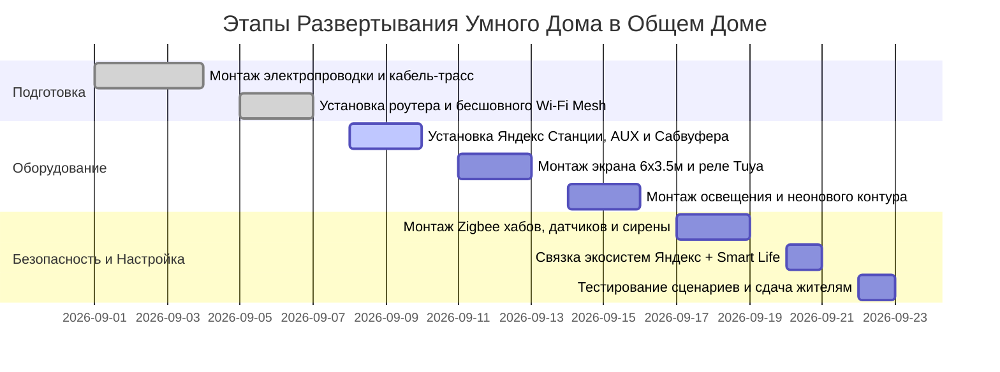

# 🧠 Проект Умного Дома: "Общий Дом NeuroLoft / Родовое Поместье"

> **Экосистема:** Яндекс Алиса + Tuya / Smart Life (Zigbee 3.0 / Wi-Fi / Matter)  
> **Архитектурный тип:** Купольный дом овальной формы ($9 \times 6$ м, площадь основания $\approx 42\text{–}45\text{ м}^2$, полезная площадь с антресолью $\approx 60\text{–}70\text{ м}^2$)  
> **Конфигурация объема:** $1/3$ дома — 2-й этаж (детская лаунж-антресоль с подушками и лежанками); $2/3$ дома — второй свет с выдвижным моторизованным экраном кинотеатра ($6 \times 3\text{–}4$ м).

---

## 🧭 1. Концепция и Архитектура Системы

Общий Дом — гибридное общественное пространство поселка:
1. **Коворкинг и рабочая зона** (будни, утро/день).
2. **Образовательный лекторий и кружки** (будни, день).
3. **Общинный медиацентр / Кинотеатр / Дискотека** (вечера, выходные).
4. **Охранный контур** (ночь / закрытые часы для защиты дорогостоящей AV и IT-техники).



---

## 🛠 2. Спецификация Оборудования (BOM)

### 2.1. Голосовое управление, хабы и акустика
| № | Оборудование | Назначение / Характеристики | Интерфейс / Протокол |
|---|--------------|-----------------------------|-----------------------|
| 1 | **Яндекс Станция (с разъемом 3.5 мм AUX OUT)** *(например, Яндекс Станция Макс или Станция 1 / Станция 2 через адаптер / Аудио-сплиттер)* | Голосовой мозг, распознавание команд «Алиса», стриминг Яндекс Музыки, передача аналогового звука на усилитель | Wi-Fi 2.4/5 ГГц, Bluetooth, AUX Out 3.5 mm |
| 2 | **Яндекс Хаб для устройств (Zigbee + ИК)** | Прямое бесшовное подключение Zigbee-датчиков и управление проектором/экраном по ИК | Zigbee 3.0, Wi-Fi, ИК-пульт |
| 3 | **Шлюз Tuya / Smart Life Zigbee 3.0 + Bluetooth Mesh** | Мост для расширенной китайской экосистемы датчиков, реле штор/экрана, сирен | Zigbee 3.0, Wi-Fi (интеграция навыком в Яндекс) |
| 4 | **Акустический комплект кинотеатра + Сабвуфер** | Усилитель/Ресивер + Фронтальные/Тыловые сателлиты + Активный сабвуфер (для мощных басов на дискотеках и в кино) | Линейный вход RCA/AUX от Станции и Проектора |
| 5 | **Аудио-селектор / Микшерный пульт с переключателем входов** | Переключение звука: Кино с проектора $\leftrightarrow$ Музыка с Алисы $\leftrightarrow$ Микрофон ведущего/собраний | 3.5 mm / RCA / XLR |

### 2.2. Свет и атмосфера купола
| № | Оборудование | Назначение / Характеристики | Протокол |
|---|--------------|-----------------------------|----------|
| 6 | **Умные лампы Яндекс (RGB + CCT, E27/GU10)** | Основное освещение рабочей зоны и подвесов в куполе. Регулировка от теплого 2700K (работа/вечер) до динамического RGB (дискотека) | Zigbee / Wi-Fi |
| 7 | **Гибкий Smart Neon LED (Неоновая адресная лента 15–20 м)** | Монтаж по периметру овального купола и арки антресоли 2-го этажа. Управление цветом, бегущими волнами, светомузыкой | Tuya Wi-Fi / Контроллер с RF-пультом + интеграция с Алисой |
| 8 | **Диммируемый свет детского яруса (2-й этаж)** | Мягкая теплая подсветка лежанок, ночники, защита от яркого света в глаза | Zigbee реле / Умные лампы |

### 2.3. Моторизация кинотеатра
| № | Оборудование | Назначение / Характеристики | Протокол |
|---|--------------|-----------------------------|----------|
| 9 | **Моторизованный экран рулонный $\approx 6 \times 3.5$ м** | Раскрытие на весь второй свет купола для киносеансов и презентаций | Электропривод 220V |
| 10 | **Модуль управления мотором жалюзи/экрана Tuya Smart Life** | Управление подъемом/опусканием экрана по Zigbee/Wi-Fi + кнопка-дублер | Zigbee 3.0 / Wi-Fi |
| 11 | **Умная розетка Zigbee (Яндекс/Tuya 16A)** | Питание проектора, автоматическое охлаждение лампы при выключении сценария | Zigbee 3.0 |

### 2.4. Безопасность и охрана дорогой техники
| № | Оборудование | Назначение / Характеристики | Протокол |
|---|--------------|-----------------------------|----------|
| 12 | **Датчики открытия дверей/окон (Герконы) (4 шт.)** | Контроль входной группы, окон купола, люков вентиляции | Zigbee 3.0 |
| 13 | **Широкоугольные PIR-датчики движения + Датчики присутствия (mmWave) (3 шт.)** | 1 — Зона второго света и проектора; 1 — Входная группа; 1 — Детский 2-й этаж | Zigbee 3.0 (mmWave 24 ГГц) |
| 14 | **Поворотная IP-камера видеонаблюдения с ночным видением** | Визуальный контроль оборудования (проектор, колонки, ноутбуки), детекция силуэта человека | Wi-Fi / RTSP / Интеграция в навык |
| 15 | **Беспроводная сирена 105–120 дБ со световой индикацией** | Локальная тревога при несанкционированном проникновении | Zigbee 3.0 |
| 16 | **Датчик протечки воды и датчик дыма** | Защита деревянных/каркасных конструкций купола | Zigbee 3.0 |

---

## 📐 3. Зонирование и Пространственное Размещение ($9 \times 6$ м)

```
        ▲  [ ЗАДНЯЯ ЧАСТЬ КУПОЛА - 3м ]       ▲
        │  ┌───────────────────────────────┐  │
        │  │   2-Й ЭТАЖ (АНТРЕСОЛЬ)       │  │ Высота: 2.1м под ней,
        │  │   Детская зона: подушки,      │  │ 1.6-1.8м на ней.
        │  │   лежанки, мягкий свет (Zigbee)│ │
        │  ├───────────────────────────────┤  │
        │  │   1-Й ЭТАЖ ПОД АНТРЕСОЛЬЮ:    │  │
        │  │   Коворкинг-столы, шкафы VDR, │  │
        │  │   Серверный шкаф + Роутер +   │  │
        │  │   Хабы + Яндекс Станция       │  │
Длина   │  └───────────────────────────────┘  │
 9 м    │                                     │
        │  ┌───────────────────────────────┐  │
        │  │   ЗОНА ВТОРОГО СВЕТА (6м):    │  │ Высота потолка: до 4.5–5.0 м
        │  │   Купольный свод, открытое    │  │ Свободное пространство:
        │  │   пространство, диваны/маты   │  │ - Днем: Лекторий / Совещания
        │  │                               │  │ - Вечером: Танцпол / Кинотеатр
        │  │   [Проектор на потолочном узле│  │
        │  │    + Сабвуфер в нише пола]    │  │
        │  │                               │  │
        │  │   ▼ ▼ ▼ ЭКРАН 6х3.5м ▼ ▼ ▼    │  │
        │  └───────────────────────────────┘  │
        ▼  [ ТОРЦЕВАЯ СТЕНА / ВХОДНАЯ ГРУППА] ▼
           ◄────────── Ширина 6 м ──────────►
```

### Рекомендации по установке оборудования:
1. **Яндекс Станция и Акустический Хаб:** Устанавливаются в центральной части (на стыке коворкинга и второго света). Это обеспечивает идеальное улавливание голосовых команд микрофонной матрицей из любой точки зала и с детского 2-го этажа.
2. **Линейный провод AUX:** Экранированный аудиокабель $3.5\text{ mm} \to 2\text{ RCA}$ прокладывается в кабель-канале до усилителя мощности и активного сабвуфера.
3. **Моторизованный экран:** Крепится к несущей дуге купола на границе торцевой стены. В сложенном виде сворачивается в компактный тубус под куполом, не загромождая обзор.
4. **Неоновый контур:** Прокладывается вдоль нижнего пояса купола и контура антресоли 2-го этажа, создавая парящий эффект "Cyber-Dome".

---

## 💡 4. Сценарии Автоматизации в Яндекс Диалогах и Smart Life

### 🎬 Сценарий 1: «Алиса, включи Кинотеатр»
* **Голосовая команда:** *«Алиса, время кино»* / *«Алиса, включи кинотеатр»*
* **Триггер:** Голос или кнопка на беспроводном пульте Smart Life.
* **Действия:**
  1. Модуль экрана опускает полотно экрана $6 \times 3.5$ м в нижнее положение.
  2. Умная розетка подает питание на проектор и медиаплеер.
  3. Основной свет Яндекс ламп плавно угасает до $0\%$ за 5 секунд.
  4. Неоновая лента купола переходит в глубокий темно-синий/янтарный цвет на яркости $5\%$ (кинотеатральный эмбиент).
  5. Свет на детском 2-м этаже приглушается до $10\%$ (чтобы детям было видно спуститься).
  6. Алиса переключает аудиовыход на линию проектора или запускает фильм с Кинопоиска/HDMI.

---

### 💃 Сценарий 2: «Алиса, Дискотека / Праздник»
* **Голосовая команда:** *«Алиса, зажги в Общем Доме»* / *«Алиса, дискотека»*
* **Действия:**
  1. Моторизованный экран поднимается вверх (освобождая пространство второго света).
  2. Яндекс лампы переходят в режим циклической смены цветов (RGB Strobe / Party mode).
  3. Неоновая адресная лента включает режим «Бегущая волна / Светомузыка под бит».
  4. Алиса устанавливает громкость на $80\text{--}90\%$, включает плейлист «Танцевальный клуб / Вечеринка недели».
  5. Сабвуфер выдает плотный бас через подключенный AUX-тракт.

---

### 💼 Сценарий 3: «Алиса, режим Коворкинг»
* **Голосовая команда:** *«Алиса, рабочий день»* / автоматический запуск в 08:00 (Пн–Сб).
* **Действия:**
  1. Основные лампы над рабочей зоной включаются на $100\%$ холодного белого света ($4500\text{--}5000\text{ K}$) для максимальной концентрации.
  2. Неоновая подсветка — нейтральный белый $4000\text{ K}$ на $30\%$.
  3. Экран поднят.
  4. Алиса включает фоновую музыку *«Lo-Fi / Deep Focus / Звуки природы»* на громкости $15\text{--}20\%$.

---

### 🧸 Сценарий 4: «Алиса, Детский час»
* **Голосовая команда:** *«Алиса, включи сказку детям»* / по расписанию в 19:00.
* **Действия:**
  1. На 2-м этаже (антресоли) включается мягкий теплый свет ($2700\text{ K}$, $40\%$).
  2. Неон переливается мягким пастельным градиентом (зеленый / розовый / фиолетовый).
  3. Алиса запускает аудиосказку или вечерний плейлист для детей.
  4. Внизу свет переходит в комфортный режим для родителей.

---

### 🛡️ Сценарий 5: «Охрана / Защита техники» (Ночной / Закрытый режим)
* **Активация:** Автоматически в 23:00 при отсутствии движения 15 минут или по кодовой фразе старосты *«Алиса, дом на охрану»*.
* **Логика работы:**
  1. Все световые приборы, розетка проектора и экран отключаются.
  2. Активируются PIR-датчики движения первого света, зоны проектора и детского яруса, а также герконы входной двери и окон.
  3. **При срабатывании датчика движения / двери в режиме охраны:**
     - Неон и все лампы начинают мигать ярко-красным стробоскопом.
     - Сирена Zigbee выдает сигнал тревоги ($110\text{ дБ}$).
     - Яндекс Станция на максимальной громкости воспроизводит голосовое предупреждение: *«Внимание! Ведется видеофиксация, охрана и правление поселка оповещены!»*.
     - В Telegram-чат правления / старосты поселка мгновенно уходит Push-уведомление со снимком с камеры наблюдения.

---

## 📋 5. Пошаговый Чеклист Реализации



- [ ] **Шаг 1. Сетевая инфраструктура и питание:**
  - [ ] Установить двухдиапазонный роутер с поддержкой Wi-Fi 6 и выделенной гостевой сетью.
  - [ ] Проложить скрытые трассы питания 220V к верхней точке купола (для проектора и мотора экрана).
  - [ ] Проложить экранированный аудиокабель AUX (Jack 3.5 mm – 2RCA) от места установки Яндекс Станции к зоне сабвуфера/усилителя.

- [ ] **Шаг 2. Развертывание базового звукового ядра:**
  - [ ] Подключить Яндекс Станцию к питанию и Wi-Fi.
  - [ ] Соединить AUX Out Станции с линейным входом активного сабвуфера и стереоусилителя.
  - [ ] Отрегулировать частоту среза кроссовера сабвуфера (рекомендуется $80\text{--}120\text{ Гц}$) для глубокого баса без бубнения в куполе.

- [ ] **Шаг 3. Интеграция хабов и платформы:**
  - [ ] Подключить Яндекс Хаб Zigbee в приложении «Дом с Алисой».
  - [ ] Подключить Мультимодовый шлюз Smart Life в приложении Tuya/Smart Life.
  - [ ] Связать аккаунт Tuya/Smart Life в приложении «Дом с Алисой» через раздел «Устройства других производителей».

- [ ] **Шаг 4. Монтаж и калибровка экрана и проектора:**
  - [ ] Смонтировать рулонный экран $6 \times 3.5$ м на силовые дуги каркаса.
  - [ ] Подключить электродвигатель экрана к Zigbee-модулю жалюзи Smart Life.
  - [ ] Откалибровать концевые выключатели мотора (верхнее и нижнее положение полотна).
  - [ ] Подключить проектор через умную розетку Zigbee.

- [ ] **Шаг 5. Освещение и неоновый периметр:**
  - [ ] Вкрутить умные лампы Яндекс в светильники общего света, объединить в группу «Зал».
  - [ ] Смонтировать неоновую ленту по нижнему овалу купола и периметру 2-го этажа.
  - [ ] Запрограммировать режимы пульта ДУ и привязать Wi-Fi контроллер ленты к приложению.

- [ ] **Шаг 6. Охранный периметр и автоматизация:**
  - [ ] Установить датчики открытия на входную дверь и окна.
  - [ ] Установить датчики движения: 1) под антресолью; 2) в зоне второго света у экрана; 3) на антресоли.
  - [ ] Установить камеру видеонаблюдения с обзором на вход и медиа-зону.
  - [ ] Создать и протестировать сценарии «Кинотеатр», «Дискотека», «Коворкинг», «Охрана».

---

## 🎯 6. Стратегия Эксплуатации и Масштабирования

1. **Защита от сбоев интернета:**
   - Zigbee-автоматизации (прямая связь датчиков движения, выключателей и сирены) настраиваются с локальным исполнением на шлюзе, чтобы охранный контур срабатывал даже при временном отключении внешнего провайдера.
2. **Антивандальность и гостевой доступ:**
   - Доступ к голосовому управлению Алисой открыт для всех присутствующих.
   - Критические настройки (снятие с охраны, перепрошивка, доступ к камерам) защищены пин-кодом и административным аккаунтом старосты/ИТ-координатора поселка.
3. **Энергоэффективность:**
   - Датчики присутствия mmWave автоматически гасят свет и переводят климат в эконом-режим, если в Общем Доме никого нет более 20 минут.
4. **Дальнейшее расширение (Фаза 2):**
   - Добавление умных терморегуляторов на конвекторы/теплый пол купола.
   - Установка умного привода приточной вентиляции купола с датчиком $CO_2$ для поддержания свежего воздуха при аншлагах на кинопоказах (до 30 человек).
