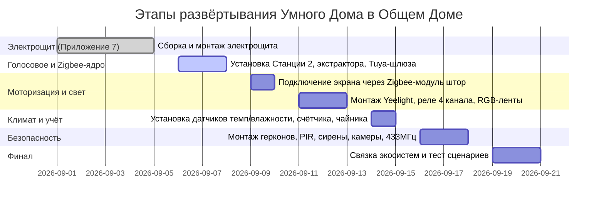

# 🧠 Приложение 6. Умный Дом на Яндекс Алисе: DIY-проект Общего Дома (бюджет Ozon/WB/AliExpress)

> **Экосистема:** Яндекс Алиса + Tuya / Smart Life (Zigbee 3.0 / Wi-Fi 2.4 ГГц / 433 МГц)
> **Философия проекта:** 100% оборудования — с открытых маркетплейсов (Ozon, Wildberries, AliExpress), без дилерских наценок и позиций «под заказ». Монтаж — DIY, один человек, без пайки и микроконтроллеров.
> **Архитектурный тип:** Купольный дом овальной формы ($9 \times 6$ м, площадь основания $\approx 45\text{ м}^2$, полезная площадь с антресолью $\approx 70\text{ м}^2$).
> **Конфигурация объёма:** $1/3$ дома — 2-й этаж (детская лаунж-антресоль с подушками и лежанками); $2/3$ дома — второй свет высотой до $5$ м с моторизованным экраном кинотеатра ($6 \times 3.5$ м, электропривод и концевые выключатели уже установлены).

## 🧭 Навигация
- Вход: [README.md](README.md) · [Приложение 5: Расписание Общего Дома](ТЭО_Родовое_Поместье_Приложение_5_Расписание_Общего_Дома.md)
- **Продолжение проекта:** [Приложение 7: Электрощит Умного Дома — DIY-монтаж](ТЭО_Родовое_Поместье_Приложение_7_Электрощит_DIY_Монтаж.md) — схема шкафа, подключение реле по клеммам, пошаговая сборка, чеклист ввода в эксплуатацию
- Связанные документы: [Приложение 2: Стратегия управления инфраструктурой](ТЭО_Родовое_Поместье_Приложение_2_Стратегия_Управления_Инфраструктурой.md) · [Раздел 16: Доходы жителей](ТЭО_Родовое_Поместье_Раздел_16_Доходы_Жителей.md)

---

## 🧭 1. Принципы проекта и архитектура системы

Общий Дом — гибридное общественное пространство поселка:
1. **Коворкинг и рабочая зона** (будни, утро/день).
2. **Образовательный лекторий и кружки** (будни, день).
3. **Общинный медиацентр / Кинотеатр / Дискотека** (вечера, выходные).
4. **Охранный контур** (ночь / закрытые часы для защиты дорогостоящей AV и IT-техники).

### 1.1. Жёсткие ограничения проекта

| № | Ограничение | Следствие для выбора оборудования |
|---|---|---|
| 1 | **Только маркетплейсы** — Ozon, Wildberries, AliExpress | Никаких профессиональных PA/KNX-брендов, никаких «под заказ». Каждая позиция BOM — то, что реально лежит в корзине на маркетплейсе |
| 2 | **DIY-монтаж одним человеком** | Только модули с клеммными колодками, отвёртка/дрель/WAGO/DIN-рейка. Никакой пайки, никаких печатных плат и микроконтроллеров |
| 3 | **Zigbee 3.0 — основной протокол** | Локальные сценарии и охрана работают через шлюз без облака. Wi-Fi — только там, где нет Zigbee-альтернативы (камеры, чайник, RGB-лента). 433 МГц — для полностью автономного дублирования света |
| 4 | **Обязательно Zigbee-реле, не Wi-Fi** | Wi-Fi-реле грузят домашний роутер и отваливаются при его перезагрузке — неприемлемо для охранных и моторных сценариев |
| 5 | **Работа без интернета — приоритет №1** | Каждая позиция BOM промаркирована: работает офлайн полностью / частично / нет |

### 1.2. Матрица устойчивости к отключению интернета

| Функция | Без интернета | Механизм |
|---|---|---|
| 🛡️ Охранный контур (движение, герконы, сирена) | ✅ Полностью | Логика зашита в Zigbee-шлюзе (Tuya/Smart Life поддерживает локальные автоматизации), работает без облака |
| 💡 Свет через 433 МГц выключатель у входа | ✅ Полностью | Радиосигнал напрямую на приёмник-реле, никакого хаба и интернета не требуется |
| 🔁 Локальные сценарии «движение → свет», «дверь → сирена» | ✅ Полностью | Исполняются на самом Zigbee-шлюзе, а не в облаке Яндекса/Tuya |
| 🎙️ Голосовое управление Алисой | ⚠️ Не работает (кроме единичных базовых команд NPU) | Распознавание речи и большинство сценариев — облачные |
| 📹 IP-камера | ⚠️ Частично | Локальная запись на SD продолжается, облачный просмотр и push-уведомления — нет |
| 🫖 Чайник, термостат, розетки | ✅ Полностью (кнопкой на корпусе) | Физическая кнопка включения не зависит от Wi-Fi |
| 💡 Yeelight-лампы и RGB-лента (Wi-Fi) | ⚠️ Частично | Держат последнее состояние; голос и удалённое управление — нет, локальное приложение в той же Wi-Fi-сети — иногда да |

### 1.3. Архитектура системы (обновлено под бюджетное решение)

```mermaid
graph TD
    subgraph "Голосовое и Zigbee-ядро (см. §2)"
        YA[Яндекс Станция 2 — Zigbee 3.0 встроен]
        EXT[HDMI-аудиоэкстрактер]
        APP[Приложение Дом с Алисой]
    end

    subgraph "Хаб расширенной экосистемы"
        SLHub[Tuya / Smart Life Zigbee 3.0 Gateway]
    end

    subgraph "Акустика и Медиа (второй свет)"
        AUX[RCA/AUX Out]
        SUB[Бюджетный активный сабвуфер]
        AMP[Стереоусилитель 2.0 + колонки]
        SCREEN[Экран 6x3.5м + Zigbee-модуль штор с интерлоком]
        PROJ[Проектор + умная розетка Zigbee]
    end

    subgraph "Свет и атмосфера купола"
        YLAMPS[Yeelight RGB+CCT E27 x6]
        RELAY4[Zigbee реле 4-канальное]
        NEON[RGB-лента 15-20м + Wi-Fi контроллер Tuya]
        RF433[Выключатель 433 МГц x3 — ручной дублёр]
    end

    subgraph "Климат и учёт (новое)"
        TH[Датчики температуры/влажности Zigbee x3]
        KETTLE[Умный чайник Tuvio Wi-Fi]
        METER[Счётчик электроэнергии Zigbee DIN]
    end

    subgraph "Безопасность и охрана"
        PIR[PIR-датчики движения Zigbee x3]
        DOOR[Герконы Zigbee x4]
        CAM[IP-камера Wi-Fi]
        SIREN[Сирена Zigbee]
        SMOKE[Датчик дыма + протечки Zigbee]
    end

    YA -->|Zigbee 3.0 напрямую| SLHub
    YA -->|HDMI| EXT --> AUX
    AUX --> SUB
    AUX --> AMP
    APP -->|Навык Tuya/Smart Life| SLHub

    YA --> YLAMPS
    SLHub --> RELAY4
    SLHub --> NEON
    RF433 -.->|Физический оверрайд, минуя облако| RELAY4
    SLHub --> SCREEN
    SLHub --> TH
    SLHub --> METER
    YA --> KETTLE
    SLHub --> PIR
    SLHub --> DOOR
    SLHub --> SIREN
    SLHub --> SMOKE
    APP --> CAM
```



---

## 🎙️ 2. Голосовое ядро: выбор хаба (Вариант A/B/C/D)

Ключевая проблема бюджетной сборки: **ни одна актуальная Яндекс Станция со встроенным Zigbee не имеет AUX-выхода.** Ниже — разбор всех 4 вариантов и итоговое решение.

### 2.1. Сравнительная таблица

| Критерий | A. Станция Миди | B. Станция 2 + HDMI-экстрактор | C. Станция Мини 2 (б/у) + Хаб Zigbee | D. Станция Макс |
|---|---|---|---|---|
| Zigbee 3.0 встроен | ✅ Да | ✅ Да | ❌ Нет (нужен отдельный Хаб) | ✅ Да |
| Аналоговый звук (AUX) | ❌ Нет — только Bluetooth | ⚠️ Через HDMI-экстрактер (~500 ₽) — проводной, без задержки | ✅ Есть родной AUX 3.5 мм | ✅ Есть родной AUX 3.5 мм |
| Микрофонная решётка | Дальнее поле (большое помещение) | Дальнее поле (большое помещение) | Ближнее поле (1–2 м, настольный формат) | Лучшая на рынке |
| Риск для видео/звука | ⚠️ Bluetooth даёт задержку звука — рассинхрон губ в кино | Нет — проводной сигнал без задержки | Нет — проводной сигнал без задержки | Нет |
| Гарантия / риск | ✅ Новое, гарантия | ✅ Новое, гарантия | ⚠️ Б/у, риск продавца, износ разъёма | ✅ Новое, гарантия |
| Цена | ~15 500 ₽ | ~15 500 ₽ (15 000 + 500) | ~8 500 ₽ (5 000 + 3 500) | ~30 000 ₽ |
| Нужен доп. Яндекс Хаб Zigbee | Нет | Нет | Да, отдельно (~3 500 ₽, уже включено выше) | Нет |

### 2.2. Решение: **Вариант B — Яндекс Станция 2 + HDMI-аудиоэкстрактер**

**Почему не остальные варианты — без «возможно»:**
- ❌ **Вариант A отклонён.** При той же цене и характеристиках, что и B, вариант A вынужден передавать звук по Bluetooth. Для кинопоказов это критично: Bluetooth-звук имеет задержку 100–300 мс, что даёт заметный рассинхрон губ с картинкой на большом экране $6 \times 3.5$ м. Вариант B решает ту же задачу за те же деньги без этого риска.
- ❌ **Вариант C отклонён как основной, но не исключён как экономия.** Купол — большое реверберирующее помещение второго света (до $5$ м высотой), используемое в том числе для шумных мероприятий (дискотека). Станция Мини рассчитана на ближнее поле (1–2 м) и слабее слышит команды на расстоянии и при фоновом шуме — это подрывает саму идею «голос как ОС дома». Плюс риск б/у-устройства неприемлем для общего, а не личного оборудования, которым пользуются десятки людей. Экономия ~7 000 ₽ не оправдывает этот риск.
- ❌ **Вариант D отклонён.** Станция Макс вдвое дороже и решает те же проблемы, что и B за 500 ₽, при этом её собственная акустика 65 Вт не используется — звук всё равно уходит на внешний усилитель и сабвуфер. Переплата не конвертируется в дополнительную функциональность.
- ✅ **Вариант B побеждает**: Zigbee 3.0 встроен (отдельный Яндекс Хаб не нужен, экономия ~3 500 ₽), микрофонная решётка дальнего поля подходит под объём купола, HDMI-экстрактер даёт стабильный проводной аналоговый сигнал на усилитель без риска рассинхрона звука и картинки, устройство новое — есть гарантия для общественного оборудования.

> ⚠️ **При закупке:** проверить на Ozon/WB, что HDMI-аудиоэкстрактер поддерживает стерео PCM (не только Dolby/DTS passthrough) — иначе звук с Яндекс-Станции через HDMI не извлечётся в аналог.

### 2.3. Хаб 2: Tuya / Smart Life Zigbee 3.0 Gateway — обязателен в любом варианте

- Мультимодовый шлюз (Zigbee + Bluetooth Mesh), ~1 200 ₽ на Ozon.
- Нужен, так как часть бюджетных Tuya-устройств (реле, лента, счётчик) не присоединяются напрямую к Яндекс-хабу — они работают через свой шлюз, который затем связывается с Алисой через навык «Tuya / Smart Life» в приложении «Дом с Алисой».

---

## 🛠 3. Оптимизированный BOM (спецификация оборудования)

Формат: **Категория поиска** — что вбивать в строку поиска на Ozon/WB/AliExpress. Столбец **Без интернета?** — да / частично / нет (см. матрицу §1.2).

### 3.1. Голосовое ядро, Zigbee-хаб и звук

| № | Наименование | Категория поиска | Кол-во | Цена/шт | Итого | Протокол | Назначение | Без интернета? | Альтернатива |
|---|---|---|---|---|---|---|---|---|---|
| 1 | Яндекс Станция 2 | «Яндекс Станция 2» | 1 | 15 000 ₽ | 15 000 ₽ | Zigbee 3.0 / Wi-Fi / HDMI | Голос + Zigbee-хаб | Частично | Яндекс Станция Миди |
| 2 | HDMI-аудиоэкстрактер | «HDMI audio extractor 3.5mm optical» | 1 | 500 ₽ | 500 ₽ | HDMI → RCA/AUX | Извлечение аналогового звука для усилителя | Да | — |
| 3 | Tuya/Smart Life Zigbee 3.0 Gateway | «Tuya Zigbee шлюз хаб» | 1 | 1 200 ₽ | 1 200 ₽ | Zigbee 3.0 / Wi-Fi | Мост для Tuya-устройств | Частично | Moes UFO-R11 |
| 4 | Активный сабвуфер 100–150 Вт | «активный сабвуфер AUX бюджетный» | 1 | 10 000 ₽ | 10 000 ₽ | RCA/AUX | Бас для кино и дискотеки | Да | Sven, Microlab |
| 5 | Стереоусилитель 2.0 + колонки | «стереоусилитель комплект колонки 2.0» | 1 компл. | 6 500 ₽ | 6 500 ₽ | RCA/AUX | Озвучка зала | Да | Активные полочные колонки |
| **Подытог** | | | | | **33 200 ₽** | | | | |

### 3.2. Свет и атмосфера купола

| № | Наименование | Категория поиска | Кол-во | Цена/шт | Итого | Протокол | Назначение | Без интернета? | Альтернатива |
|---|---|---|---|---|---|---|---|---|---|
| 6 | Умная розетка Zigbee 16A | «Tuya Zigbee умная розетка 16A» | 4 | 600 ₽ | 2 400 ₽ | Zigbee 3.0 | Проектор, усилитель, IP-камера, резерв | Да | Яндекс розетка (дороже) |
| 7 | Yeelight E27 RGB+CCT | «Yeelight лампа RGB E27» | 6 | 750 ₽ | 4 500 ₽ | Wi-Fi | Декоративный/акцентный свет, работает с Алисой напрямую | Частично | Aqara Zigbee bulb |
| 8 | RGB-лента 5050, 15–20 м | «RGB светодиодная лента 5050 IP65 15м» | 1 компл. | 1 200 ₽ | 1 200 ₽ | 12/24V | Подсветка периметра купола | Да (кнопкой на контроллере) | — |
| 9 | Wi-Fi RGB-контроллер Tuya | «Tuya Wi-Fi RGB контроллер ленты» | 1 | 500 ₽ | 500 ₽ | Wi-Fi | Управление цветом/светомузыкой | Частично | Zigbee RGB-контроллер (+400 ₽) |
| 10 | Блок питания 12/24V 10A | «блок питания 12V 10A LED IP20» | 1 | 700 ₽ | 700 ₽ | 220V → 12/24V | Питание ленты | Да | — |
| 11 | Zigbee реле 4-канальное, скрытый монтаж | «Zigbee 4 канальный модуль реле скрытый монтаж» (напр. арт. Ozon 1910738953) | 1 | 1 500 ₽ | 1 500 ₽ | Zigbee 3.0 | Группы рабочего света + антресоли + питание ленты | Да | Zemismart 4 Gang |
| **Подытог** | | | | | **10 800 ₽** | | | | |

> 💡 **Почему не 6 «умных» ламп на весь купол:** Yeelight используются точечно как акцентный/декоративный свет (эффект, цвет). Практическое рабочее и потолочное освещение — обычные недорогие LED-светильники, сгруппированные через Zigbee-реле 4 канала. Это вдвое дешевле, чем ставить умную лампу в каждый патрон, при той же гибкости сценариев.

### 3.3. Моторизация экрана

| № | Наименование | Категория поиска | Кол-во | Цена/шт | Итого | Протокол | Назначение | Без интернета? | Альтернатива |
|---|---|---|---|---|---|---|---|---|---|
| 12 | Zigbee-модуль штор/жалюзи, 2 канала с интерлоком | «Zigbee curtain module 2 channel motor switch» | 1 | 700 ₽ | 700 ₽ | Zigbee 3.0 | Открыть/закрыть экран (мотор и концевики уже есть) | Да | Moes MS-108Z |
| **Подытог** | | | | | **700 ₽** | | | | |

> ⚠️ **Обязательно модуль именно с аппаратным интерлоком** (взаимной блокировкой каналов), а не обычное 2-канальное реле общего назначения. Интерлок физически не даёт включиться обоим направлениям одновременно — иначе при сбое/двойном нажатии оба провода мотора окажутся под фазой одновременно, что ведёт к короткому замыканию обмоток или пожароопасному нагреву. Экран и мотор уже есть — модуль штор не покупает моторизацию заново, а лишь добавляет Zigbee-управление существующим концевикам.

### 3.4. Климат и коммунальные сервисы (новое)

| № | Наименование | Категория поиска | Кол-во | Цена/шт | Итого | Протокол | Назначение | Без интернета? | Альтернатива |
|---|---|---|---|---|---|---|---|---|---|
| 13 | Датчик температуры/влажности Zigbee | «Tuya Zigbee датчик температуры влажности» | 3 | 500 ₽ | 1 500 ₽ | Zigbee 3.0 | Коворкинг, антресоль, вход — климат-контроль | Да | MOES с дисплеем (+1 000 ₽) |
| 14 | Умный чайник Tuvio TKP2117S | «Tuvio TKP2117S умный чайник» | 1 | 3 200 ₽ | 3 200 ₽ | Wi-Fi | Кофе-брейк, кружки, «Алиса, вскипяти чайник» | Частично (кнопка на корпусе) | Tuya Wi-Fi чайник с термостатом |
| 15 | Счётчик электроэнергии Zigbee, DIN, 80A | «Tuya Zigbee счётчик электроэнергии DIN 80A» | 1 | 3 500 ₽ | 3 500 ₽ | Zigbee 3.0 | Учёт энергопотребления Общего Дома, биллинг Gravita+ | Да (показания на ЖК локально) | Tuya Wi-Fi счётчик с ТТ (−1 500 ₽, но Wi-Fi) |
| **Подытог** | | | | | **8 200 ₽** | | | | |

### 3.5. Безопасность и охрана

| № | Наименование | Категория поиска | Кол-во | Цена/шт | Итого | Протокол | Назначение | Без интернета? | Альтернатива |
|---|---|---|---|---|---|---|---|---|---|
| 16 | Zigbee геркон (датчик открытия) | «Tuya Zigbee датчик открытия двери окна» | 4 | 500 ₽ | 2 000 ₽ | Zigbee 3.0 | Дверь, окна купола | Да | Aqara door sensor |
| 17 | PIR-датчик движения Zigbee | «Tuya Zigbee PIR датчик движения» | 3 | 325 ₽ | 975 ₽ | Zigbee 3.0 | Охрана + автосвет (второй свет, вход, антресоль) | Да | mmWave (Фаза 2, дороже в 5–7 раз) |
| 18 | Zigbee сирена 100+ дБ | «Tuya Zigbee сирена 100дБ» | 1 | 650 ₽ | 650 ₽ | Zigbee 3.0 | Тревога при проникновении | Да | Модель 110–120 дБ (+300 ₽) |
| 19 | Zigbee датчик дыма | «Tuya Zigbee датчик дыма пожарный» | 1 | 550 ₽ | 550 ₽ | Zigbee 3.0 | Пожарная безопасность деревянного купола | Да | Автономный (без Zigbee, дешевле, но без push) |
| 20 | Zigbee датчик протечки | «Tuya Zigbee датчик протечки воды» | 1 | 450 ₽ | 450 ₽ | Zigbee 3.0 | Защита от воды | Да | — |
| 21 | IP-камера Wi-Fi поворотная + SD | «IP камера Wi-Fi поворотная ночное видение SD карта» | 1 | 4 000 ₽ | 4 000 ₽ | Wi-Fi | Визуальный контроль зала и техники | Частично (SD — да, облако — нет) | Tuya Smart Camera |
| 22 | Выключатель 433 МГц, 3 клавиши + приёмник-реле | «беспроводной выключатель 433 МГц 3 клавиши + реле приёмник» (напр. арт. Ozon 4316243025) | 1 компл. | 1 000 ₽ | 1 000 ₽ | 433 МГц (RF) | Ручной дублёр света у входа, полностью автономен | Да (полностью) | 1-клавишный (дешевле) |
| **Подытог** | | | | | **9 625 ₽** | | | | |

### 3.6. Электрощит и монтажные материалы (детали в [Приложении 7](ТЭО_Родовое_Поместье_Приложение_7_Электрощит_DIY_Монтаж.md))

| № | Наименование | Категория поиска | Кол-во | Цена/шт | Итого | Назначение | Альтернатива |
|---|---|---|---|---|---|---|---|
| 23 | Электрощит навесной, 24 модуля (2×12) | «электрощит навесной пластиковый 24 модуля IP65» | 1 | 2 500 ₽ | 2 500 ₽ | Корпус для автоматики и реле | 18 модулей, если сократить резерв |
| 24 | DIN-рейка + клеммники WAGO + шины N/PE | «DIN рейка клеммная колодка WAGO набор шина N PE» | 1 компл. | 700 ₽ | 700 ₽ | Коммутация внутри щита | — |
| 25 | Вводной дифавтомат 25A/30мА, 2P | «дифавтомат 25А 30мА 2P IEK EKF» | 1 | 700 ₽ | 700 ₽ | Защита ввода (автомат + УЗО в одном) | Раздельно автомат+УЗО |
| 26 | Групповые автоматы 1P, 10–16A | «автоматический выключатель 1P 10A 16A IEK» | 5 | 150 ₽ | 750 ₽ | Защита групп нагрузки | — |
| 27 | Кабель, кабель-канал, маркировка, стяжки | «кабель ВВГнг кабель-канал маркировка стяжки набор» | 1 компл. | 2 000 ₽ | 2 000 ₽ | Монтаж проводки | — |
| **Подытог** | | | | | **6 650 ₽** | | |

> Полная схема щита, раскладка по DIN-рейкам, нагрузки по каналам и пошаговая сборка — в отдельном документе [Приложение 7](ТЭО_Родовое_Поместье_Приложение_7_Электрощит_DIY_Монтаж.md), т.к. это самостоятельный монтажный проект.

### 3.7. Итоговая стоимость BOM

| Раздел | Стоимость |
|---|---|
| 3.1 Голосовое ядро, хаб, звук | 33 200 ₽ |
| 3.2 Свет и атмосфера | 10 800 ₽ |
| 3.3 Моторизация экрана | 700 ₽ |
| 3.4 Климат и коммунальные сервисы | 8 200 ₽ |
| 3.5 Безопасность и охрана | 9 625 ₽ |
| 3.6 Электрощит и монтаж | 6 650 ₽ |
| **ИТОГО** | **≈ 69 175 ₽** |

> Сравнение с неоптимизированным исходным BOM (16 позиций) и расчёт экономии — в §10.

---

## ✅ 4. Матрица совместимости устройств

| № | Устройство | Напрямую с Алисой? | Нужен шлюз Tuya? | Работает офлайн? | Нюанс / известная проблема |
|---|---|---|---|---|---|
| 1 | Яндекс Станция 2 | ✅ Да (родное) | Не нужен | Частично (базовые NPU-команды) | Первичная настройка требует интернет и аккаунт Яндекс |
| 2 | HDMI-аудиоэкстрактер | — | — | ✅ Да | Проверить поддержку стерео PCM, не Dolby passthrough |
| 3 | Tuya/Smart Life шлюз | ✅ Через навык «Tuya/Smart Life» | Сам является шлюзом | Частично (локальные сценарии — да, добавление устройств — нет) | При смене роутера — переподключить шлюз к Wi-Fi |
| 4–5 | Сабвуфер, усилитель+колонки | — | — | ✅ Да | Выставить кроссовер сабвуфера 80–120 Гц |
| 6 | Умная розетка Zigbee 16A | ✅ Да | Только для Tuya-бренда | ✅ Да | Не включать нагрузку выше 16A/3520 Вт |
| 7 | Yeelight E27 | ✅ Через навык Yeelight | Не нужен (Wi-Fi напрямую) | Частично | Требует отдельную привязку в приложении Yeelight; теряет связь при смене IP роутера |
| 8–10 | RGB-лента + контроллер + БП | ✅ Через навык Tuya | Да (для голоса) | Частично | Обычная лента не поддерживает «бегущие огни», только цвет/яркость целиком |
| 11 | Zigbee реле 4-канальное | ✅ Через Tuya-шлюз | Да | ✅ Да | Часть дешёвых моделей требует нейтраль (N) на каждый канал — проверить перед покупкой |
| 12 | Zigbee-модуль штор (экран) | ✅ Через Tuya-шлюз | Да | ✅ Да | Без интерлока — риск короткого замыкания, см. §3.3 |
| 13 | Датчик температуры/влажности | ✅ Через Tuya-шлюз | Да | ✅ Да | Яндекс «Климатический модуль» несовместим со Станцией 2 — поэтому берём Tuya-вариант |
| 14 | Умный чайник Tuvio | ✅ Напрямую (бренд-партнёр Яндекс Маркета) | Не нужен | Частично (кнопка на корпусе) | Только Wi-Fi 2.4 ГГц — на роутере нужна отдельная сеть 2.4 ГГц, если стоит объединённая с 5 ГГц |
| 15 | Счётчик электроэнергии Zigbee | ✅ Через Tuya-шлюз | Да | ✅ Да (ЖК-дисплей локально) | При подключении через трансформатор тока соблюдать направление стрелки на ТТ |
| 16 | Геркон Zigbee | ✅ Через Tuya-шлюз | Да | ✅ Да | На металлических дверях держать зазор датчик-магнит не более 2–3 см |
| 17 | PIR-датчик | ✅ Через Tuya-шлюз | Да | ✅ Да | Ложные срабатывания от кондиционера/сквозняка — не направлять на окна и вентиляцию |
| 18 | Zigbee сирена | ✅ Через Tuya-шлюз | Да | ✅ Да | Батарейное питание — проверять заряд раз в 3–6 месяцев |
| 19 | Zigbee датчик дыма | ✅ Через Tuya-шлюз | Да | ✅ Да | Не заменяет автономный пожарный извещатель по нормативам — это дополнительное уведомление |
| 20 | Zigbee датчик протечки | ✅ Через Tuya-шлюз | Да | ✅ Да | Класть на пол у вероятных источников протечки, не крепить на стену |
| 21 | IP-камера | ⚠️ Зависит от бренда | Иногда | Частично (SD — да, облако — нет) | Карта SD class10, 32–128 ГБ, форматировать через приложение камеры |
| 22 | Выключатель 433 МГц + приёмник | ❌ Нет — вне экосистемы Алисы | Не нужен | ✅ Да (полностью автономен) | Чисто аппаратный дублёр, работает даже при полном отказе Zigbee-сети и интернета |
| 23–27 | Щит, DIN-рейка, автоматы, расходники | — | — | ✅ Да (пассивная инфраструктура) | См. [Приложение 7](ТЭО_Родовое_Поместье_Приложение_7_Электрощит_DIY_Монтаж.md) |

---

## 🔌 5. Схема подключения мотора экрана

Мотор экрана уже установлен: 220V, два провода направления (условно «Открыть»/«Закрыть»), общий ноль, и **встроенные концевые выключатели**, которые механически обесточивают своё направление в крайнем положении полотна. Наша задача — дать Zigbee-управление уже существующим проводам, ничего не переделывая в самом моторе.

```
                         ГРУППОВОЙ АВТОМАТ "ЭКРАН" 10А (щит, см. Приложение 7)
                                          │
                                          ▼
                    ┌─────────────────────────────────────────┐
                    │   Zigbee-МОДУЛЬ ШТОР (2 канала, ИНТЕРЛОК) │
                    │                                           │
     Фаза  L ───────┼──► [L, вход]                              │
     Ноль  N ────────┼──► [N, вход]                              │
                    │                                           │
                    │   Канал 1 «ОТКРЫТЬ»  ─── P1 (выход) ───────┼───► WAGO «ЭКРАН L-ОТКР» (маркировка: чёрный)
                    │   Канал 2 «ЗАКРЫТЬ»  ─── P2 (выход) ───────┼───► WAGO «ЭКРАН L-ЗАКР» (маркировка: красный)
                    │                                           │
                    │   [Аппаратный интерлок: P1 и P2 физически  │
                    │    не могут быть под фазой одновременно]   │
                    └─────────────────────────────────────────┘
                                          │
     Шина N щита ───────────────────────►│ (ноль идёт к мотору напрямую, реле коммутирует только фазу)
     Шина PE щита ──────────────────────►│ (земля — напрямую на корпус мотора)
                                          │
                                          ▼
                    ┌─────────────────────────────────────────┐
                    │     КЛЕММНАЯ КОЛОДКА WAGO (у экрана,      │
                    │     в кабель-канале под куполом)          │
                    └─────────────────────────────────────────┘
                       │            │            │        │
                       ▼            ▼            ▼        ▼
              ═══════════════════════════════════════════════════
              МОТОР ЭКРАНА 220V (существующий, со встроенными концевиками)
              ┌───────────────────────────────────────────────┐
              │  Провод «ОТКРЫТЬ» (обычно чёрн./коричн.) ◄─────┼── WAGO «ЭКРАН L-ОТКР»
              │  Провод «ЗАКРЫТЬ» (обычно красн./чёрн. №2) ◄───┼── WAGO «ЭКРАН L-ЗАКР»
              │  Провод N (синий, общий) ◄──────────────────────┼── шина N щита напрямую
              │  Провод PE (жёлто-зелёный) ◄─────────────────────┼── шина PE щита напрямую
              │                                                 │
              │  [Внутри мотора: механические концевые           │
              │   выключатели отключают питание своего           │
              │   направления в верхнем/нижнем положении —       │
              │   уже настроены заводом/монтажником, трогать не  │
              │   нужно]                                         │
              └───────────────────────────────────────────────┘
```

**Логика работы:**
1. Голос/сценарий «Кинотеатр» → Zigbee-модуль подаёт фазу на канал 1 («Открыть» = опустить полотно) → мотор крутится до нижнего концевика → концевик обесточивает канал 1 → модуль в приложении показывает статус «открыто».
2. Голос/сценарий «Дискотека»/«Коворкинг» → фаза на канал 2 («Закрыть» = поднять полотно) → аналогично до верхнего концевика.
3. Интерлок модуля не даёт подать фазу на оба канала одновременно, даже если пользователь и Алиса отдадут противоречащие команды почти одновременно.
4. Провода N и PE идут от щита к мотору напрямую, минуя реле — коммутируется только фаза (однополюсное переключение, стандартная практика для бытовой автоматики).

---

## 📐 6. Зонирование и пространственное размещение ($9 \times 6$ м)

```
        ▲  [ ЗАДНЯЯ ЧАСТЬ КУПОЛА - 3м ]       ▲
        │  ┌───────────────────────────────┐  │
        │  │   2-Й ЭТАЖ (АНТРЕСОЛЬ)        │  │ Высота: 2.1м под ней,
        │  │   Детская зона: подушки,       │  │ 1.6-1.8м на ней.
        │  │   лежанки, Yeelight тёплый     │  │ Датчик темп/влажности #2
        │  │   свет + PIR-датчик            │  │
        │  ├───────────────────────────────┤  │
        │  │   1-Й ЭТАЖ ПОД АНТРЕСОЛЬЮ:     │  │
        │  │   Коворкинг-столы, Датчик      │  │
        │  │   темп/влажности #1, ЭЛЕКТРО-  │  │
        │  │   ЩИТ + роутер + Tuya-шлюз     │  │
        │  │   (щит — вне зоны приёма       │  │
        │  │    голоса Станцией!)           │  │
Длина   │  └───────────────────────────────┘  │
 9 м    │                                     │
        │  ┌───────────────────────────────┐  │
        │  │   ЗОНА ВТОРОГО СВЕТА (6м):     │  │ Высота потолка: до 4.5–5.0 м
        │  │   Купольный свод, PIR-датчик    │  │ - Днем: Лекторий / Совещания
        │  │   #2, Яндекс Станция 2 (центр,  │  │ - Вечером: Танцпол / Кинотеатр
        │  │   лучший приём голоса)          │  │
        │  │   [Проектор на потолочном узле  │  │
        │  │    + Сабвуфер в нише пола]      │  │
        │  │   ▼ ▼ ▼ ЭКРАН 6х3.5м ▼ ▼ ▼      │  │
        │  └───────────────────────────────┘  │
        ▼  [ВХОДНАЯ ГРУППА: геркон, PIR #3,   ▼
        	выключатель 433МГц, датчик темп #3]
           ◄────────── Ширина 6 м ──────────►
```

### Рекомендации по установке:
1. **Яндекс Станция 2** — центральная точка на стыке коворкинга и второго света, для равного охвата голосом всей площади, включая антресоль.
2. ⚠️ **Электрощит, Zigbee- и Wi-Fi-хабы — НЕ внутри металлического корпуса щита без вентиляционных прорезей и НЕ формируют «клетку Фарадея».** Металлический корпус ослабляет радиосигнал Zigbee/Wi-Fi. Если щит металлический — Tuya-шлюз и роутер размещаются рядом на полке, не внутри самого щита (подробности в [Приложении 7, §9](ТЭО_Родовое_Поместье_Приложение_7_Электрощит_DIY_Монтаж.md)).
3. **Экран и мотор** — крепится к несущей дуге купола, кабель-канал с проводкой от щита идёт вдоль стены к клеммнику у экрана (см. §5).
4. **RGB-лента** — по нижнему поясу купола и контуру антресоли, создавая эффект «парящего» контура.
5. **Датчики температуры/влажности** — 3 шт: коворкинг, антресоль, входная группа — покрывают все климатические зоны купола для сценария «Климат-контроль» (§7.7).

---

## 💡 7. Сценарии автоматизации

Для каждого сценария указаны: триггер, последовательность действий, задействованные устройства и поведение при отключении интернета.

### 🎬 Сценарий 1: «Кинотеатр»
- **Триггер:** Голос («Алиса, включи кинотеатр») или расписание Пт/Сб/Вс вечер.
- **Действия:**
  1. Zigbee-модуль штор подаёт фазу на канал «Открыть» → экран опускается до нижнего концевика.
  2. Умная розетка Zigbee включает питание проектора.
  3. Zigbee-реле 4 канала гасит рабочий свет коворкинга и антресоли до $0\%$.
  4. RGB-лента переходит в тёмно-синий/янтарный цвет на $5\%$ яркости.
  5. Станция 2 передаёт звук через HDMI-экстрактер на усилитель и сабвуфер.
- **Устройства:** поз. 1, 2, 6, 11, 12, 8–10 (BOM §3).
- **Без интернета:** ❌ Голосовой запуск не сработает. Ручной запуск — кнопка 433 МГц гасит свет, экран и проектор включаются вручную через приложение Tuya в локальной сети (без облака работать не будет — учитывать при отключении интернета).

### 💃 Сценарий 2: «Дискотека»
- **Триггер:** Голос («Алиса, дискотека») или расписание суббота 18:00–19:00 (после пикника, см. [Приложение 5](ТЭО_Родовое_Поместье_Приложение_5_Расписание_Общего_Дома.md)).
- **Действия:**
  1. Zigbee-модуль штор поднимает экран (канал «Закрыть»).
  2. Yeelight-лампы переходят в режим циклической смены цвета.
  3. RGB-лента включает «Светомузыку» через Tuya-контроллер.
  4. Громкость на усилителе $80\text{--}90\%$, плейлист «Вечеринка недели».
- **Устройства:** поз. 1, 7, 8–10, 12.
- **Без интернета:** ❌ Плейлист и голос не работают. Свет и лента управляются вручную через приложение в локальной сети или кнопкой 433 МГц (базовый ON/OFF без эффектов).

### 💼 Сценарий 3: «Коворкинг»
- **Триггер:** Голос («Алиса, рабочий день») или автозапуск 08:00 Пн–Сб.
- **Действия:**
  1. Zigbee-реле 4 канала включает рабочий свет на $100\%$ холодного белого ($4500\text{--}5000\text{ K}$).
  2. Экран поднят (канал «Закрыть», если ещё не поднят).
  3. Станция 2 включает фоновую музыку Lo-Fi на $15\text{--}20\%$ громкости.
- **Устройства:** поз. 1, 11, 12.
- **Без интернета:** ⚠️ Частично — свет включается по расписанию шлюза локально, музыка недоступна.

### 🧸 Сценарий 4: «Детский час»
- **Триггер:** Голос («Алиса, включи сказку детям») или расписание 19:00.
- **Действия:**
  1. Yeelight на антресоли — тёплый свет $2700\text{ K}$, $40\%$.
  2. Zigbee-реле 4 канала приглушает свет коворкинга внизу до комфортного уровня.
  3. Станция 2 запускает аудиосказку.
- **Устройства:** поз. 1, 7, 11.
- **Без интернета:** ⚠️ Частично — свет переключается, аудиосказка недоступна без интернета.

### 🛡️ Сценарий 5: «Охрана»
- **Триггер:** Автоматически в 23:00 при отсутствии движения 15 мин, либо голос/кодовая фраза старосты.
- **Действия:**
  1. Свет, розетка проектора и экран отключаются.
  2. Активируются PIR ×3 и герконы ×4.
  3. При срабатывании: Yeelight и лента мигают красным, Zigbee-сирена ($100+$ дБ), Станция 2 голосом предупреждает нарушителя, push с камеры уходит в Telegram-чат правления.
- **Устройства:** поз. 1, 7, 8–10, 16, 17, 18, 21.
- **Без интернета:** ✅ Почти полностью. Датчики, сирена и локальные Zigbee-сценарии работают через шлюз без облака. Не работает: голосовое предупреждение Алисой и push-уведомление в Telegram.

### 🫖 Сценарий 6 (новый): «Чайник / Кофе-брейк»
- **Триггер:** Голос («Алиса, вскипяти чайник») или физическая кнопка на корпусе.
- **Действия:**
  1. Чайник Tuvio включается на заданную температуру ($95^\circ$ или $100^\circ$C для чая/кофе).
  2. Станция 2 подтверждает звуковым сигналом «Чайник включён».
  3. Свет и остальные сценарии не меняются.
- **Устройства:** поз. 14.
- **Без интернета:** ⚠️ Частично — голосом не включить, кнопка на корпусе чайника работает всегда.

### 🌡️ Сценарий 7 (новый): «Климат-контроль»
- **Триггер:** Автоматический, по показаниям датчиков температуры/влажности ×3.
- **Действия:**
  1. При температуре $<18^\circ$C в зоне — включить конвектор/обогреватель через умную розетку Zigbee.
  2. При температуре $>28^\circ$C — включить вентилятор через свободный канал розетки (Фаза 2 — приточная вентиляция, см. §9).
  3. Уведомление о влажности $>70\%$ (риск для деревянных конструкций купола) — push через Станцию/приложение.
- **Устройства:** поз. 6, 13.
- **Без интернета:** ✅ Полностью — локальная автоматизация «датчик → розетка» исполняется на Zigbee-шлюзе без облака. Push-уведомление — недоступно.

### ⚡ Сценарий 8 (новый): «Энергомониторинг»
- **Триггер:** Автоматический, по показаниям Zigbee-счётчика электроэнергии.
- **Действия:**
  1. Счётчик передаёт данные о потреблении в приложение раз в 5–15 минут.
  2. При превышении лимита (напр. $>4$ кВт одновременно) — push-уведомление правлению/старосте через Станцию.
  3. Данные используются для биллинга Общего Дома через ИС Gravita+ (см. [Приложение 2](ТЭО_Родовое_Поместье_Приложение_2_Стратегия_Управления_Инфраструктурой.md)).
- **Устройства:** поз. 15.
- **Без интернета:** ⚠️ Частично — показания видны локально на ЖК-дисплее счётчика, передача в приложение и push — нет.

---

## 📋 8. Пошаговый чеклист реализации



- [ ] **Шаг 1. Электрощит** — собрать по [Приложению 7](ТЭО_Родовое_Поместье_Приложение_7_Электрощит_DIY_Монтаж.md) полностью, включая ввод 220V и заземление, до подключения любых Zigbee-устройств.
- [ ] **Шаг 2. Голосовое ядро:**
  - [ ] Подключить Яндекс Станцию 2 к питанию и Wi-Fi, настроить в приложении «Дом с Алисой».
  - [ ] Подключить HDMI-экстрактер между Станцией и усилителем, проверить звук на обоих каналах.
  - [ ] Подключить Tuya/Smart Life шлюз, привязать его аккаунт в разделе «Устройства других производителей» Алисы.
- [ ] **Шаг 3. Экран и свет:**
  - [ ] Подключить провода мотора экрана к Zigbee-модулю штор через щит (см. §5), откалибровать направления в приложении (физические концевики не трогать).
  - [ ] Подключить Zigbee-реле 4 канала к группам света, привязать Yeelight отдельно через приложение Yeelight + навык.
  - [ ] Смонтировать RGB-ленту, подключить Wi-Fi контроллер и блок питания.
- [ ] **Шаг 4. Климат и коммунальные сервисы:**
  - [ ] Разместить 3 датчика температуры/влажности (коворкинг, антресоль, вход).
  - [ ] Подключить умный чайник к Wi-Fi 2.4 ГГц через приложение Tuvio.
  - [ ] Установить и откалибровать счётчик электроэнергии на DIN-рейке (см. Приложение 7).
- [ ] **Шаг 5. Безопасность:**
  - [ ] Установить герконы на дверь и окна (4 шт).
  - [ ] Установить PIR-датчики: второй свет, вход, антресоль (3 шт).
  - [ ] Установить сирену, датчик дыма, датчик протечки.
  - [ ] Установить и настроить IP-камеру.
  - [ ] Смонтировать выключатель 433 МГц у входа и его приёмник-реле.
- [ ] **Шаг 6. Финал:**
  - [ ] Создать и протестировать все 8 сценариев (§7).
  - [ ] Проверить работу охранного контура и локальных сценариев при отключённом интернете (выключить роутер на 10 минут и повторить тест).
  - [ ] Передать инструкцию по эксплуатации правлению/старосте.

---

## 🚀 9. Фаза 2 (апгрейды)

| Апгрейд | Что даёт | Ориентировочная цена |
|---|---|---|
| mmWave-датчики присутствия | Точнее PIR: видят неподвижного человека (чтение, работа за столом), не только движение | ~1 500–2 500 ₽/шт |
| Умные термостаты на конвекторы/тёплый пол | Автоматический климат-контроль вместо розеточного включения/выключения | ~1 500–2 000 ₽/шт |
| Привод приточной вентиляции + датчик $CO_2$ | Свежий воздух при аншлагах на кинопоказах (до 30 человек) | ~5 000–8 000 ₽ |
| Адресная неоновая лента (замена обычной RGB) | Бегущие эффекты, посегментное управление, а не просто заливка цветом | ~4 000–6 000 ₽ (доплата к уже имеющейся ленте) |
| Дополнительные IP-камеры | Полное покрытие входной группы и антресоли | ~4 000 ₽/шт |
| Увлажнитель воздуха с Zigbee/Wi-Fi управлением | Контроль влажности для деревянных конструкций купола зимой | ~3 000–5 000 ₽ |
| Умный замок на входную дверь | Доступ по коду/приложению вместо ключа, интеграция с охранным сценарием | ~5 000–8 000 ₽ |

---

## 💰 10. Итоговая стоимость и сравнение с исходным BOM

### 10.1. Исходный (неоптимизированный) BOM — 16 позиций

| № | Позиция исходного BOM | Ориентировочная цена (неоптимизированная) |
|---|---|---|
| 1 | Яндекс Станция с AUX (Станция Макс) | 30 000 ₽ |
| 2 | Яндекс Хаб Zigbee + ИК | 4 000 ₽ |
| 3 | Шлюз Tuya Zigbee 3.0 | 1 200 ₽ |
| 4 | Акустический комплект + сабвуфер (профессиональный) | 55 000 ₽ |
| 5 | Аудио-селектор / микшерный пульт | 3 000 ₽ |
| 6 | Умные лампы Яндекс RGB+CCT ×6 | 7 200 ₽ |
| 7 | Адресная неоновая лента 15–20 м | 4 000 ₽ |
| 8 | Диммируемый свет детского яруса | 1 500 ₽ |
| 9 | Моторизованный экран (уже есть) | 0 ₽ |
| 10 | Модуль управления мотором Tuya | 700 ₽ |
| 11 | Умная розетка Zigbee 16A ×1 | 600 ₽ |
| 12 | Герконы ×4 | 2 000 ₽ |
| 13 | PIR + mmWave ×3 | 6 000 ₽ |
| 14 | IP-камера поворотная | 4 000 ₽ |
| 15 | Беспроводная сирена 110 дБ | 1 500 ₽ |
| 16 | Датчик протечки + датчик дыма | 1 500 ₽ |
| **ИТОГО (16 позиций, без электрощита)** | | **122 200 ₽** |

### 10.2. Те же 16 категорий функциональности — в оптимизированном проекте

| № исходного | Заменено на (поз. из §3) | Цена оптимизированная |
|---|---|---|
| 1 | Станция 2 + HDMI-экстрактор (поз. 1–2) | 15 500 ₽ |
| 2 | Не нужен — Zigbee уже в Станции 2 | 0 ₽ |
| 3 | Tuya-шлюз (поз. 3) | 1 200 ₽ |
| 4 | Бюджетный сабвуфер + усилитель (поз. 4–5) | 16 500 ₽ |
| 5 | Не нужен — экстрактор решает переключение источников | 0 ₽ |
| 6 | Yeelight ×6 (поз. 7) | 4 500 ₽ |
| 7 | RGB-лента + контроллер + БП (поз. 8–10) | 2 400 ₽ |
| 8 | Не нужен отдельно — канал реле 4 + Yeelight на антресоли | 0 ₽ |
| 9 | Экран уже есть | 0 ₽ |
| 10 | Zigbee-модуль штор с интерлоком (поз. 12) | 700 ₽ |
| 11 | Умная розетка ×1 (из поз. 6) | 600 ₽ |
| 12 | Герконы ×4 (поз. 16) | 2 000 ₽ |
| 13 | PIR ×3, без mmWave (поз. 17) | 975 ₽ |
| 14 | IP-камера (поз. 21) | 4 000 ₽ |
| 15 | Zigbee сирена (поз. 18) | 650 ₽ |
| 16 | Датчик протечки + дыма (поз. 19–20) | 1 000 ₽ |
| **ИТОГО (эквивалент 16 категорий)** | | **50 025 ₽** |

**Экономия на эквивалентной функциональности: 122 200 − 50 025 = 72 175 ₽ (≈ 59%).**

### 10.3. Новые позиции, отсутствовавшие в исходном проекте

| Добавлено | Цена |
|---|---|
| Ещё 3 умные розетки (расширение с 1 до 4 шт) | 1 800 ₽ |
| Zigbee-реле 4-канальное | 1 500 ₽ |
| Датчики температуры/влажности ×3 | 1 500 ₽ |
| Умный чайник Tuvio | 3 200 ₽ |
| Счётчик электроэнергии Zigbee | 3 500 ₽ |
| Выключатель 433 МГц + приёмник | 1 000 ₽ |
| Электрощит + DIN-рейка + автоматы + расходники | 6 650 ₽ |
| **ИТОГО новых позиций** | **19 150 ₽** |

### 10.4. Итог

| Показатель | Значение |
|---|---|
| Исходный BOM (16 позиций, без электрощита) | 122 200 ₽ |
| Оптимизированный BOM (27 позиций, включая электрощит и новые функции) | **≈ 69 175 ₽** |
| **Итоговая экономия** | **53 025 ₽ (≈ 43%)** |
| При этом добавлено функций | Климат-контроль, учёт энергии, чайник по голосу, автономный физический дублёр света, полностью спроектированный электрощит |

> ✅ Итог однозначен: даже с учётом добавленных новых функций (которых не было в исходном проекте вообще), итоговая стоимость оптимизированного проекта на **43% ниже** исходного, а по прямым эквивалентным категориям экономия достигает **59%**.

---

## 🎯 11. Стратегия эксплуатации и масштабирования

1. **Защита от сбоев интернета:** Zigbee-автоматизации (движение → свет, дверь → сирена) исполняются локально на шлюзе, охранный контур работает независимо от внешнего провайдера (см. матрицу §1.2).
2. **Антивандальность и гостевой доступ:** Голосовое управление Алисой открыто для всех присутствующих. Снятие с охраны, доступ к камере и настройкам щита — только через пин-код и аккаунт старосты/ИТ-координатора.
3. **Энергоэффективность:** PIR-датчики гасят свет и переводят климат в эконом-режим при отсутствии людей более 20 минут; счётчик электроэнергии (поз. 15) даёт объективные данные для биллинга через Gravita+.
4. **Пожарная и электробезопасность:** Zigbee датчик дыма — дополнение, а не замена автономного пожарного извещателя. Электрощит собран с УЗО/дифавтоматом на вводе — обязательное требование для деревянного каркасного купола (см. [Приложение 7](ТЭО_Родовое_Поместье_Приложение_7_Электрощит_DIY_Монтаж.md)).
5. **Дальнейшее расширение:** см. Фазу 2 (§9) — mmWave, приточная вентиляция с $CO_2$-датчиком, адресный неон, доп. камеры, умный замок.
