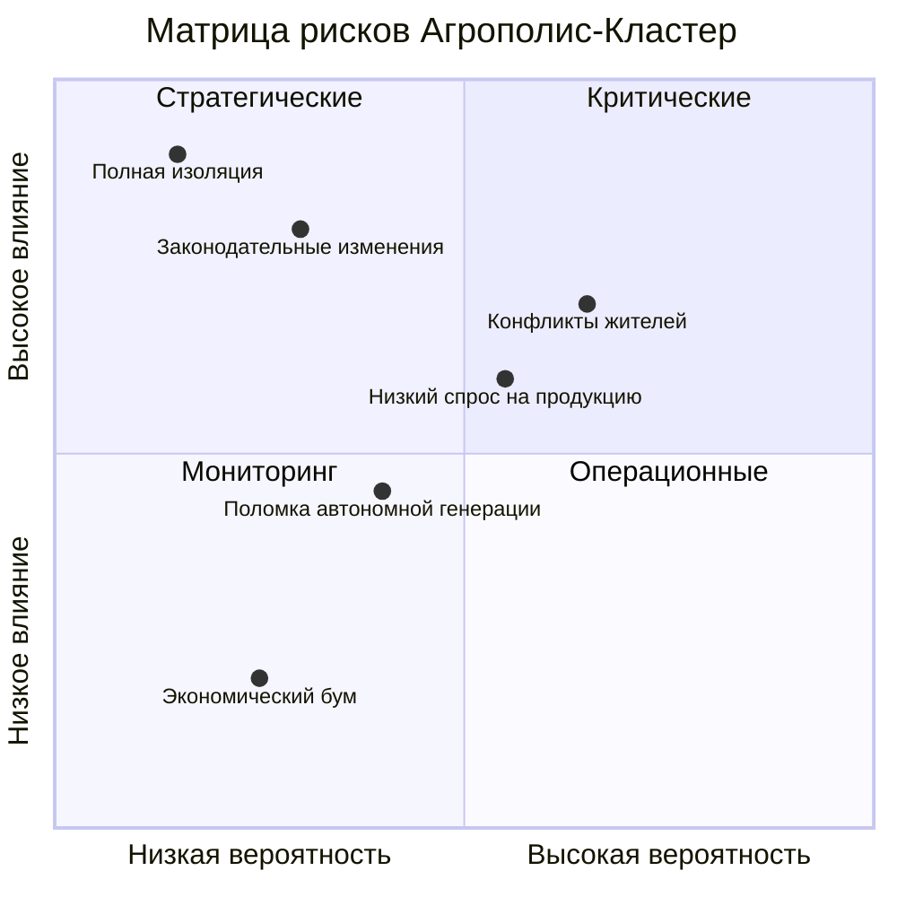

# 10. Риски: Матрица Антихрупкости

## Навигация
- Вход: [README.md](README.md) · [Манифест_Питчбук_Родовое_Поместье.md](Манифест_Питчбук_Родовое_Поместье.md) · [ТЭО_Родовое_Поместье_План_разделов.md](ТЭО_Родовое_Поместье_План_разделов.md)
- Проверка: [ИСТОЧНИКИ_И_БЕНЧМАРКИ.md](ИСТОЧНИКИ_И_БЕНЧМАРКИ.md) · [Приложения_Библиотека_Технологий/](Приложения_Библиотека_Технологий/)
- Переход: [← Структура](ТЭО_Родовое_Поместье_Раздел_9_Организационная_структура.md) · [Следующий →](ТЭО_Родовое_Поместье_Раздел_11_Выводы_и_рекомендации.md)

---

## 10.1. Карта Рисков (Risk Map)
Мы классифицируем риски по трем горизонтам: Старт, Ожидание, Жизнь.

### Группа А: Рыночные риски (Market)
*   **Риск:** Низкий спрос на продукцию Кооператива.
*   **Минимизация:**
    1.  **Off-take контракты:** Предварительные договоры с торговыми сетями еще до посева.
    2.  **Глубокая переработка:** Продаем не сырое молоко (киснет), а выдержанный сыр (хранится год, стоит дороже).

### Группа Б: Операционные и Демографические риски (Социум)
*   **Риск:** «Разброд и шатание» жителей, конфликты, отток населения.
*   **Минимизация — Социальная ОС:**
    1.  **Превентивный отбор:** Технология «Подбор Единомышленников» отсекает большинство несовместимых кандидатов и «случайных пассажиров» до момента покупки земли.
    2.  **Слаживание:** Обязательные совместные проекты на этапе «Слета Созидателей» выявляют скрытые конфликты за 3 дня, а не за 3 года ипотеки.
    3.  **Экономическая мотивация:** Цифровой рейтинг участника привязывает доступ к благам (дешевые кредиты, техника) к социальному рейтингу семьи.

### Группа В: Технологические риски (Tech)
*   **Риск:** Поломка автономной генерации зимой.
*   **Минимизация:**
    1.  **Резервирование:** Дизель-генератор на Ядро + печное отопление в каждом доме как backup.
    2.  **Простота:** Мы не ставим экспериментальные ветряки, мы ставим проверенные твердотопливные котлы.

---

## 10.2. Тепловая карта рисков (Risk Heatmap)

## 10.3. Стресс-тест бизнес-модели
*Что будет, если всё пойдет не так?*

*   **Сценарий «Зомби-апокалипсис» (Полная изоляция):**
    *   Поселение выживает за счет полной автономии (вода, тепло, еда свои).
    *   Риск для инвестора: Заморозка возврата капитала.
    *   Действие: Переход в режим натурального обмена.

*   **Сценарий «Экономический бум»:**
    *   Резкий рост цен на продовольствие в мире.
    *   Поселение получает сверхприбыль.
    *   Действие: Досрочные выплаты инвесторам + скупка соседних земель.

---

## 10.4. Расширенный реестр рисков (ТОП-15)

| # | Риск | Категория | Вероятность | Ущерб | Приоритет | Триггер (ранний индикатор) | Мера минимизации | Владелец |
| :--- | :--- | :--- | :--- | :--- | :--- | :--- | :--- | :--- |
| 1 | **Низкий спрос / медленные продажи** | Рыночный | Средняя | Критический | 🔴 | Продажи < 50% плана 2 мес. подряд | Off-take контракты, усиление маркетинга, снижение порога входа | Ком. директор |
| 2 | **Конфликты между резидентами** | Социальный | Высокая | Высокий | 🔴 | >3 жалоб/мес от одной семьи | Академия Поселенцев, медиация, Кодекс поведения | HR-директор |
| 3 | **Перерасход CAPEX (>25%)** | Финансовый | Средняя | Высокий | 🔴 | Факт > план на 15% за квартал | Резервный фонд 10%, фиксация цен в контрактах | Фин. директор |
| 4 | **Законодательные изменения (земля/кооперация)** | Регуляторный | Низкая | Критический | 🟡 | Новые НПА / законопроекты | Диверсификация правовых форм, юр. мониторинг | Юрист |
| 5 | **Поломка автономной генерации (зима)** | Технологический | Средняя | Средний | 🟡 | Отключение >4 часов | Дизель-бэкап, печное отопление, двойное резервирование | Тех. директор |
| 6 | **Кибератака / утечка ПДн** | IT/Кибер | Средняя | Высокий | 🔴 | Аномалии трафика, попытки brute-force | 152-ФЗ compliance, WAF, шифрование, бэкапы 3-2-1 | CTO |
| 7 | **Репутационный кризис (СМИ: «секта»)** | Репутационный | Средняя | Высокий | 🟡 | Негативные публикации >3 за месяц | PR-стратегия, FAQ, open-door политика, журналистские туры | PR-директор |
| 8 | **Отток ключевых кадров УК** | HR | Средняя | Средний | 🟡 | Увольнение >2 сотрудников за квартал | KPI-бонусы, опционная программа, дублирование компетенций | Директор |
| 9 | **Недостаточный урожай (климат)** | Природный | Средняя | Средний | 🟡 | Отклонение >30% от плана урожая | Теплицы (снижение зависимости от погоды), страхование посевов | Агроном |
| 10 | **Рост ключевой ставки ЦБ** | Макроэкономический | Высокая | Средний | 🟡 | КС > 25% | Фиксация ипотечных ставок, акцент на наличную оплату | Фин. директор |
| 11 | **Мошенничество / нецелевое использование средств** | Корпоративный | Низкая | Критический | 🟡 | Расхождения в отчётности | Цифровая прозрачность, ежеквартальный аудит, ревизионная комиссия | Председатель |
| 12 | **Отсутствие дорог/сетей (от государства)** | Инфраструктурный | Средняя | Высокий | 🔴 | Срыв сроков ТУ >6 мес. | Автономные решения (скважина, СЭС), lobbying, альтернативные маршруты | Тех. директор |
| 13 | **Неликвидность земельных активов** | Рыночный | Низкая | Средний | 🟢 | 0 сделок переуступки за 12 мес. | Рыночная оценка каждые 2 года, маркетинг вторичного рынка | Ком. директор |
| 14 | **Санкционные ограничения (импорт оборудования)** | Геополитический | Средняя | Средний | 🟡 | Ограничения на ключевые комплектующие | Импортозамещение (отечественные СЭС, LFP), запас комплектующих | Тех. директор |
| 15 | **Экологический инцидент (разлив, пожар)** | Экологический | Низкая | Высокий | 🟡 | Датчики аномалий (IoT) | Экологический протокол, страхование, план эвакуации | Тех. директор |

---

## 10.5. Антихрупкость: От защиты к выигрышу
*По Нассиму Талебу: система, которая становится сильнее от стресса.*

| Стресс-фактор | Хрупкая реакция (обычный КП) | Антихрупкая реакция (Агрополис) |
| :--- | :--- | :--- |
| **Рост цен на продовольствие** | Расходы жителей растут | Доходы жителей растут (свой агро-бизнес) |
| **Кризис на рынке недвижимости** | Падение цен, паника | Автономия: «дом кормит», отток минимален |
| **Энергетический кризис** | Рост тарифов → долги по ЖКХ | Собственная генерация (СЭС) → независимость |
| **Пандемия / изоляция** | Заточение в квартирах, стресс | Просторные участки, свежие продукты, здоровье |
| **Инфляция >15%** | Обесценивание сбережений | Земля + продукция = реальный актив, опережающий инфляцию |
| **Отток молодёжи из регионов** | Продолжается | Агрополис = «магнит» для IT-удалёнщиков (обратная миграция) |
