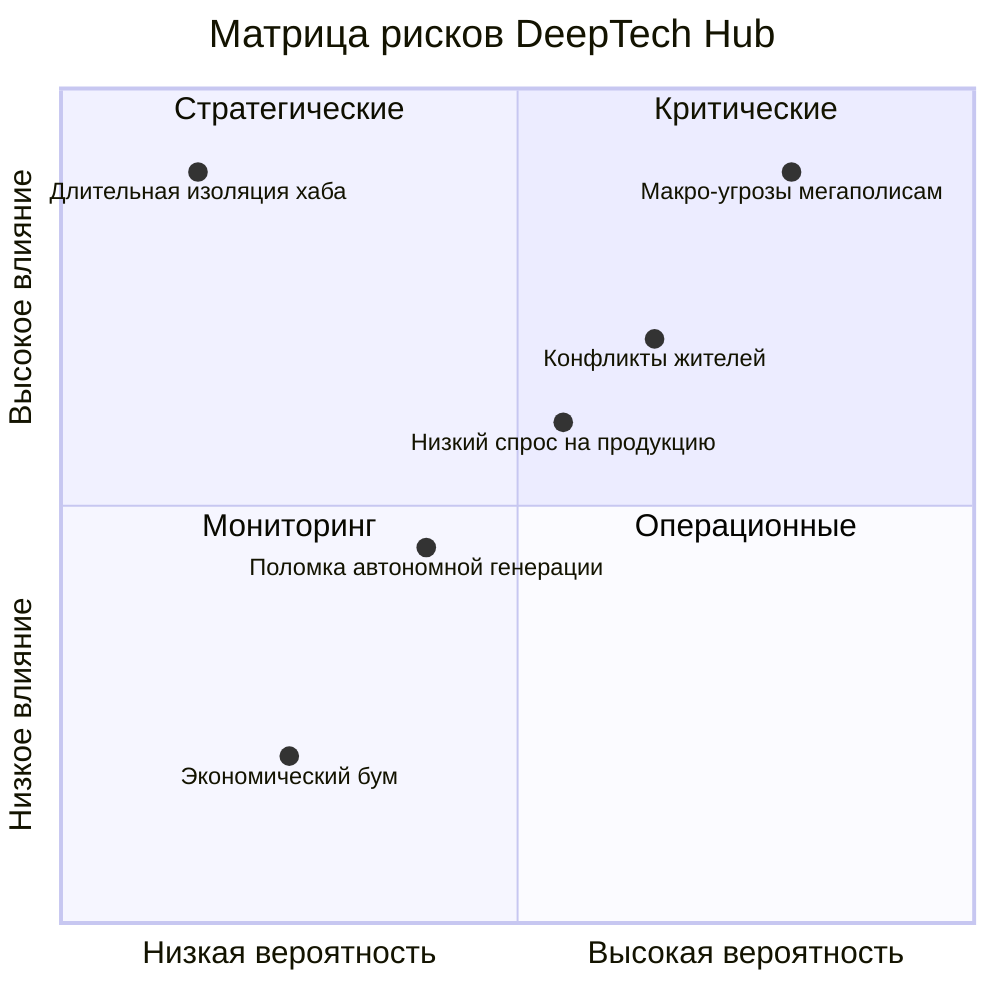
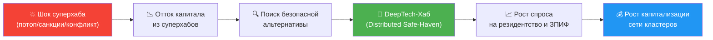

# 10. Риски: Матрица Антихрупкости

## Навигация
- Вход: [README.md](README.md) · [Манифест_Питчбук_Родовое_Поместье.md](Манифест_Питчбук_Родовое_Поместье.md) · [ТЭО_Родовое_Поместье_План_разделов.md](ТЭО_Родовое_Поместье_План_разделов.md)
- Проверка: [ИСТОЧНИКИ_И_БЕНЧМАРКИ.md](ИСТОЧНИКИ_И_БЕНЧМАРКИ.md) · [Приложения_Библиотека_Технологий/](Приложения_Библиотека_Технологий/)
- Переход: [← Структура](ТЭО_Родовое_Поместье_Раздел_9_Организационная_структура.md) · [Следующий →](ТЭО_Родовое_Поместье_Раздел_11_Выводы_и_рекомендации.md)

> **Дисклеймер:** Настоящий раздел содержит анализ **идентифицированных** рисков проекта и описание мер их минимизации. Перечень не является исчерпывающим, требует регулярного пересмотра и адаптации к конкретному региону/этапу. Оценки вероятности и ущерба — экспертные и подлежат валидации по результатам пилота.

---

## 10.1. Парадигма Расконцентрации: Ответ на глобальные макро-риски
В основу риск-модели заложен принцип **Расконцентрации**. Вкладывать капитал и концентрировать таланты в крупных финансовых хабах (таких как Дубай, Лондон, мегаполисы РФ) сегодня несет беспрецедентные риски:
1. **Геополитическая и кибер-уязвимость:** Крупные хабы — это критические точки (Single Points of Failure). Отключение централизованной инфраструктуры парализует жизнь миллионов.
2. **Пандемические и экологические ловушки:** Плотность населения делает мегаполисы очагами мгновенного распространения угроз на фоне сниженного физического иммунитета населения.
3. **Финансовый паралич:** Высокая закредитованность населения (классическая ипотека) делает людей заложниками системы в случае кризиса.

Наш проект, имея **сетевую, децентрализованную структуру**, не является единой мишенью. Расконцентрация активов и людей, умноженная на автономию, обеспечивает **Многоуровневую Безопасность** (физическую, продовольственную, энергетическую и финансовую). Этот принцип существенно снижает системные риски, присущие классическому девелопменту мегаполисов (подробнее — [Раздел 1, п. 1.2.2](ТЭО_Родовое_Поместье_Раздел_1_Введение.md)).

---

## 10.2. Карта Рисков проекта (Risk Map)
Мы классифицируем локальные риски проекта по трем горизонтам: Старт, Ожидание, Жизнь.

### Группа А: Рыночные и Финансовые риски (Market & Finance)
*   **Риск:** Низкий спрос на продукцию, падение доходов населения, невозможность обслуживать долги.
*   **Минимизация:**
    1.  **Лизинг вместо Ипотеки:** Люди не "замораживают" деньги в капитале и не становятся банкротами. Резидент может вернуть префаб-модуль синдикату без штрафов и потери состояния при кризисе, либо заменить его на меньший/больший.
    2.  **Off-take / B2B контракты:** Предварительные договоры с торговыми сетями и бизнесами.

### Группа Б: Операционные и Демографические риски (Социум)
*   **Риск:** Демотивация резидентов, конфликты в R&D-ячейках, отток талантов.
*   **Минимизация — Социальная ОС:**
    1.  **превентивный ручной скоринг (интервью + скоринг-модель):** Технология отбора отсекает несовместимых кандидатов до момента подписания HaaS-договора.
    2.  **Слаживание (Hackathon):** Обязательные совместные проекты на этапе «Bootcamp» выявляют скрытые конфликты за 3 дня, а не за 3 года ипотеки.
    3.  **Экономическая мотивация:** Soulbound Tokens (SBT) привязывают доступ к благам (Venture фондирование, спецтехника) к социальному рейтингу.

### Группа В: Технологические риски (Tech)
*   **Риск:** Поломка автономной генерации зимой.
*   **Минимизация:**
    1.  **Резервирование:** Дизель-генератор на Ядро + печное отопление в каждом доме как backup.
    2.  **Простота:** Мы не ставим экспериментальные ветряки, мы ставим проверенные твердотопливные котлы.

---

## 10.3. Тепловая карта рисков (Risk Heatmap)

## 10.4. Стресс-тест бизнес-модели
*Что будет, если всё пойдет не так?*

*   **Сценарий «Коллапс инфраструктуры мегаполисов» (Геополитика / Кибер-атаки):**
    *   Сетевая децентрализация позволяет кластеру продолжать операционную деятельность. Автономная генерация, локальные дата-центры и VPN-Mesh сеть обеспечивают работу IT-сектора.
    *   Риск для инвестора: При таком сценарии ожидается повышенный спрос на автономное жильё и рассредоточенную инфраструктуру, что может поддержать стоимость актива. Однако возможны перебои в логистике и задержки лизинговых платежей.
    *   Действие: Переключение на автономные режимы снабжения; активация резервных каналов связи.

*   **Сценарий «Длительная изоляция» (стихийное бедствие, логистический коллапс):**
    *   Кластер поддерживает жизнедеятельность за счёт автономии (вода, тепло, агро-контур, резервная генерация).
    *   Риск для инвестора: Временная заморозка денежного возврата капитала; снижение ликвидности актива.
    *   Действие: Переход на внутренние учётные механизмы (в рамках ФЗ-259 о ЦФА); приоритетное обеспечение базовых потребностей резидентов.

*   **Сценарий «Экономический бум»:**
    *   Резкий рост цен на продовольствие и тех-активы в мире.
    *   Кластер может получить повышенную маржинальность по агро- и technology-контурам.
    *   Действие: Ускоренные выплаты инвесторам, реинвестирование в масштабирование сети кластеров.

---

## 10.5. Расширенный реестр рисков (ТОП-15)

| # | Риск | Категория | Вероятность | Ущерб | Приоритет | Триггер (ранний индикатор) | Мера минимизации | Владелец |
| :--- | :--- | :--- | :--- | :--- | :--- | :--- | :--- | :--- |
| 1 | **Низкий спрос / медленные продажи** | Рыночный | Средняя | Критический | 🔴 | Продажи < 50% плана 2 мес. подряд | Off-take контракты, усиление маркетинга, снижение порога входа | Ком. директор |
| 2 | **Конфликты между резидентами** | Социальный | Высокая | Высокий | 🔴 | >3 жалоб/мес от одной ячейки | DAO Bootcamp, Liquid Dispute Resolution, Кодекс HaaS | Синдикат (Цифровой Кооператив) |
| 3 | **Перерасход CAPEX (>25%)** | Финансовый | Средняя | Высокий | 🔴 | Факт > план на 15% за квартал | Резервный фонд 10%, фиксация цен в контрактах | Фин. директор |
| 4 | **Законодательные изменения (земля/кооперация)** | Регуляторный | Низкая | Критический | 🟡 | Новые НПА / законопроекты | Диверсификация правовых форм, юр. мониторинг | Юрист |
| 5 | **Поломка автономной генерации (зима)** | Технологический | Средняя | Средний | 🟡 | Отключение >4 часов | Дизель-бэкап, печное отопление, двойное резервирование | Тех. директор |
| 6 | **Кибератака / утечка ПДн** | IT/Кибер | Средняя | Высокий | 🔴 | Аномалии трафика, попытки brute-force | 152-ФЗ compliance, WAF, шифрование, бэкапы 3-2-1 | CTO |
| 7 | **Репутационный кризис (СМИ: «секта»)** | Репутационный | Средняя | Высокий | 🟡 | Негативные публикации >3 за месяц | PR-стратегия, FAQ, open-door политика, журналистские туры | PR-директор |
| 8 | **Отток ключевых кадров УК** | HR | Средняя | Средний | 🟡 | Увольнение >2 сотрудников за квартал | KPI-бонусы, опционная программа, дублирование компетенций | Директор |
| 9 | **Недостаточный урожай (климат)** | Природный | Средняя | Средний | 🟡 | Отклонение >30% от плана урожая | Теплицы (снижение зависимости от погоды), страхование посевов | Агроном |
| 10 | **Рост ключевой ставки ЦБ** | Макроэкономический | Высокая | Средний | 🟡 | КС > 25% | Фиксация ипотечных ставок, акцент на наличную оплату | Фин. директор |
| 11 | **Мошенничество / нецелевое использование средств** | Корпоративный | Низкая | Критический | 🟡 | Расхождения в отчётности | Цифровая прозрачность, ежеквартальный аудит, ревизионная комиссия | Председатель |
| 12 | **Отсутствие дорог/сетей (от государства)** | Инфраструктурный | Средняя | Высокий | 🔴 | Срыв сроков ТУ >6 мес. | Автономные решения (скважина, СЭС), lobbying, альтернативные маршруты | Тех. директор |
| 13 | **Неликвидность земельных активов** | Рыночный | Низкая | Средний | 🟢 | 0 сделок переуступки за 12 мес. | Рыночная оценка каждые 2 года, маркетинг вторичного рынка | Ком. директор |
| 14 | **Санкционные ограничения (импорт оборудования)** | Геополитический | Средняя | Средний | 🟡 | Ограничения на ключевые комплектующие | Импортозамещение (отечественные СЭС, LFP), запас комплектующих | Тех. директор |
| 15 | **Экологический инцидент (разлив, пожар)** | Экологический | Низкая | Высокий | 🟡 | Датчики аномалий (IoT) | Экологический протокол, страхование, план эвакуации | Тех. директор |

---

## 10.6. Антихрупкость: От защиты к выигрышу
*По Нассиму Талебу: система, которая становится сильнее от стресса.*

| Стресс-фактор | Хрупкая реакция (обычный КП / Мегаполис) | Антихрупкая реакция (Сетевой DeepTech Хаб) |
| :--- | :--- | :--- |
| **Геополитические и военные угрозы** | Паника, концентрация ударов по единым хабам (Дубай/Мск) | Расконцентрация: множество автономных кластеров не являются выгодной мишенью |
| **Рост цен на продовольствие** | Расходы жителей растут | Доходы жителей растут (свой агро/foodtech-бизнес) |
| **Кризис на рынке недвижимости** | Падение цен, дефолты по ипотеке | Гибкий лизинг: инфраструктура как услуга (HaaS), отток минимален |
| **Энергетический кризис / Blackout** | Остановка инфраструктуры, нарушение общественного порядка, прерывание бизнес-процессов | Собственная генерация (СЭС+ESS) → автономность, непрерывность IT-процессов |
| **Пандемия / Биологические угрозы** | Заточение в квартирах, стресс, падение иммунитета | Естественный буфер: автономные модули, FoodTech, health span |
| **Инфляция >15%** | Обесценивание сбережений | Земля + IP (интеллектуальная собственность) = реальный актив |
| **Отток молодёжи из регионов** | Продолжается (деградация территорий) | DeepTech Хаб = «магнит» для IT-удалёнщиков и инженеров (обратная миграция, безопасность) |
| **Технологическое устаревание** | Залоченность в старых системах | Open Source + модульная HaaS архитектура → апгрейд компонентно |

---

## 10.7. Климатическая адаптация: Стратегия устойчивости к изменению климата
*Климатические риски — долгосрочный фактор для поселения с горизонтом 50+ лет.*

| Климатический риск | Мера адаптации | Технология |
| :--- | :--- | :--- |
| **Засухи** | Система сбора дождевой воды + капельный полив + мульчирование | IoT-датчики влажности почвы |
| **Жара (>35°C)** | Пассивное охлаждение домов + озеленение + водоёмы | Проектирование по Passivhaus |
| **Сильные морозы (<-35°C)** | Двойное резервирование отопления + тепловые накопители | Пеллеты + дизель + печь |
| **Паводки** | Выбор участка выше зоны затопления + дренаж | GIS-анализ на этапе выбора земли |
| **Нестабильные сезоны** | Расширение доли тепличного производства | AI Crop Advisor (adaptive planting) |

> **Позиционирование:** Климатическая адаптация — не «бонус», а **основание для ESG-рейтинга**. Соответствие TCFD (Task Force on Climate-Related Financial Disclosures) повышает инвестиционную привлекательность.

---

## 10.8. Когда суперхабы падают — мы растём: Инверсия риска

> **Ключевой нарратив для инвесторов:** Кризисы суперхабов — это не просто риск для владельцев тех активов. Для нас это **катализатор спроса**. Каждый шок в Дубае, Сингапуре или Лондоне — это волна капитала и людей, которые ищут альтернативу.

| Стрессовый сценарий | Суперхаб (концентрация) | DeepTech-Хаб (расконцентрация) | Эффект для нас |
| :--- | :--- | :--- | :--- |
| **Климатический катаклизм** (апрель 2024, Дубай: рекордный потоп) | Аэропорт закрыт на 72 часа. Деловые центры затоплены. Инвесторы не могут получить доступ к активам. | Каждый узел автономен, распределён по регионам. Климатические риски РФ иные (холод, не потоп). PUE 1.1–1.15 — холод как преимущество для eDC. | ↑ Спрос на активы в юрисдикциях без климатических экстремумов |
| **Санкционная блокировка** (DIFC 2022-2024, Сингапур 2023-2025) | Активы заморожены. Расчёты заблокированы. Переструктурирование занимает 12-18 месяцев. | ЗПИФ под российским правом. DAO-реестр даёт прозрачность. Нет зависимости от иностранных SD. | ↑ Приток СНГ-капитала, ищущего юрисдикционную безопасность |
| **Эскалация в Персидском заливе** (Ормуз, конфликт Иран — США, 2024–2026) | Весь бизнес в регионе (филиалы, представительства, штаб-квартиры) зависит от 1 пролива и 1 геополитического коридора. Угроза вовлечения инфраструктуры в конфликт «Иран – прокси – коалиция США», закрытие Ормуза, рост страховых надбавок «war risk», авиационные ограничения, заморозка транзакций через банки региона — экзистенциальная операционная угроза для инвесторов с активами и офисами в ОАЭ, Катаре, Бахрейне. | Россия — нейтральная и стратегически удалённая макроплатформа. СМП — альтернативный глобальный маршрут. ЗПИФ под ГК РФ исключает иностранный юрисдикционный риск. Денежный поток в рублях — независимость от внешнего давления. | ↑ Переток корпоративного капитала и семейных офисов из «горячих» юрисдикций в стратегически защищённые активы РФ |
| **Энергетический кризис** (Европа 2021-2024) | Мегаполисы с централизованной энергосистемой — первые жертвы: блэкауты, рост тарифов x3. | Каждый кластер — автономная микросеть (Smart Grid + BESS + СЭС). Электроэнергия РФ: 4–7 руб./кВт·ч. | ↑ Резиденты с производством переезжают из дорогих регионов |
| **Пандемия / биошок** | Мегаполисная плотность = мгновенное распространение. Локдауны останавливают всё. | Малоплотные кластеры, автономия жизнеобеспечения (еда/вода/тепло), удалённая работа как норма. | ↑ Резкий рост интереса к distributed living после любого биошока |
| **Инфляция + девальвация** | Капитал в деривативах теряет покупательную способность. | Земля + IP + инфраструктура = реальный актив с полезностью и генерирующим потоком (HaaS). | ↑ Переход из «бумажных» в «реальные» активы |

### Вывод: Мы единственный актив, который умнеет от чужих кризисов

> **Антихрупкость по Талебу:** Обычный актив боится шоков. Наш актив **потребляет шоки как топливо** для роста. Именно так работает физический блокчейн: каждый кризис централизованных систем усиливает обоснование децентрализованной сети.

---

*Методологическое замечание: в реестре рисков (раздел 10.5) концентрационные и геополитические события сознательно выведены в отдельный блок, так как по своей природе они являются не столько рисками для проекта, сколько **драйверами спроса** при правильном позиционировании.*

