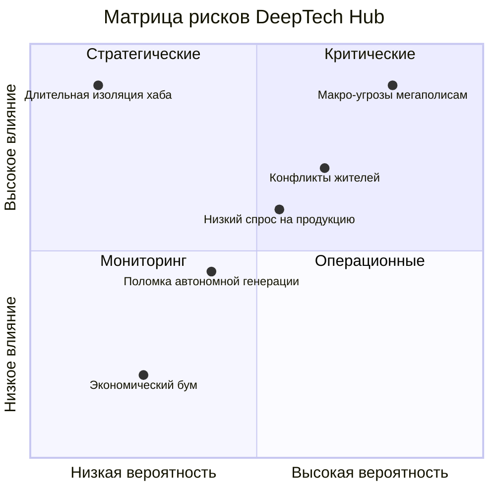
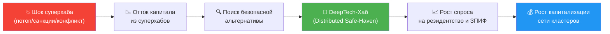

# 10. Риски: Матрица антихрупкости

## Навигация

- Вход: [README.md](README.md) · [Манифест_Питчбук_Родовое_Поместье.md](Манифест_Питчбук_Родовое_Поместье.md) · [ТЭО_Родовое_Поместье_План_разделов.md](ТЭО_Родовое_Поместье_План_разделов.md)
- Проверка: [ИСТОЧНИКИ_И_БЕНЧМАРКИ.md](ИСТОЧНИКИ_И_БЕНЧМАРКИ.md) · [Приложения_Библиотека_Технологий/](Приложения_Библиотека_Технологий/)
- Переход: [← Структура](ТЭО_Родовое_Поместье_Раздел_9_Организационная_структура.md) · [Следующий →](ТЭО_Родовое_Поместье_Раздел_11_Выводы_и_рекомендации.md)

> **Дисклеймер:** настоящий раздел содержит анализ **идентифицированных** рисков проекта и описание мер их минимизации. Перечень не является исчерпывающим, требует регулярного пересмотра и адаптации к конкретному региону и этапу. Оценки вероятности и ущерба экспертные и подлежат валидации по результатам пилота.

---

## 10.1. Парадигма расконцентрации: ответ на глобальные макро-риски

В основу риск-модели заложен принцип **расконцентрации**. Вкладывать капитал и концентрировать таланты в крупных финансовых хабах сегодня означает принимать повышенный системный риск:

1. **Геополитическая и киберуязвимость:** крупные хабы становятся критическими точками с высокой зависимостью от централизованной инфраструктуры.
2. **Пандемические и экологические ловушки:** высокая плотность населения ускоряет распространение угроз и усиливает нагрузку на среду.
3. **Финансовый паралич:** высокая закредитованность населения и жёсткие ипотечные модели снижают гибкость семей в кризисные периоды.

Проект с **сетевой и децентрализованной структурой** снижает эти риски. Расконцентрация активов и людей, умноженная на автономию, обеспечивает **многоуровневую безопасность**: физическую, продовольственную, энергетическую и финансовую. Этот принцип снижает системные риски, присущие классическому девелопменту мегаполисов. Подробнее — [ТЭО_Родовое_Поместье_Раздел_1_Введение.md](ТЭО_Родовое_Поместье_Раздел_1_Введение.md).

---

## 10.2. Карта рисков проекта (Risk Map)

Мы классифицируем локальные риски проекта по трём горизонтам: старт, ожидание, жизнь.

### Группа А: рыночные и финансовые риски (Market & Finance)

- **Риск:** низкий спрос на продукцию, падение доходов населения, невозможность обслуживать долги.
- **Минимизация:**
    1. **Поэтапный вход вместо перегруза семьи долгом:** базовый жилой контур семьи не переводится в подписочную зависимость. Снижение порога входа достигается очередностью строительства, выбором конфигурации дома, использованием обратимых решений на пилоте и аккуратной финансовой моделью.
    2. **Off-take / B2B-контракты:** предварительные договоры с торговыми сетями и бизнесами.

### Группа Б: операционные и демографические риски (Социум)

- **Риск:** демотивация резидентов, конфликты в R&D-ячейках, отток талантов.
- **Минимизация через социальную операционную систему:**
    1. **Взаимное знакомство и совпадение по ценностям:** технология отбора отсеивает несовместимых кандидатов до момента подписания договора участия.
    2. **Слаживание (Hackathon):** обязательные совместные проекты на этапе bootcamp выявляют скрытые конфликты заранее.
    3. **Экономическая мотивация:** доступ к льготным пакетам, проектным грантам и спецтехнике привязывается к прозрачным правилам участия, выполнению обязательств и репутации в совместных проектах.

### Группа В: технологические риски (Tech)

- **Риск:** поломка автономной генерации зимой.
- **Минимизация:**
    1. **Резервирование:** дизель-генератор на Ядро + печное отопление в каждом доме как резерв.
    2. **Простота:** в критическом контуре применяются проверенные решения, а не экспериментальные технологии без эксплуатационной истории.
- **Риск:** реверсивная технология строительства воспринимается как временное решение и теряет доверие банка, резидента или подрядчика.
- **Минимизация:**
    1. **Разделение продуктовых режимов:** капитальные семейные сценарии и Zero Trace Habitat не смешиваются в одну правовую и инженерную сущность.
    2. **Паспортизация:** material passport, disassembly map, recovery SLA и эксплуатационный регламент входят в обязательный пакет пилотного юнита.
    3. **Доказательство на пилоте:** 1-2 эталонных юнита проходят не только монтаж, но и учебный частичный демонтаж с актом восстановления площадки.

### Группа Г: риски исполнения (Execution)

- **Риск:** проект переусложняется, команда размазывается между десятками инноваций, а пилот не собирается вовремя.
- **Минимизация:**
    1. **Stage-Gates:** переход к следующей фазе только после закрытия обязательных критериев готовности.
    2. **PTRL:** внедрение технологий слоями, без прыжков через базовые контуры.
    3. **Proof-First:** приоритет у участка, ТУ, Node Zero, тарифов, LoI и эксплуатационных регламентов, а не у новых концептов.

---

## 10.3. Тепловая карта рисков (Risk Heatmap)

## 10.4. Стресс-тест бизнес-модели

*Что будет, если всё пойдёт не так?*

- **Сценарий «Коллапс инфраструктуры мегаполисов» (геополитика / кибератаки):**
  - Сетевая децентрализация позволяет кластеру продолжать операционную деятельность. Автономная генерация, локальные дата-центры и VPN-Mesh-сеть обеспечивают работу IT-сектора.
  - **Риск для инвестора:** при таком сценарии ожидается повышенный спрос на автономное жильё и рассредоточенную инфраструктуру, что может поддержать стоимость актива. Однако возможны перебои в логистике и задержки сервисных платежей.
  - **Действие:** переключение на автономные режимы снабжения; активация резервных каналов связи.

- **Сценарий «Длительная изоляция» (стихийное бедствие, логистический коллапс):**
  - Кластер поддерживает жизнедеятельность за счёт автономии: вода, тепло, агро-контур, резервная генерация.
  - **Риск для инвестора:** временная заморозка денежного возврата капитала; снижение ликвидности актива.
  - **Действие:** переход на внутренние учётные механизмы в допустимых правовых рамках; приоритетное обеспечение базовых потребностей резидентов.

- **Сценарий «Экономический бум»:**
  - Резкий рост цен на продовольствие и технологические активы в мире.
  - Кластер может получить повышенную маржинальность по агро- и технологическим контурам.
  - **Действие:** ускоренные выплаты инвесторам, реинвестирование в масштабирование сети кластеров.

---

## 10.5. Расширенный реестр рисков (ТОП-15)

| # | Риск | Категория | Вероятность | Ущерб | Приоритет | Триггер (ранний индикатор) | Мера минимизации | Владелец |
| :--- | :--- | :--- | :--- | :--- | :--- | :--- | :--- | :--- |
| 1 | **Низкий спрос / медленные продажи** | Рыночный | Средняя | Критический | 🔴 | Продажи < 50% плана 2 мес. подряд | Off-take контракты, усиление маркетинга, снижение порога входа | Ком. директор |
| 2 | **Конфликты между резидентами** | Социальный | Высокая | Высокий | 🔴 | >3 жалоб/мес от одной ячейки | Bootcamp, медиация, протокол разрешения споров, кодекс сервисного контура | Синдикат (цифровой кооператив) |
| 3 | **Перерасход CAPEX (>25%)** | Финансовый | Средняя | Высокий | 🔴 | Факт > план на 15% за квартал | Резервный фонд 10%, фиксация цен в контрактах | Фин. директор |
| 4 | **Законодательные изменения (земля/кооперация)** | Регуляторный | Низкая | Критический | 🟡 | Новые НПА / законопроекты | Диверсификация правовых форм, юр. мониторинг | Юрист |
| 5 | **Поломка автономной генерации (зима)** | Технологический | Средняя | Средний | 🟡 | Отключение >4 часов | Дизель-бэкап, печное отопление, двойное резервирование | Тех. директор |
| 6 | **Кибератака / утечка ПДн** | IT/Кибер | Средняя | Высокий | 🔴 | Аномалии трафика, попытки brute-force | 152-ФЗ compliance, WAF, шифрование, бэкапы 3-2-1 | CTO |
| 7 | **Репутационный кризис (СМИ: «секта»)** | Репутационный | Средняя | Высокий | 🟡 | Негативные публикации >3 за месяц | PR-стратегия, FAQ, open-door политика, журналистские туры | PR-директор |
| 8 | **Отток ключевых кадров УК** | HR | Средняя | Средний | 🟡 | Увольнение >2 сотрудников за квартал | KPI-бонусы, опционная программа, дублирование компетенций | Директор |
| 9 | **Недостаточный урожай (климат)** | Природный | Средняя | Средний | 🟡 | Отклонение >30% от плана урожая | Теплицы (снижение зависимости от погоды), страхование посевов | Агроном |
| 10 | **Рост ключевой ставки ЦБ** | Макроэкономический | Высокая | Средний | 🟡 | КС > 25% | Фиксация ипотечных ставок, акцент на наличную оплату | Фин. директор |
| 11 | **Мошенничество / нецелевое использование средств** | Корпоративный | Низкая | Критический | 🟡 | Расхождения в отчётности | Цифровая прозрачность, ежеквартальный аудит, ревизионная комиссия | Председатель |
| 12 | **Отсутствие дорог/сетей (от государства)** | Инфраструктурный | Средняя | Высокий | 🔴 | Срыв сроков ТУ >6 мес. | Автономные решения (скважина, СЭС), lobbying, альтернативные маршруты | Тех. директор |
| 13 | **Неликвидность земельных активов** | Рыночный | Низкая | Средний | 🟢 | 0 сделок переуступки за 12 мес. | Рыночная оценка каждые 2 года, маркетинг вторичного рынка | Ком. директор |
| 14 | **Санкционные ограничения (импорт оборудования)** | Геополитический | Средняя | Средний | 🟡 | Ограничения на ключевые комплектующие | Импортозамещение (отечественные СЭС, LFP), запас комплектующих | Тех. директор |
| 15 | **Экологический инцидент (разлив, пожар)** | Экологический | Низкая | Высокий | 🟡 | Датчики аномалий (IoT) | Экологический протокол, страхование, план эвакуации | Тех. директор |
| 16 | **Feature Creep / перегрузка пилота** | Исполнение | Высокая | Высокий | 🔴 | Добавление новых модулей без DoD и владельца | PTRL, change-control, запрет на нефинансируемые инновации в пилоте | CEO / CTO |
| 17 | **Неподтверждённая земля / ТУ** | Земля / инфраструктура | Средняя | Критический | 🔴 | Нет land memo, ТУ сдвигаются >90 дней | Shortlist участков, параллельный инженерный скрининг, fallback-сценарии | Land lead |
| 18 | **Нематериализованная команда** | Управленческий | Средняя | Высокий | 🔴 | Ключевые потоки без named owner | RACI, role-based hiring, advisory board, stage-gate проверки | CEO |
| 19 | **Недоверие к Zero Trace Habitat как к активу** | Технологический / рыночный | Средняя | Средний | 🟡 | Банк/резидент требует только капитальную схему, подрядчики не понимают стандарт | Отдельный продуктовый паспорт, пилотные эталонные кейсы, каталог узлов, сметы, recovery audit | CTO / Product lead |
| 20 | **Неудачный демонтаж или неполное восстановление площадки** | Экологический / исполнение | Низкая | Высокий | 🟡 | Превышение recovery SLA, повреждение корневых зон, рост отходов | Disassembly map, low-impact техника, pre-scan/post-audit, подрядный SLA на восстановление | Тех. директор |

---

## 10.6. Антихрупкость: от защиты к адаптивному росту

*По Нассиму Талебу: система, которая способна становиться сильнее после стресса, если её архитектура правильно спроектирована.*

| Стресс-фактор | Хрупкая реакция (обычный КП / Мегаполис) | Антихрупкая реакция (Сетевой DeepTech Хаб) |
| :--- | :--- | :--- |
| **Геополитические и военные угрозы** | Высокая зависимость от нескольких крупных узлов и маршрутов | Расконцентрация: множество автономных кластеров снижают системную уязвимость |
| **Рост цен на продовольствие** | Расходы жителей растут | Доходы жителей растут (свой агро/foodtech-бизнес) |
| **Кризис на рынке недвижимости** | Падение цен, дефолты по ипотеке | Поэтапное строительство, сервисный контур Ядра и гибкие временные модули снижают давление на семью |
| **Энергетический кризис / Blackout** | Остановка инфраструктуры, нарушение общественного порядка, прерывание бизнес-процессов | Собственная генерация (СЭС+ESS) → автономность, непрерывность IT-процессов |
| **Пандемия / Биологические угрозы** | Заточение в квартирах, стресс, падение иммунитета | Естественный буфер: автономные модули, FoodTech, health span |
| **Инфляция >15%** | Обесценивание сбережений | Земля + IP (интеллектуальная собственность) = реальный актив |
| **Отток молодёжи из регионов** | Продолжается (деградация территорий) | DeepTech Хаб = «магнит» для IT-удалёнщиков и инженеров (обратная миграция, безопасность) |
| **Технологическое устаревание** | Залоченность в старых системах | Open Source + модульная сервисная архитектура → апгрейд компонентно |
| **Ошибка ранней строительной гипотезы** | Бетон и тяжёлые конструкции “запирают” ошибку на годы | Реверсивные ZTH-юниты позволяют дешево откатить неудачную конфигурацию и собрать новую |

---

## 10.7. Климатическая адаптация: стратегия устойчивости к изменению климата

*Климатические риски — долгосрочный фактор для поселения с горизонтом 50+ лет.*

| Климатический риск | Мера адаптации | Технология |
| :--- | :--- | :--- |
| **Засухи** | Система сбора дождевой воды + капельный полив + мульчирование | IoT-датчики влажности почвы |
| **Жара (>35°C)** | Пассивное охлаждение домов + озеленение + водоёмы | Проектирование по Passivhaus |
| **Сильные морозы (<-35°C)** | Двойное резервирование отопления + тепловые накопители | Пеллеты + дизель + печь |
| **Паводки** | Выбор участка выше зоны затопления + дренаж | GIS-анализ на этапе выбора земли |
| **Нестабильные сезоны** | Расширение доли тепличного производства | AI Crop Advisor (adaptive planting) |

> **Позиционирование:** Климатическая адаптация — не «бонус», а **основание для ESG-рейтинга**. Соответствие TCFD (Task Force on Climate-Related Financial Disclosures) повышает инвестиционную привлекательность.

---

## 10.8. Как распределённая модель использует сдвиг спроса: инверсия риска

> **Ключевой нарратив для инвесторов:** стресс в сверхконцентрированных хабах усиливает запрос на более распределённые и юрисдикционно понятные модели размещения капитала. Для проекта это означает потенциальный рост интереса со стороны тех, кто ищет более устойчивую альтернативу.

| Стрессовый сценарий | Суперхаб (концентрация) | DeepTech-Хаб (расконцентрация) | Эффект для нас |
| :--- | :--- | :--- | :--- |
| **Климатический катаклизм** (апрель 2024, Дубай: рекордный потоп) | Аэропорт закрыт на 72 часа. Деловые центры затоплены. Инвесторы временно теряют доступ к активам. | Каждый узел автономен и распределён по регионам. Климатические риски РФ иного типа; холод работает как преимущество для eDC. | Рост внимания к активам в юрисдикциях с иным климатическим профилем |
| **Санкционная блокировка** (DIFC 2022-2024, Сингапур 2023-2025) | Активы заморожены. Расчёты заблокированы. Переструктурирование занимает 12-18 месяцев. | ЗПИФ под российским правом. Цифровой кооператив и проверяемые реестры усиливают прозрачность. Нет зависимости от иностранных SD. | Повышенный интерес капитала, ищущего юрисдикционную определённость |
| **Эскалация в Персидском заливе** (Ормуз, 2024–2026) | Бизнес в регионе зависит от ограниченного числа коридоров и маршрутов. Рост страховых надбавок, авиационные ограничения и сбои расчётов повышают операционный риск. | Россия — стратегически удалённая макроплатформа. СМП — альтернативный глобальный маршрут. ЗПИФ под ГК РФ исключает иностранный юрисдикционный риск. Денежный поток в рублях снижает зависимость от внешнего давления. | Усиление интереса семейных офисов и корпоративного капитала к защищённым инфраструктурным активам |
| **Энергетический кризис** (Европа 2021-2024) | Мегаполисы с централизованной энергосистемой уязвимы к блэкаутам и резкому росту тарифов. | Каждый кластер — автономная микросеть (Smart Grid + BESS + СЭС). Электроэнергия РФ: 4–7 руб./кВт·ч. | Повышение привлекательности распределённых производственных площадок |
| **Пандемия / биошок** | Мегаполисная плотность ускоряет распространение и повышает нагрузку на систему. | Малоплотные кластеры, автономия жизнеобеспечения (еда/вода/тепло), удалённая работа как норма. | Рост интереса к распределённому образу жизни |
| **Инфляция + девальвация** | Капитал в финансовых инструментах теряет покупательную способность. | Земля + IP + инфраструктура = реальный актив с полезностью и генерирующим потоком сервисного контура. | Сдвиг интереса от полностью бумажных активов к инфраструктурным |

### Вывод: проект усиливает свою релевантность в периоды внешней турбулентности

> **Антихрупкость по Талебу:** обычный актив стремится просто пережить шок. Антихрупкая система учится на нём и усиливает аргументацию своей архитектуры. В этом смысле физический блокчейн — это не лозунг, а модель распределённой устойчивости.

---

*Методологическое замечание: в реестре рисков (раздел 10.5) концентрационные и геополитические события выделены в отдельный блок, поскольку для проекта они выступают не только внешними ограничениями, но и факторами перераспределения спроса в пользу более устойчивых моделей.*

