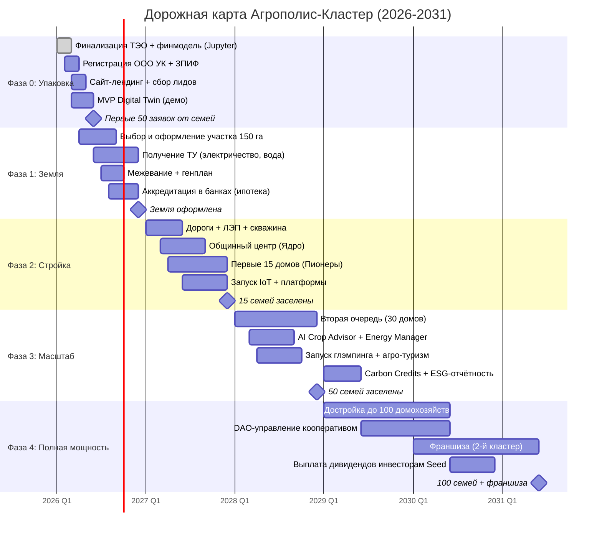

# 11. Дорожная карта: Стратегия победы

## Навигация
- Вход: [README.md](README.md) · [Манифест_Питчбук_Родовое_Поместье.md](Манифест_Питчбук_Родовое_Поместье.md) · [ТЭО_Родовое_Поместье_План_разделов.md](ТЭО_Родовое_Поместье_План_разделов.md)
- Проверка: [ИСТОЧНИКИ_И_БЕНЧМАРКИ.md](ИСТОЧНИКИ_И_БЕНЧМАРКИ.md) · [Приложения_Библиотека_Технологий/](Приложения_Библиотека_Технологий/)
- Переход: [← Риски](ТЭО_Родовое_Поместье_Раздел_10_Риски_и_пути_их_минимизации.md) · [В начало](README.md)

---

## 11.1. Execution Roadmap: 4 Шага к цели
Мы не строим "светлое будущее" за один день. Мы двигаемся итерациями.

### Шаг 1: Packaging (Месяцы 1-3)
*   **Задача:** Упаковка продукта для инвестора.
*   **Действия:**
    *   Финализация финмодели (Excel → Приложение).
    *   Регистрация ООО «УК Агрополис» и ЗПИФ.
    *   Сайт-лендинг для сбора лидов (семей).

### Шаг 2: Seed Phase (Месяцы 4-12)
*   **Задача:** Приобретение земли и проектирование.
*   **Действия:**
    *   Покупка участка 150 га (или аренда).
    *   Получение ТУ на электричество.
    *   Разметка участков (межевание) под кластеры.

### Шаг 3: Construction (Год 2)
*   **Задача:** Стройка Ядра и первых домов.
*   **Действия:**
    *   Дороги (щебень) + ЛЭП + Скважина.
    *   Строительство Общинного центра (Коворкинг + Цех).
    *   Заезд первых 10 семей (Пионеры).

### Шаг 4: Scale & Exit (Год 5)
*   **Задача:** Выход на полную мощность и возврат инвестиций.
*   **Действия:**
    *   Полная продажа 100 лотов.
    *   Рефинансирование кредитов.
    *   Выплата дивидендов инвесторам этапа Seed.

---

## 11.2. Предложение для Партнеров (Call to Action)

### Для Государства
*   **Просим:** Выделение земли без торгов (как МИП) + Субсидия на дорогу.
*   **Даем:** Решение жилищного вопроса для 100 семей + Налоги с бизнеса, которого раньше не было.

### Для Частного Инвестора
*   **Вход:** от 10 млн руб.
*   **Инструмент:** Пай в ЗПИФН «Агрополис».
*   **Доходность:** X3 за 5 лет (за счет перевода земли из с/х в "дачку" де-факто через капитализацию поселка).

---

## 11.3. Сводная таблица инвестиционной привлекательности

| Параметр | Значение | Бенчмарк | Наше преимущество |
| :--- | :--- | :--- | :--- |
| **NPV (10 лет, r=18%)** | +187 млн руб. | Средний КП: 0-20 млн | x9+ |
| **IRR** | 28.4% | Банк. депозит 21%, КП 12-15% | +13 п.п. vs КП |
| **Точка безубыточности** | 38 домохозяйств | КП: 60-80 | Быстрее на 40% |
| **Рост стоимости земли (5 лет)** | x3-5 | КП: x1.3-1.5 | Эффект экосистемы |
| **Углеродный баланс** | Отрицательный к 5-му году | КП: не измеряется | Монетизация через carbon credits |
| **NPS (прогноз)** | >60 | Средний КП: 15-25 | Отбор + сообщество |
| **UN SDGs покрытие** | 10 из 17 | КП: 0-2 | ESG-рейтинг |

---

## 11.4. Расширенная дорожная карта (Roadmap v3.0)

### Ключевые вехи (Milestones)

| Веха | Дата | Критерий достижения | Ответственный |
| :--- | :--- | :--- | :--- |
| **M1: Product-Market Fit** | Q2 2026 | 50+ заявок от семей, 3+ заинтересованных инвестора | Ком. директор |
| **M2: Land Secured** | Q4 2026 | Участок оформлен, ТУ получены | Юрист |
| **M3: First Settlers** | Q4 2027 | 15 семей заселены, Ядро функционирует | Директор УК |
| **M4: Breakeven** | Q4 2028 | 50 семей (>точки безубыточности: 38), OPEX покрывается | Фин. директор |
| **M5: Full Scale + Franchise** | H1 2031 | 100 семей, запуск 2-го кластера, дивиденды | Председатель |

---

## 11.5. Предложение для Партнеров (Call to Action) v2.0

### Для Государства (региональные администрации)
*   **Просим:** Выделение земли без торгов (как МИП / КРТ) + субсидия на дорожную инфраструктуру.
*   **Даём:** Решение жилищного вопроса для 100+ семей. Создание 50+ рабочих мест. Налоговая база. Исполнение KPI по Нацпроектам «Демография», «Жильё», «Экология». **Social Impact Bond:** регион платит только за достигнутый результат.

### Для Стратегического Инвестора
*   **Вход:** от 10 млн руб. (пай ЗПИФ «Агрополис»).
*   **Доходность:** IRR 28%+ (базовый сценарий) / x3 за 5 лет.
*   **ESG-рейтинг:** Инвестиция маппируется на 10 UN SDGs. Green Bond-eligible.
*   **Exit:** Продажа пая на вторичном рынке / Buyback кооперативом / IPO (перспектива 7+ лет).

### Для IT-специалистов и семей
*   **Вход:** от 3 млн руб. (маткапитал + сельская ипотека 3%).
*   **Получаете:** 1 га земли, дом, коворкинг 500 Мбит/с, сообщество единомышленников, продуктовую автономию 60%+.
*   **Доход:** Удалённая работа + агробизнес + кооперативные выплаты = **220 тыс. руб./мес.** (базовый сценарий, 3-й год).
*   **Перспектива:** «Родовой капитал» к 10-му году = **18+ млн руб.** (ликвидный актив).

### Для Экспертного Сообщества
Нам нужна ваша экспертиза:
1.  Валидация финансовой модели (NPV/IRR-расчёты, допущения).
2.  Замечания по правовым конструкциям (аренда + опцион + кооператив).
3.  Рекомендации по ESG-методологиям и источникам данных.
4.  Интро к потенциальным партнёрам (банки, застройщики, агрономы).

---

## 11.6. Финальное слово
Мы не изобретаем велосипед. Мы берём идею, которая живёт в сердцах миллионов россиян (свой дом на своей земле), и ставим её на жёсткие рельсы современной экономики, права и технологий.

Проект «Агрополис-Кластер» — это:
*   **Для государства** — инструмент исполнения Национальных целей (демография, жильё, экология) без нагрузки на бюджет.
*   **Для инвестора** — ESG-актив с IRR 28%+ на стыке PropTech, AgriTech и Impact Investing.
*   **Для семьи** — пространство, где выгодно рожать детей, выгодно беречь природу и выгодно работать честно.

> _«Агрополис — это мост между мечтой и реальностью. Между городским комфортом и свободой жизни на земле. Между экономической эффективностью и человечностью.»_

**Время строить.**

---
*Контакты проекта:*
*   GitHub: [github.com/NeuroLoft](https://github.com/NeuroLoft)
*   Email: ecobrainstorming@gmail.com
*   Telegram: [@NeuroLoft](https://t.me/NeuroLoft)
