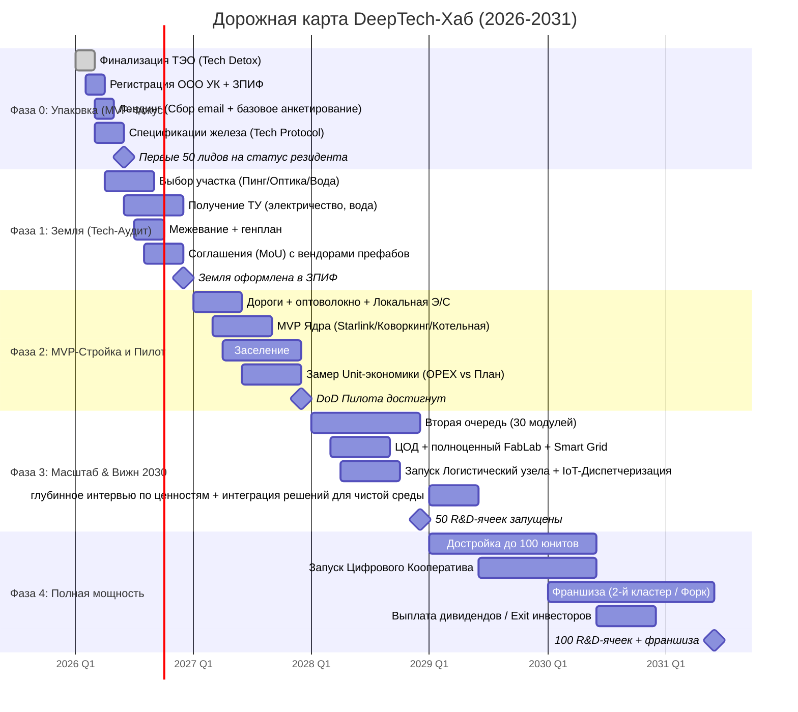

# 11. Дорожная карта: Стратегия реализации

## Навигация

- Вход: [README.md](README.md) · [Манифест_Питчбук_Родовое_Поместье.md](Манифест_Питчбук_Родовое_Поместье.md) · [ТЭО_Родовое_Поместье_План_разделов.md](ТЭО_Родовое_Поместье_План_разделов.md)
- Проверка: [ИСТОЧНИКИ_И_БЕНЧМАРКИ.md](ИСТОЧНИКИ_И_БЕНЧМАРКИ.md) · [Приложения_Библиотека_Технологий/](Приложения_Библиотека_Технологий/)
- Переход: [← Риски](ТЭО_Родовое_Поместье_Раздел_10_Риски_и_пути_их_минимизации.md) · [Сценарии жизни →](ТЭО_Родовое_Поместье_Раздел_12_Сценарии_Жизни.md) · [В начало](README.md)

---

## 11.1. Дорожная карта исполнения: 4 шага к цели

Мы не строим "светлое будущее" за один день. Мы двигаемся итерациями.

### Чего мы сознательно не делаем на пилоте

1. Не продаём инвестору или резиденту полный набор DeepTech-обещаний без земли, ТУ и Node Zero.
2. Не перегружаем пилот сложными финтех-, ESG- и AI-надстройками, если ещё не работает базовый сервисный контур.
3. Не подменяем готовность проекта количеством текста: приоритет у доказательств, контрактов и эксплуатационных регламентов.
4. Не загоняем пилот в необратимую капитальную стройку там, где можно сначала проверить спрос и быт реверсивными low-impact модулями.

Отдельный смысл этой последовательности в том, что проект учит работать с материальной реальностью не из дефицита, а из зрелости. Семья, пара, сообщество и инженерная среда здесь не конкурируют друг с другом, а собираются в единую систему созидания.

### Шаг 1: Упаковка проекта (месяцы 1-3)

**Задача:** превратить идею в понятный для инвестора и региона пилотный продукт.

**Действия:**

- Финализация финмодели (Jupyter-ноутбук → Web-Дашборд).
- Регистрация ООО «УК Инновационная Среда» (Venture Builder) и ЗПИФ Недвижимости.
- Сайт-лендинг для сбора заявок резидентов (рекомендация от действующих участников).

### Шаг 2: Посевная стадия (месяцы 4-12)

**Задача:** обеспечить землю, юридический контур и проектирование без потери темпа.

**Действия:**

- Покупка участка 150 га (или аренда).
- Получение ТУ на электричество.
- Разметка участков (межевание) под кластеры.
- Подготовка Zero Trace Habitat spec: перечень узлов, паспорт материалов, протокол демонтажа, критерии восстановления площадки.

### Шаг 3: Развёртывание пилота (год 2)

**Задача:** собрать Ядро и первые жилые, гостевые и сервисные модули так, чтобы территория сразу начала работать как среда жизни и труда.

**Действия:**

- Дороги + Smart Grid + ЦОД.
- Строительство инфраструктурного Ядра (IT-хаб, модульный FabLab, Логистический хаб).
- Развёртывание 1-2 эталонных Zero Trace Habitat юнитов как демонстратора обратимого строительства.
- Заезд первых 10 R&D-команд (Пионеры Синдиката).

### Шаг 4: Масштабирование и выход (год 5)

**Задача:** выйти на полную мощность, подтвердить повторяемость модели и дать инвестору прозрачный сценарий возврата капитала.

**Действия:**

- Полный capacity: 100 активных договоров сервисного контура и доступа к инфраструктуре.
- Рефинансирование кредитов, старт работы полномасштабных DeepTech производств.
- Выплата дивидендов инвесторам этапа Seed или продажа доли институционалам.

## 11.1.1. Ворота стадий (Stage-Gates) и критерии полной готовности (Definition of Done)

| Ворота | Срок | Что должно быть закрыто |
| :--- | :--- | :--- |
| **Gate A** | 45 дней | участок shortlist → 1 приоритет, land memo, черновой Data Room, владельцы потоков |
| **Gate B** | 120 дней | юрмемо пилота, договоры v1, финмодель на КП, 5+ LoI/резервов |
| **Gate C** | до конца пилота | Node Zero, 5–10 семей-пионеров, работающий сервисный контур, 10 KPI в дашборде |

**Критерий полной готовности пилота:** участок и инфраструктура легально и технически подтверждены, резиденты прошли онбординг, ядро работает в штатном режиме, а базовая юнит-экономика подтверждена не гипотезами, а фактами.

---

## 11.2. Сводная таблица инвестиционной привлекательности

*Примечание: значения приведены по расчетной модели (см. Раздел 5) и служат ориентиром для обсуждения; не являются офертой и требуют валидации на пилоте и в ходе due diligence.*

| Параметр | Значение | Бенчмарк | Наше преимущество |
| :--- | :--- | :--- | :--- |
| **NPV (10 лет, r=18%)** | +187 млн руб. | Средний КП: 0-20 млн | Выше типового КП (по расчетной модели) |
| **IRR** | 28.4% | Банк. депозит 21%, КП 12-15% | +13 п.п. vs КП |
| **Точка безубыточности** | 38 домохозяйств | КП: 60-80 | Быстрее на 40% |
| **Потенциал капитализации (5 лет)** | Сценарно: выше типового КП при выполнении предпосылок | КП: x1.3-1.5 | Эффект экосистемы |
| **Прирост гумуса** | +1% за 5 лет | КП: не измеряется | Капитализация земли, органическая продукция |
| **Углеродная нейтральность (Net-Zero)** | Достижимо | Средний КП: нет | Номинальная отчетность (квоты) |
| **NPS (прогноз)** | >60 | Средний КП: 15-25 | Отбор + сообщество |
| **UN SDGs покрытие** | 10 из 17 | КП: 0-2 | ESG-рейтинг |

---

## 11.3. Расширенная дорожная карта (Roadmap v3.0)

### Ключевые вехи (Milestones)

| Веха | Дата | Критерий достижения | Ответственный |
| :--- | :--- | :--- | :--- |
| **M1: Product-Market Fit** | Q2 2026 | 50+ заявок от резидентов, 3+ заинтересованных инвестора | Ком. директор |
| **M2: Land Secured** | Q4 2026 | Участок оформлен или зафиксирован исполнимой схемой пилота, ТУ получены | Юрист / Land lead |
| **M3: First Settlers** | Q4 2027 | 5-10 семей-пионеров заехали, Node Zero и Ядро функционируют | Директор УК |
| **M4: Breakeven** | Q4 2028 | 50 активных жилых и сервисных единиц (>точки безубыточности: 38), OPEX покрывается | Фин. директор |
| **M5: Full Scale + Franchise** | H1 2031 | 100 юнитов, запуск 2-го кластера (Форк), дивиденды | Синдикат |

## 11.3.1. Матрица доказательств для следующей стадии

| Блок | Минимум для перехода |
| :--- | :--- |
| **Земля** | кадастр, ограничения, фото, логистика, инженерный скрининг |
| **Право** | MVP-правовой путь, шаблоны договоров, политика данных |
| **Финансы** | CAPEX-book, OPEX-book, stress test, сценарии |
| **Коммерция** | пакеты, тарифы, воронка, LoI/MoU, резервы |
| **Технологии** | Node Zero spec, middleware, dashboards, регламенты SLA |
| **Строительная обратимость** | каталог Zero Trace Habitat, карта демонтажа, material passports, recovery SLA, базовый restoration audit |
| **Команда** | RACI, named owners, advisors, ритм управления |

---

## 11.4. Предложение для партнёров: почему проекту можно доверять уже сейчас

### Для Государства (региональные администрации)

- **Просим:** Выделение земли без торгов (как МИП / ОЭЗ) + субсидия на дорожную магистраль.
- **Даём:** Создание высокотехнологичного парка исследований и разработок на локации, которая ранее простаивала. Удержание ИТ-кадров от релокации, рост налоговой базы, исполнение КПЭ по нацпроектам «Цифровая экономика», «Жильё», «Экология».

### Для Институционального Инвестора

- **Вход:** от 50 млн руб. (пай ЗПИФ «Инновационная Среда» / доля в Venture Builder).
- **Доходность:** ориентир по базовому сценарию финмодели — IRR 28.4% (см. Раздел 5); фактические значения зависят от параметров пилота, структуры финансирования и темпов продаж/заселения.
- **ESG-рейтинг:** Инвестиция маппируется на 10 UN SDGs. Проект Net-Zero.
- **Exit:** Продажа пая на вторичном рынке институционалу / Поглощение Синдикатом.

**Что особенно важно в 2026:** инвестор должен видеть не только upside, но и дисциплину исполнения. Поэтому сильнейший оффер проекта сегодня — это сочетание трёх вещей: понятный пилот, доказательная экономика и антихрупкая архитектура спроса.

Отдельный усилитель оффера: **антихрупкая архитектура строительства**. Если часть пилота создаётся по стандарту Zero Trace Habitat, инвестор получает не просто квадратные метры, а портфель реверсивных активов, которые легче перестраивать, релокировать и выводить из эксплуатации без тяжёлого остаточного ущерба для земли и баланса проекта.

**Оффер расконцентрации и «физического блокчейна»:**  
Вкладывать капитал только в масштабные внешние финансовые центры сегодня означает принимать зависимость от одной географии и одной институциональной среды. Проект предлагает более устойчивую альтернативу: **сеть распределённых жизненных пространств**, распределённых по регионам. Сплав передовых технологий и первозданной природы обеспечивает многоуровневую безопасность резидентов и капиталов. Если один элемент временно выпадает, сеть не теряет устойчивость.

**Россия как сильный базовый контур:** территория РФ с её земельными, энергетическими и логистическими ресурсами — одна из лучших сред для развёртывания такой автономной сети. Архитектура хабов концептуально работает как **физический блокчейн**: распределённые узлы, приватность резидентов, ограниченный выпуск премиальных узлов и прозрачное цифровое управление. Инвестор получает актив, обеспеченный базовыми ресурсами, инфраструктурой и человеческим капиталом, а не только спекулятивным спросом.

### Для IT-специалистов, Инженеров и Фаундеров

- **Вход:** Прохождение глубинного интервью по ценностям + депозит по договору доступа к сервисному контуру.
- **Получаете:** Готовый к жизни префаб-модуль, умную энергосеть, доступ в цифровую мастерскую FabLab и логистический хаб, гигабитный mesh-интернет, венчурное фондирование ваших проектов. Не побег от мира, а более сильную и суверенную конфигурацию жизни.
- **Доход:** Удалённая работа + агробизнес + кооперативные выплаты = **220 тыс. руб./мес.** (базовый сценарий, 3-й год).
- **Перспектива:** «Родовой капитал» к 10-му году = **18+ млн руб.** (ликвидный актив).

### Для Экспертного Сообщества

Нам нужна ваша экспертиза:

1. Валидация финансовой модели (NPV/IRR-расчёты, допущения).
2. Замечания по правовым конструкциям (аренда + опцион + кооператив).
3. Рекомендации по ESG-методологиям и источникам данных.
4. Интро к потенциальным партнёрам (банки, застройщики, агрономы).

---

## 11.5. Финальное слово

Мы не изобретаем велосипед. Мы берём идею, которая живёт в сердцах миллионов россиян, свой дом на своей земле, и переводим её в язык современной экономики, права и технологий.

Проект **«DEEPTECH-ХАБ»** — это:

- **Для государства** — инструмент исполнения Национальных целей (экономика, кадры, технопарки, экология) без избыточной нагрузки на бюджет; инструмент демографической и продовольственной политики.
- **Для инвестора** — инфраструктурный актив с повторяемой выручкой от сервисов Ядра, транспорта, энергии и производственных контуров, защищённый базовый актив и венчурный контур интеллектуальных прав и долей; **принципиально иная архитектура риска** по сравнению с концентрированными суперхабами: распределённый портфель узлов, отказоустойчивый по конструкции.
- **Для территории** — возможность развивать пилот без необратимой строительной травмы: лёгкие модули, сухая сборка, измеримый протокол демонтажа и сценарий возврата площадки к «чистой поляне».
- **Для резидента** — операционная среда с реальной многоуровневой безопасностью: продовольственной, энергетической, информационной, физической — где выгодно создавать продукты, осваивать навыки и строить проекты в партнёрстве с инфраструктурой хаба.

> *«DeepTech-Хаб — это мост между амбицией и реализацией, между городским удобством и свободой строить на своих условиях, между инфраструктурой и человеческим потенциалом.»*

**Следующий шаг — пилот и верификация допущений.**

---

## 11.6. Impact Scorecard: Единая карта ценности проекта

*Агрегированный взгляд на проект для любой аудитории за 60 секунд.*

| Измерение | Метрика | Значение | Статус |
| :--- | :--- | :--- | :---: |
| **💰 Финансы** | IRR (10 лет) | 28.4% (расчётная модель) | ✅ |
| **💰 Финансы** | NPV (r=18%) | +187 млн руб. | ✅ |
| **💰 Финансы** | Точка безубыточности | 38 резидентов | ✅ |
| **👨‍👩‍👧‍👦 Социум** | SROI | 1 : 4.2 | ✅ |
| **👨‍👩‍👧‍👦 Социум** | Рабочие места | 50+ прямых | ✅ |
| **👨‍👩‍👧‍👦 Социум** | СКР (рождаемость) | 2.5 | 🎯 |
| **🌍 Экология** | Прирост гумуса | +1% за 5 лет | 🎯 |
| **🌍 Экология** | SDG покрытие | 10 / 17 | ✅ |
| **🌍 Экология** | Энергоавтономия | >60% ВИЭ к 5-му году | 🎯 |
| **🧠 Технологии** | AI-модули | 6 | ✅ |
| **🧠 Технологии** | IoT-Диспетчеризация | Cesium.js + IoT | 🔧 |
| **🧠 Технологии** | Индекс инновационности | 53/60 (внутренняя самооценка) | требует внешней валидации |
| **❤️ Здоровье** | Больничные дни/год | <7 (vs 14 РФ) | 🎯 |
| **❤️ Здоровье** | Индекс счастья | >7.5/10 (vs 5.8 РФ) | 🎯 |
| **📈 Масштаб** | Целевая воронка (5 лет) | 100 семей | 🎯 |
| **📈 Масштаб** | Франшиза (10 лет) | 10 кластеров | 🎯 |
| **🔒 Сетевая безопасность** | Уровни расконцентрации | 6 (капитал / люди / пр-во / экология / еда / данные) | ✅ |
| **🔒 Сетевая безопасность** | Fault-tolerance | Отказ 1 узла ≠ отказ системы | ✅ |
| **🌐 Геополитика** | Позиционирование vs суперхабы | Дубай/Сингапур — проигрывают по 6/9 критериев безопасности | ✅ |
| **🌐 Геополитика** | Russia sandbox | 17.1 млн км², дешёвая энергия (4-7 руб./кВт·ч), СМП | ✅ |
| **🌐 Геополитика** | ESG-премия рынка | +15-25% к стоимости distributed активов (MSCI 2025) | ✅ |
| **🪙 Физ. Блокчейн** | RWA-баллизация | ЗПИФ + сервисный инфраструктурный контур = ранний игрок $10 трлн рынка (Deloitte 2025) | 🎯 |
| **🪙 Физ. Блокчейн** | Лимитированная «эмиссия» | Кол-во premium-узлов ограничено — дефицит → рост цены пая | ✅ |

Статусы: ✅ = подтверждено расчётами · 🎯 = целевой показатель · 🔧 = в разработке

> **Позиционирование:** на **одной странице** собрана вся ценность проекта для государства, инвестора, резидента и территории. Это слайд, после которого у сильного собеседника возникает не вопрос «что это вообще?», а вопрос «как войти в пилот?».
>
> **Конкурентная рамка 2026:** пока конкуренты концентрируют капитал в суперхабах, мы строим распределённую сеть, физический блокчейн, обеспеченный землёй, лесом, водой и технологиями. Каждый внешний шок повышает цену не хаоса, а устойчивости.

---

*Контакты проекта:*

- GitHub: [github.com/NeuroLoft](https://github.com/NeuroLoft)
- Email: [ecobrainstorming@gmail.com](mailto:ecobrainstorming@gmail.com)
- Telegram: [@NeuroLoft](https://t.me/NeuroLoft)

