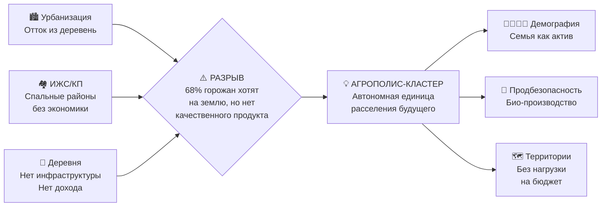

# 1. Введение: От философии к инженерной системе

## Навигация
- Вход: [README.md](README.md) · [Манифест_Питчбук_Родовое_Поместье.md](Манифест_Питчбук_Родовое_Поместье.md) · [ТЭО_Родовое_Поместье_План_разделов.md](ТЭО_Родовое_Поместье_План_разделов.md)
- Проверка: [ИСТОЧНИКИ_И_БЕНЧМАРКИ.md](ИСТОЧНИКИ_И_БЕНЧМАРКИ.md) · [Приложения_Библиотека_Технологий/](Приложения_Библиотека_Технологий/)
- Переход: [← План](ТЭО_Родовое_Поместье_План_разделов.md) · [Следующий →](ТЭО_Родовое_Поместье_Раздел_2_Резюме_проекта.md)

---

## 1.1. ДНК Проекта: Умная Среда Обитания
**Главный тезис:** Проект «Агрополис-Кластер» переносит стандарты **«Умного Города» (Минстрой РФ)** на сельскую территорию, создавая полноценную среду жизни, где высокое качество и экономическая эффективность достигаются за счет синергии человеческого капитала, природных циклов и цифровых платформ.

Мы не строим "дачные поселки". Мы создаем **автономные единицы расселения будущего**, которые решают триединую задачу:
1.  **Демографический ренессанс** (семья как актив).
2.  **Продовольственная безопасность** (локальное био-производство).
3.  **Освоение территорий** (без нагрузки на федеральный бюджет).

## 1.2. Проблема: Кризис старых моделей
Анализ текущей ситуации (см. [Раздел 4](ТЭО_Родовое_Поместье_Раздел_4_Анализ_рынка_и_зарубежных_аналогов.md)) показывает тупик двух доминирующих подходов:
*   **ИЖС / Коттеджные поселки:** Спальные районы без рабочих мест («маятниковая миграция», нагрузка на город).
*   **Традиционная деревня:** Отсутствие инфраструктуры, низкий доход, отток молодежи.

**Разрыв:** Существует гигантский спрос на жизнь на земле (по данным ВЦИОМ — 68% горожан), но отсутствует **инженерно-экономический продукт**, способный обеспечить городской комфорт и доходность выше депозита.

## 1.3. Решение: Агрополис как Кооперативная Экосистема

Мы предлагаем относиться к поселению как к **единому хозяйствующему субъекту**, где:
*   **Жители** — совладельцы (пайщики кооператива).
*   **Территория** — актив, капитализируемый через инфраструктуру и экологию.
*   **Управление** — цифровая платформа (Цифровой Кооператив) с прозрачными метриками эффективности.

В основе решения лежит **гибридная архитектура**:
*   *Право:* Адаптация лучших практик жилищной кооперации под ГК РФ (долгосрочная аренда + целевой выкуп).
*   *Технология:* Пакетное внедрение решений («Паспорт объекта»: дом + скважина + солнечная станция + ЛОС).
*   *Экономика:* Монетизация не только продукции, но и **экосистемных услуг** (углеродные квоты, агротуризм).

## 1.4. Навигация для стейкхолдеров (Резюме для руководства)
ТЭО структурировано так, чтобы каждый участник нашел ответ на свои КПЭ:

| Для кого | Ключевой раздел | Ожидаемый результат (Ценность) |
| :--- | :--- | :--- |
| **Государство (Чиновник)** | [Раздел 7 (КПЭ)](ТЭО_Родовое_Поместье_Раздел_7_KPI_и_показатели_эффективности.md) | Исполнение Нацпроектов «Демография», «Экология». Снижение соц. нагрузки. |
| **Инвестор (Партнер)** | [Раздел 5 (Финмодель)](ТЭО_Родовое_Поместье_Раздел_5_Финансовая_модель.md) | Доходность > 18%, «зеленый» портфель, прогнозируемый денежный поток. |
| **Семья (Житель)** | [Раздел 3 (Концепция)](ТЭО_Родовое_Поместье_Раздел_3_Описание_концепции.md) | Доход > 150 тыс. руб., здоровье детей, рост Родового Капитала. |

---
*Методологическая основа документа базируется на разработках Экономического факультета МГУ им. М.В. Ломоносова (научная школа М.Ю. Павлова) в области экономики природопользования и устойчивого развития сельских территорий, а также соответствует целям Национальных проектов РФ.*

---

## 1.5. Макроконтекст 2026: Почему именно сейчас

### Ключевые тренды, открывающие окно возможностей

| Тренд | Данные (2024–2026) | Как используем |
| :--- | :--- | :--- |
| **Удалённая работа** | 40%+ IT-специалистов РФ работают удалённо (hh.ru, 2025). Средняя з/п 200-400 тыс. р. | IT-резиденты — ядро ЦА. Коворкинг 500 Мбит/с в Ядре. |
| **Высокие ипотечные ставки** | КС ЦБ = 21% (фев. 2026). Рыночная ипотека >25%. Но: сельская 3%, семейная 6%, IT 5% | Льготная ипотека — наш главный конкурентный козырь |
| **ESG и Impact Investing** | Глобальный рынок $1.16 трлн (GIIN 2024). Green Bonds РФ: рост в 3 раза за 2 года | ESG-маркировка проекта, Green Bond, SIB |
| **AI в сельском хозяйстве** | AgriTech рынок $100B+ (2025). Рост 20%/год | AI Crop Advisor, Predictive Maintenance, GenAI-ассистент |
| **Регенеративное земледелие** | Biodiversity Credits: $5B к 2030 (WEF). Carbon credits РФ: реестр запущен | Soil Health Passport + Carbon/Biodiversity credits |
| **Цифровые финансовые активы (RWA)** | Рынок RWA $16 трлн к 2030 (McKinsey). ФЗ-259 РФ о ЦФА | Земельные ЦФА, кооперативные токены |
| **Спрос на землю** | 68% горожан хотят жить на земле (ВЦИОМ, 2023). Рынок ИЖС +25%/год | Продукт, которого не хватает рынку |

> **Вывод:** Совпадение 6+ макротрендов создаёт **идеальное окно** для запуска. Через 2-3 года оно может закрыться (отмена льготных программ, насыщение рынка). **Действовать нужно сейчас.**
