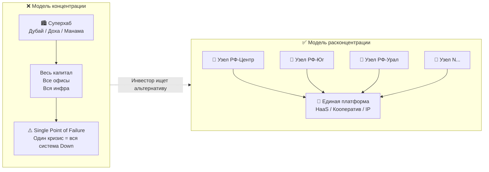
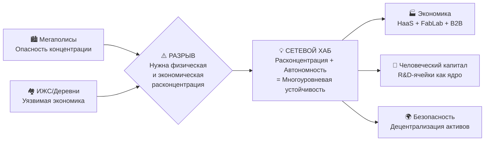

# 1. Введение: От философии к инженерной системе

> *«Через 20 лет вы будете больше разочарованы теми вещами, которые вы не сделали, чем теми, которые сделали. Отчальте от тихой гавани.»*
> — Марк Твен

**Версия документа:** 4.0 (февраль 2026) · **Индекс инновационности:** внутренняя самооценка, ожидает внешней валидации · **SDG-покрытие:** 10/17

## Навигация

- Вход: [README.md](README.md) · [Манифест_Питчбук_Родовое_Поместье.md](Манифест_Питчбук_Родовое_Поместье.md) · [ТЭО_Родовое_Поместье_План_разделов.md](ТЭО_Родовое_Поместье_План_разделов.md)
- Проверка: [ИСТОЧНИКИ_И_БЕНЧМАРКИ.md](ИСТОЧНИКИ_И_БЕНЧМАРКИ.md) · [Приложения_Библиотека_Технологий/](Приложения_Библиотека_Технологий/)
- Переход: [← План](ТЭО_Родовое_Поместье_План_разделов.md) · [Следующий →](ТЭО_Родовое_Поместье_Раздел_2_Резюме_проекта.md)

---

## 1.1. ДНК Проекта: Инновационная Среда Жизни, Труда и Капитала

**Главный тезис:** Проект «DeepTech-Хаб» переносит стандарты **умной инфраструктуры** и **кластеров исследований и разработок (R&D)** на территорию вне мегаполиса, создавая полноценную среду жизни, производства и накопления капитала. Экономическая эффективность достигается за счёт синергии человеческого капитала, модульной инфраструктуры по модели «жильё как сервис» (HaaS) и цифровой платформы управления.

Мы не строим "дачные поселки". Мы создаем **автономные производственно-жилищные кластеры будущего**, которые решают триединую задачу:

1. **Формирование нового технологического уклада** (инфраструктура для IT и креативных индустрий).
2. **Экономическая и продовольственная безопасность** (децентрализованное производство, агро-инновации).
3. **Демографический ренессанс и освоение территорий** (без нагрузки на федеральный бюджет).

## 1.2. Проблема: Кризис старых моделей и Глобальная Угроза Макроконцентрации

Анализ текущей ситуации (см. [Раздел 4](ТЭО_Родовое_Поместье_Раздел_4_Анализ_рынка_и_зарубежных_аналогов.md)) показывает тупик двух доминирующих подходов:

- **ИЖС / Коттеджные поселки:** Спальные районы без рабочих мест («маятниковая миграция», нагрузка на инфраструктуру).
- **Традиционная деревня:** Отсутствие инфраструктуры, низкий доход, отток молодежи.

### 1.2.1. Геополитический перелом: конец эпохи суперхабов

**Ситуация 2024–2026** фиксирует исторический сдвиг: **концентрация** перестала быть синонимом эффективности и стала синонимом уязвимости. Мировые финансовые суперхабы — **Дубай (ОАЭ), Доха (Катар), Маскат (Оман), Манама (Бахрейн), Сингапур** — десятилетиями притягивали капиталы, штаб-квартиры и передовые кадры. Сегодня их главное преимущество стало фатальной уязвимостью. Вкладывать капитал, открывать филиалы и перевозить бизнес в классические ближневосточные мега-хабы теперь объективно опасно на фоне обострения противостояния по линии «Иран — коалиция США»: концентрация инвестиций, заблокированной логистики и офисов в одной географической точке работает как гигантский магнит для ракетных, санкционных и корпоративных рисков. Эпоха стеклянных башен под прицелом уступает место архитектуре защищённых распределённых сетей.

| Тип концентрации | Хаб-пример | Реализованный / потенциальный риск |
| :--- | :--- | :--- |
| **Финансовая** | Дубай (DIFC), Манама | Санкционная блокировка счетов и транзакций; юрисдикционный риск при смене геополитической ориентации партнёра |
| **Корпоративная недвижимость** | Дубай, Доха (офисные башни) | Точечная остановка регионального хаба при дипломатическом кризисе или военном обострении |
| **Инвестиционная недвижимость** | Дубай (Пальма Джумейра, Marina) | Резкая волатильность при геополитических событиях; доп. риск природных катаклизмов (наводнение апрель 2024) |
| **Логистическая** | Доха (порт Хамад), Маскат | Уязвимость Ормузского пролива и Баб-эль-Мандебского пролива как инфраструктурные «горлышки» |
| **Экологическая** | Все мегаполисы | Смог, перегрузка водо- и теплоснабжения, тепловые острова, нулевая пищевая и энергетическая автономия |
| **Цифровая/данные** | Гиперскейл-датцентры | Единый физический объект = единая точка атаки или аварии (Single Point of Failure) |

> **Системный вывод:** Мегаполис, финансовый суперхаб, гиперскейл-датацентр, монофабрика — все они работают по одной логике: **высокая эффективность в спокойные времена → катастрофная уязвимость при шоке**. Инвестор, вложивший в концентрированный хаб, принимает на себя риск, который не поддаётся диверсификации внутри самого этого хаба.

### 1.2.2. Расконцентрация: Архитектура антихрупкости и многоуровневой безопасности

**Расконцентрация** — это концептуальный ключ и ядро проекта. Мы децентрализуем не только капиталы, но и саму жизнь: мы "размазываем" городскую среду по регионам, снимая критическую напряженность — экологическую, транспортную, психологическую. Концентрация всегда несет угрозу (скопление выбросов, отходов, стоков, стресса). Расконцентрация плюс сетевая структура создают **многоуровневую безопасность**: защиту жителей, защиту капиталов, продовольственный и энергетический суверенитет.

Проект **DeepTech-Хаб** построен на принципе **сети малых автономных узлов**, вписанных в первозданную природу. Это не побег из цивилизации, а новая инженерная форма цивилизации: высокие технологии, встроенные в живой ландшафт без разрушения его логики. Такая связка воспроизводит три доказанных принципа устойчивости:

1. **Отказоустойчивые распределённые системы (fault-tolerant distributed systems)**: отказ одного узла не приводит к остановке всей сети — она перераспределяет нагрузку.
2. **Рассредоточение сил** (военная тактика): децентрализованная структура практически нечувствительна к точечным ударам, цель трудно идентифицировать и поразить.
3. **Принцип биоразнообразия** (экология): моноплантация уничтожается одним паразитом или заморозком, экосистема с разнообразием видов самовосстанавливается.

DeepTech-Хаб масштабируется как **децентрализованная сеть кластеров**, каждый из которых:

- **Автономен** в базовых ресурсах (энергия ← умная энергосеть Smart Grid, вода ← локальные очистные системы, еда ← агроконтур, данные ← локальный центр обработки данных).
- **Связан** в единую операционную платформу (жильё, транспорт и энергия как сервис: HaaS/MaaS/EaaS, цифровой кооператив, фабрика стартапов Venture Builder, общий реестр интеллектуальных прав).
- **Взаимозаменяем** на уровне команд, капиталов и сервисов — резидент одного узла может работать с инфраструктурой другого.

Отказ одного узла (форс-мажор, локальная авария, административный риск) **не обнуляет портфель** — сеть продолжает функционировать, а инвестор сохраняет доходность через оставшиеся узлы.

**Разрыв рынка:** Существует гигантский спрос на жизнь на земле (по данным ВЦИОМ — 68% горожан) и острая потребность крупного капитала в **расконцентрации активов**, но отсутствует готовый инженерно-экономический продукт, способный обеспечить городской комфорт, высокодоходные рабочие места и физическую безопасность за пределами мегаполиса.

## 1.3. Решение: DeepTech-Хаб как Сетевая Экосистема Безопасности

Мы предлагаем относиться к поселению как к **единому сетевому узлу, распределенному технопарку и зоне безопасности**, где:

- **Парадигма расконцентрации:** проект распределяется по регионам системой малых кластеров, снимая риски централизованного удара. Если поражается один элемент социальной или ИТ-сети, вся система сохраняет устойчивость.
- **Глубокая интеграция инструментов:** снижение барьеров для входа через финансовые инструменты, включая лизинг производственного оборудования и реверсивных модульных домов.
- **Резиденты** — соинвесторы и пользователи HaaS-инфраструктуры, участники распределённой производственной сети.

В основе решения лежит **гибридная архитектура**:

- *Право:* адаптация практик кооперации, лизинговых контрактов и режимов особых экономических зон.
- *Технология:* пакетное внедрение решений (паспортизация объектов, цифровая мастерская FabLab, распределённая умная энергосеть Smart Grid).
- *Экономика:* монетизация в сфере ИТ, микропроизводства, логистики и сервисных контуров; углеродные инструменты — опционально, как надстройка при наличии рынка и регуляторики.

## 1.4. Навигация для стейкхолдеров (Резюме для руководства)

ТЭО структурировано так, чтобы каждый участник нашел ответ на свои КПЭ:

| Для кого | Ключевой раздел | Ожидаемый результат (Ценность) |
| :--- | :--- | :--- |
| **Государство (Чиновник)** | [Раздел 7 (КПЭ)](ТЭО_Родовое_Поместье_Раздел_7_KPI_и_показатели_эффективности.md) | Исполнение Нацпроектов по суверенитету, инновациям и экологии. Создание рабочих мест. |
| **Инвестор (Партнер)** | [Раздел 5 (Финмодель)](ТЭО_Родовое_Поместье_Раздел_5_Финансовая_модель.md) | Доходность > 18%, диверсифицированный "зеленый" портфель, прогнозируемый денежный поток. |
| **Резидент (Команда)** | [Раздел 3 (Концепция)](ТЭО_Родовое_Поместье_Раздел_3_Описание_концепции.md) | Рост дохода и производительности, доступ к инфраструктуре (HaaS), капитализация личного и проектного портфеля (IP/доли). |

---
*Методологическая основа документа базируется на разработках Экономического факультета МГУ им. М.В. Ломоносова (научная школа М.Ю. Павлова) в области экономики природопользования и устойчивого развития сельских территорий, а также соответствует целям Национальных проектов РФ.*

---

## 1.5. Конкурентный ров (Competitive Moat): 8 барьеров входа

*Почему проект невозможно скопировать «за выходные» и в чём стратегическая уникальность.*

| # | Барьер | Суть | Время на воспроизведение |
| :--- | :--- | :--- | :--- |
| 1 | **Комплексная архитектура** | 12 разделов ТЭО + финмодель + интеграция пром_сектора — 2000+ часов интеллектуальной работы | 12-18 мес. |
| 2 | **AI-слой и Smart-Инфраструктура** | Модули GenAI, CV-мониторинг, автоматизация производства и логистики | 6-12 мес. |
| 3 | **Академия Резидентов** | Уникальная воронка отбора: ценностный мэтчинг + биржа компетенций + стажировка в R&D/производственных контурах | Не воспроизводимо (ноу-хау) |
| 4 | **ЦФА-интеграция** | Земельные и промышленные баллы (ФЗ-259) | 12+ мес. (регуляторный путь) |
| 5 | **ESG-сертификация и квоты** | Монетизация углеродного следа (GRI + GHG Protocol) для фондирования | 6-12 мес. |
| 6 | **Open Source стратегия** | Парадоксальный рвов: открытость = сетевой эффект, бренд-лидерство, community | Требует философского alignment |
| 7 | **IoT-Диспетчеризация** | Живая 3D-модель территории с real-time IoT → доказательство технологической зрелости | 8-12 мес. |
| 8 | **Сетевая Расконцентрация (Physical Blockchain)** | Архитектурный принцип: сеть автономных узлов → fault-tolerant портфель vs. одиночный хаб. Это не тиражируемая «фишка» — это парадигма. Требует перестройки всей бизнес-модели. | 18–36 мес. + смена ментальной модели |

> **Итого:** Полное воспроизведение потребует **$500K+ и 18+ месяцев**. За это время проект уже выходит на M3: первые 15 HaaS-модулей и исследовательско-производственных ячеек запущены. Преимущество первого хода здесь не маркетинговое, а структурное.

> **8-й барьер — самый стратегически значимый:** парадигму «физического блокчейна» невозможно скопировать за деньги. Это требует полного пересмотра бизнес-логики от концентрации к расконцентрации — ментального перехода, который рынок ещё только начинает совершать.

---

## 1.6. Макроконтекст 2026: Почему именно сейчас

### Ключевые тренды, открывающие окно возможностей

| Тренд | Данные (2024–2026) | Как используем |
| :--- | :--- | :--- |
| **Удалённая работа и ИТ-сектор** | 40%+ ИТ-специалистов РФ работают удалённо. Средняя з/п 200-400 тыс. р. | ИТ-резиденты — ядро ЦА, создание ИТ-парков и центров обработки данных. Коворкинг 500 Мбит/с в Ядре. |
| **Децентрализованное производство и инновации** | Тренд на микрофабрики и цифровые мастерские (FabLab), 3D-печать, локализацию пром. цепочек | Размещение экологичных сборочных цехов, роботизированных производств и лабораторий исследований и разработок на территории кластера. |
| **Логистика и транспорт нового типа** | Рост электронной коммерции и потребности в региональных хабах | Создание умных логистических узлов, инфраструктуры для электротранспорта и коптерной доставки. |
| **Внутренний туризм** | Резкий рост спроса на глэмпинги, эко-маршруты и агротуризм | Формирование туристического кластера с интеграцией в локальную экономику поселения. |
| **Углеродная повестка (ESG)** | Глобальный рынок углеродных единиц. Внедрение трансграничного углеродного регулирования. | Сертификация Net Zero, расчет углеродного следа для привлечения "зеленых" инвестиций и фондирования. |
| **Высокие ипотечные ставки** | КС ЦБ = 21% (фев. 2026). Рыночная ипотека >25%. Льготные программы 3–6% могут действовать/меняться | Ипотека — один из каналов входа. Базовая модель устойчивости строится на HaaS (лизинг/подписка) и B2B-экономике. |
| **Искусственный интеллект в бизнесе и АПК** | Рост внедрения AI на 20%/год во всех секторах | ИИ-советник для агроконтура, предиктивное обслуживание производственных линий, генеративный ИИ-ассистент кластера. |
| **Регенеративное земледелие** | Рост спроса на органику. Восстановление почв — глобальный тренд | Базовая продовольственная безопасность резидентов, Soil Health Passport. |
| **Цифровые финансовые активы** | Рынок токенизированных реальных активов (RWA) $16 трлн к 2030 (McKinsey). ФЗ-259 РФ о ЦФА | Земельные и промышленные ЦФА, кооперативные баллы. |
| **Спрос на землю** | 68% горожан хотят жить на земле (ВЦИОМ, 2023). Рынок ИЖС +25%/год | Готовый инженерно-экономический продукт, которого сейчас нет на рынке. |
| **Геополитическая расконцентрация** | Выход капиталов из суперхабов (Дубай, Доха, Манама, Сингапур): геополитика, санкции, климат. Запрос на «рассредоточенные» активы с локальным суверенитетом (PwC Global RE Survey, 2025) | Ключевой инвест-тезис: сеть малых кластеров = резилентный портфель; каждый узел автономен и не создаёт «единой точки отказа» для инвестора |

> **Вывод:** Совпадение **11 макротрендов** формирует не просто окно возможностей, а редкий исторический момент, когда спрос на безопасность, землю, автономию и продуктивную среду совпадает с технологической готовностью решений. Ранний старт позволяет занять нишу и зафиксировать условия по земле и льготным программам до возможного изменения регуляторики.

---

## 1.7. Индекс инновационности проекта

*Ниже приведена внутренняя рабочая самооценка по 6 ключевым параметрам. Она полезна для навигации по сильным сторонам проекта, но не должна трактоваться как независимая внешняя экспертиза до отдельной валидации экспертами, инвесторами и отраслевыми консультантами.*

| Параметр | Оценка (1-10) | Обоснование |
| :--- | :---: | :--- |
| **Технологическая зрелость** | 9/10 | Интеграция реального IT/Пром сектора, AI-модули, IoT-Диспетчеризация, BIM |
| **Бизнес-модель** | 9/10 | Диверсификация: IT-инфраструктура, Пром-хаб, агро как прикладной трек, туризм; целевые ориентиры доходности — см. финмодель |
| **Социальная инженерия** | 10/10 | Академия Резидентов — система пре-квалификации, онбординга и интеграции кадров |
| **Правовая конструкция** | 8/10 | Гибрид: ЗПИФ (базовый актив) + договор инфраструктурной подписки + кооперативные регламенты + цифровой контур управления |
| **ESG-интеграция** | 8/10 | Маркировка Net Zero, трекинг углеродного следа по протоколам GRI/GHG для квотирования |
| **Масштабируемость** | 10/10 | Open Source франшиза, модульная индустриальная архитектура (Prefab) |
| **ИТОГО** | **★ 54/60 (внутренняя самооценка)** | **Категория: DeepTech-Хаб / Промышленно-Жилая Среда; ожидает внешней валидации** |

