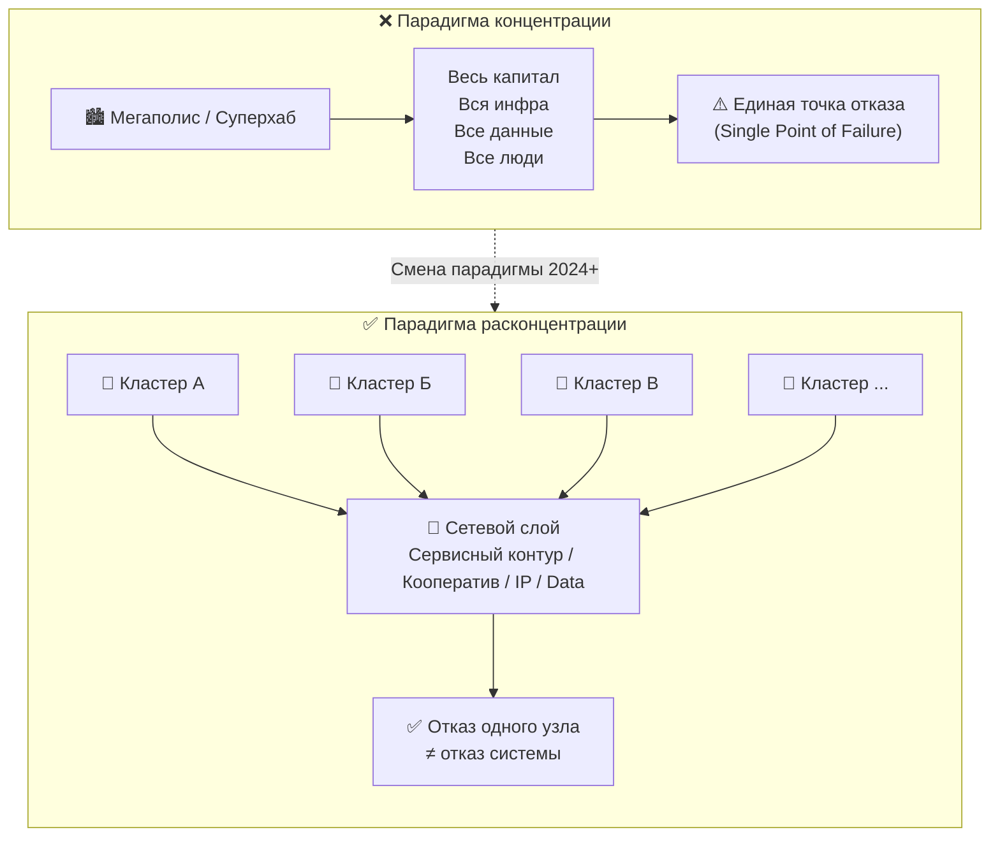
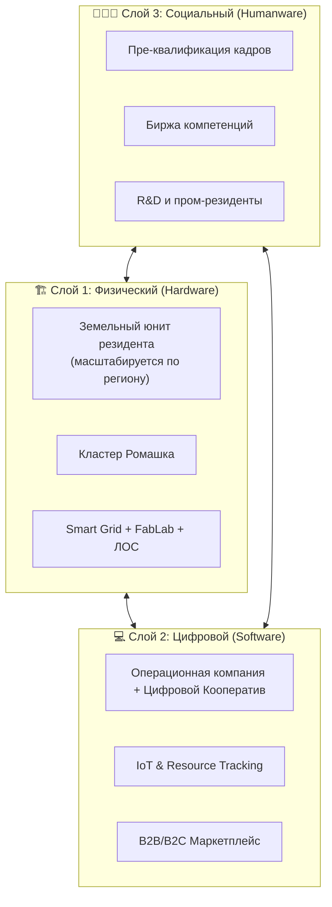
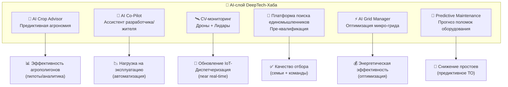
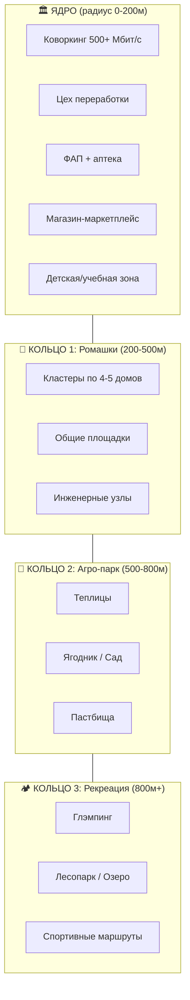
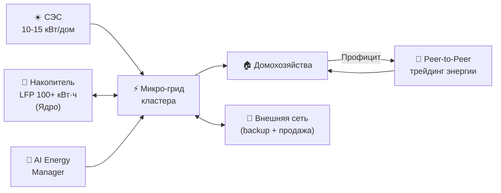
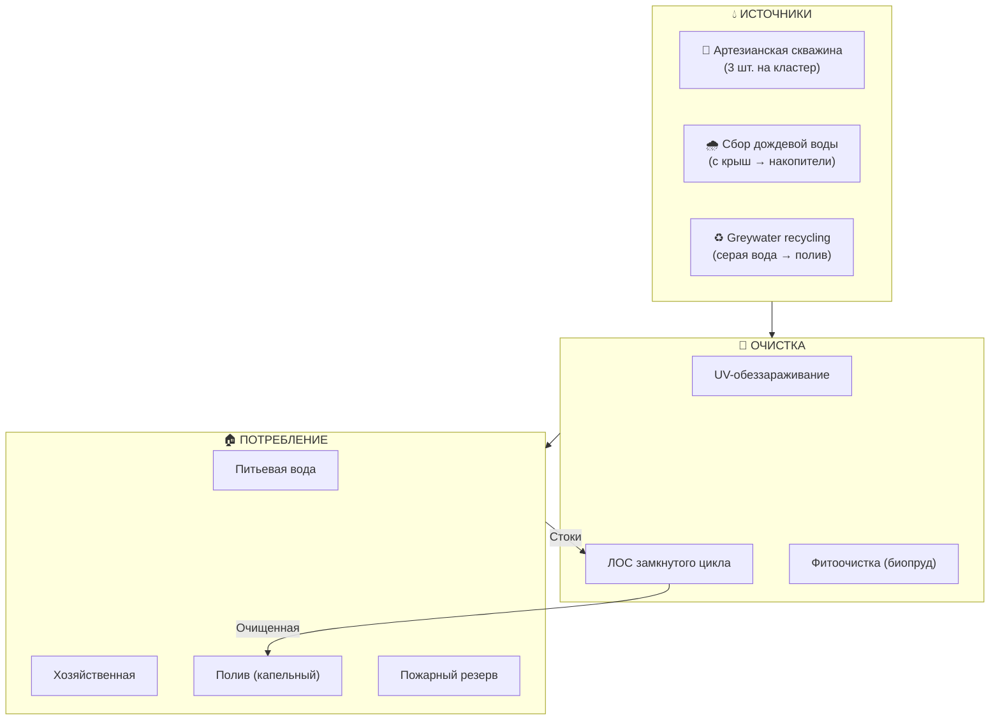
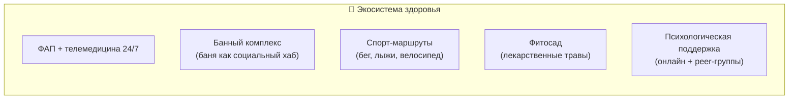

# 🏗️ 3. Описание концепции: Архитектура Smart Habitat

## Навигация

- Вход: [README.md](README.md) · [Манифест_Питчбук_Родовое_Поместье.md](Манифест_Питчбук_Родовое_Поместье.md) · [ТЭО_Родовое_Поместье_План_разделов.md](ТЭО_Родовое_Поместье_План_разделов.md)
- Проверка: [ИСТОЧНИКИ_И_БЕНЧМАРКИ.md](ИСТОЧНИКИ_И_БЕНЧМАРКИ.md) · [Приложения_Библиотека_Технологий/](Приложения_Библиотека_Технологий/)
- **Социальная ОС:** [Gravita+ (Gravita+)](../../../../Gravita+/README.md) — платформа Созидательного Союза (Hardware = ТЭО, Software = Gravita+)
- Переход: [← Резюме](ТЭО_Родовое_Поместье_Раздел_2_Резюме_проекта.md) · [Следующий →](ТЭО_Родовое_Поместье_Раздел_4_Анализ_рынка_и_зарубежных_аналогов.md)

---

## 🛡️ 3.0. Фундаментальный Принцип: Расконцентрация как Архитектура Безопасности

> *Прежде чем описывать слои технической архитектуры — необходимо зафиксировать философский фундамент, из которого вытекает каждое инженерное и организационное решение проекта.*

### Концентрация = уязвимость. Расконцентрация = устойчивость

Эпоха «суперхабов» (мегаполисы, мировые финансовые центры, гиперскейл-датацентры) создала иллюзию вечного комфорта, которая теперь стремительно рушится. Вкладывать капитал, строить корпоративные штаб-квартиры или покупать недвижимость в **Дубае, Дохе, Омане, Бахрейне или Сингапуре сегодня объективно опасно**. Концентрация всего (финансов, людей, активов, данных) в одной географической точке превращает эту точку в идеальную мишень для геополитических шоков, санкционных блокировок и климатических катастроф.

**Принцип расконцентрации** — это концептуальный фундамент и абсолютный мировой тренд. Мы "размазываем" проект по регионам, создавая децентрализованную, экзотическую и ультра-живую сеть, где высокие технологии сплетаются с первозданной экологией. Концентрация всегда несет напряженность: пробки, стресс, концентрация выбросов, отходов, стоков. Наш проект *расконцентрирует* города, снимая эту напряженность на всех уровнях.

**Расконцентрация + сетевая структура = Многоуровневая БЕЗОПАСНОСТЬ**. Если поражается один узел (политический конфликт, блэкаут), вся сеть перехватывает нагрузку и совершенно не теряет устойчивость:

### Многоуровневая безопасность: шесть измерений

Расконцентрация в проекте работает не как один принцип, а как **системная философия**, проявленная на шести взаимосвязанных уровнях:

| Уровень | Что концентрируется сейчас и почему это риск | Как DeepTech-Хаб снимает напряжение |
| :--- | :--- | :--- |
| **Капитал и инвестиции** | Всё в одном хабе/юрисдикции → санкции, заморозки, геополитика | Портфель узлов (ЗПИФ): потеря одного узла не обнуляет портфель |
| **Жизнь и люди** | 70%+ населения в <20% территорий → перегрузка инфраструктуры, риски пандемий, зависимость от городской экономики | Перераспределение людей и компетенций по сети кластеров; каждый узел — полноценная среда, не «спальник» |
| **Производство и цепочки** | Монофабрики, единые логистические хабы → один разрыв цепочки → остановка производств | FabLab в каждом узле: локальное производство «на месте»; сеть → взаимодополняемость, не зависимость |
| **Экология** | Концентрация выбросов, стоков, отходов в одной точке → «экологическая бомба» | Распределение нагрузки на природу; каждый узел работает в замкнутом ресурсном цикле (вода, энергия, органика) |
| **Продовольствие** | Зависимость от импорта и длинных цепочек → уязвимость к логистическим шокам | Агро-контур каждого кластера → базовая продовольственная автономия узла и сети |
| **Данные и управление** | Гиперскейл-датацентры в зарубежных юрисдикциях → суверенный риск | Локальные IoT/ЦОД в каждом кластере + реестр Кооператива на суверенной инфраструктуре |

> **Вывод для инвестора:** каждый рубль, вложенный в DeepTech-Хаб, работает не на один актив в одной точке, а на **право участвовать в сети**, которая продолжает функционировать при выходе из строя любого отдельного элемента. Это не просто ESG-нарратив — это конкурентное преимущество в мире, где геополитическая турбулентность стала нормой.

---

## 🇷🇺 3.1. Территория России как плацдарм и Физический Блокчейн

**Для экспертов, инвесторов и ЛПР (лиц, принимающих решения):**
Россия обладает беспрецедентными и уникальными в мировом масштабе ресурсами для строительства распределённой сетевой структуры безопасности. Огромная территория, избыток генерации (энергоресурсы), мощно развивающаяся логистика (автомагистрали, Северный морской путь, железные дороги) и технологический суверенитет делают её идеальным плацдармом. Это лучшее место для **парковки, сохранения и кратного преумножения крупного капитала**. Сетевая структура на этой бескрайней территории даёт на порядки больше гарантий для капитала.

Концептуально эта сеть работает **по законам сверхнадежной криптовалюты**, перенося её принципы из виртуального мира в физическую землю и инфраструктуру:

1. **Децентрализация**

Нет единого уязвимого "центрального сервера" управления (одного города или банка). Сеть поддерживается самими участниками — множеством автономных кластеров (узлов), географически распределённых по стране. Уничтожение или отключение одного узла не обрушает экономику и процессы всей сети.

1. **Блокчейн (Цепочка блоков)**

Основа устойчивости проекта — неразрывная связь кластеров едиными цифровыми регламентами, договорами доступа к сервисному контуру и платформой кооператива. Каждый "блок" (кластер) содержит свою инфраструктуру, реестр резидентов и историю операций. Изменить правила задним числом без процедур и журналов решений невозможно — это формирует управляемость и доверие к системе.

1. **Криптография (Ключи доступа)**

В пространстве хаба это реализовано как водораздел публичного и приватного. *Публичные ключи (адреса кошельков)* — это экспортные витрины узла: маркетплейс, публичный ESG-рейтинг, внешние сервисы, куда могут поступать средства и запросы. *Приватные ключи* — это личные пространства резидентов, их закрытая интеллектуальная собственность, частная жизнь и внутренние смарт-периметры. Никто извне не имеет доступа за этот криптографический (и физический) забор.

1. **Подтверждение транзакций (Консенсус)**

Новые ценности и операции генерируют и подтверждают участники сети:

- **Майнеры (Proof-of-Work)** — резиденты-созидатели, которые интеллектуальным или физическим трудом на базе инфраструктурного ядра «решают задачи» и добывают реальную ценность, получая награду в виде дохода и статуса. В границах своего частного поместья семья развивает собственный капитал рода.
- **Валидаторы (Proof-of-Stake)** — инвесторы или опытные резиденты, которые блокируют часть своего капитала как залог (паи ЗПИФ внешней инфраструктуры) и подтверждают стабильность сети, получая пассивный доход от комиссий сервисного контура и ликвидности.

1. **Ограниченная эмиссия (Встроенный дефицит)**

Как у Bitcoin существует заранее заданный предел в 21 млн монет, так и в нашей концепции заложен жесткий лимит на количество ультра-премиальных узлов Хаба и инфраструктурных ячеек. Земли в России много, но *квалифицированных инженерией и R&D-ядром территорий* — абсолютный дефицит. По мере масштабирования сети (аналог халвинга) стоимость входа и капитала фундаментально и математически растёт вверх.

1. **Прозрачность и открытость**

Как в блокчейне, все ключевые экономические транзакции Синдиката (бюджеты, закупки, выплаты, KPI) должны быть аудируемы и доступны в дашбордах платформы в пределах прав доступа. При этом частная жизнь и чувствительные данные резидентов не раскрываются — прозрачность относится к управлению активом, а не к личному пространству семьи.

---

## 🍰 3.2. Ключевая метафора: «Слоеный пирог»

Концепция **DeepTech-Хаба** реализуется через интеграцию трех независимых, но сопряженных слоев. Это позволяет разделять инфраструктурные, операционные и «венчурные» риски.

### Слой 1: Физический (Hardware) — Инфраструктурный базис

*Задача: Создание автономной биосферной единицы, встроенной в реальный сектор экономики.*

- **Землепользование:** земельные юниты переходят в **частную собственность семей** (формирование неотчуждаемого оплота рода). Земли общего пользования и инфраструктурного «Ядра» (содержащие производственные, логистические и вычислительные мощности) остаются в контуре управления. Забор частного поместья — это священная граница безопасности.
- **Планировка:** Кластеры «Ромашка» (5 участков вокруг инженерного узла) снижают протяженность сетей в 3 раза по сравнению с линейной застройкой.
- **Макро-структура:** «Ромашки» собираются в более крупные жилые хабы, разделённые агро-буферами и зелёными коридорами. Базовый ритм территории: **жилой хаб -> агро-буфер -> жилой хаб**, чтобы отделить тихую среду жизни от производственных и логистических зон, сохранив при этом близость к рабочим местам и Ядру.
- **Технологии:** Префабрикация домов (скорость), Zero Trace Habitat как реверсивная ветка сухой сборки, ЛОС замкнутого цикла, возобновляемая генерация (Smart Grid) для общественных зон. Учет/трекинг экологических метрик.

### Слой 2: Цифровой (Software) — Операционная система внешней инфраструктуры

*Задача: Управление общими ресурсами, сервисами Ядра и капитализацией активов.*

- **Цифровой Кооператив / цифровой контур управления:** реестр решений, бюджетирование, голосования, договорные реестры, helpdesk и трекинг метрик, необходимых для эксплуатации, аудита и отчётности.
- **IoT-мониторинг:** IoT-Диспетчеризация (IoT-Диспетчеризация) территории, мониторинг энергопотребления дата-центров и производственных линий.
- **Маркетплейс:** B2B/B2C-каналы сбыта для продукции FabLab/микропроизводств, сервисов и образовательных программ.

### Слой 3: Социальный (Humanware) — Капитал сообщества и Созидательный Союз

*Задача: Сборка, слаживание и капитализация высококвалифицированного человеческого ядра (инженеры, IT-специалисты, предприниматели) — и формирование семейного ядра поселения на фундаменте компетенций, а не «химии».*

- **Тетрада устойчивости:**
    1. **Gravita+ (Gravita+):** Платформа поиска Соратника по Роду — Биржа Компетенций для осознанного выбора партнёра. ТЭО — это **Hardware** (земля, дом, FabLab); Gravita+ — это **Software** (операционная система рода). Подробнее: [Gravita+/README.md](../../../../Gravita+/README.md).
    2. **Пре-квалификация:** Ценностный и компетентностный отбор резидентов кластера — «О любви делами говорят».
    3. **Академия Резидентов (Onboarding):** Адаптация к управлению инфраструктурой, продуктовым контурам и правилам участия.
    4. **Синдикация:** Объединение резидентов в проектные команды (IT-аутсорс, R&D-лаборатории, агро-стартапы) и семейные Династии.

---

## 3.2.1. PTRL: Уровни технологической готовности проекта

Главный принцип 2026 года: **нельзя продавать Smart Grid, если ещё не собран и не отлажен Dumb Grid**. Поэтому технологическая архитектура проекта разбивается на уровни готовности.

| Уровень | Что реально внедряется | Цель уровня | Что нельзя делать раньше времени |
| :--- | :--- | :--- | :--- |
| **PTRL-1. Physical Base** | Земля, дороги, вода, связь, электроснабжение, модульное ядро | Обеспечить базовую жизнеспособность пилота | Продавливать сложную автоматизацию без базовой инфраструктуры |
| **PTRL-2. Telemetry** | Счётчики, датчики, MQTT-шлюз, диспетчеризация, паспорта объектов | Получить реальные данные о потреблении и использовании активов | Обещать AI-оптимизацию без исторических данных |
| **PTRL-3. Service Logic** | Бронирование, биллинг, resident app, helpdesk, SLA, витрина сервисов | Превратить инфраструктуру в управляемый сервис | Масштабировать без отлаженного биллинга и правил доступа |
| **PTRL-4. Optimization** | Predictive maintenance, energy analytics, персональные рекомендации | Снизить OPEX и повысить загрузку Ядра | Усложнять стек до подтверждения unit economics |
| **PTRL-5. Expansion** | Интеграция новых узлов, франшиза, data-driven network governance | Масштабировать модель на сеть | Копировать невалидированный пилот |

### Node Zero: минимальное инженерно-цифровое ядро пилота

Node Zero — это первый объект, который доказывает реализуемость хаба до большой стройки. В нём обязательно должны быть:

| Контур | Минимальный состав | Зачем нужен |
| :--- | :--- | :--- |
| **Связь** | Оптика/радиоканал + резервный спутниковый канал | Непрерывность работы и демонстрация цифровой среды |
| **Энергия** | Подключение к сети + ИБП + резервная генерация | Uptime для управления, связи и базовых сервисов |
| **Вычисления** | Локальный сервер/стойка, NAS, мониторинг | Данные, RAG/поиск, локальные сервисы, телеметрия |
| **Сервисный контур** | Helpdesk, дашборд, журнал инцидентов, resident onboarding | Демонстрация того, что среда управляется как продукт |
| **Middleware** | MQTT-брокер, InfluxDB/Postgres, API-шлюз | Связь между датчиками, интерфейсами и управленческой логикой |

Node Zero превращает проект из архитектурной идеи в **демонстрируемый объект**, который одинаково понятен резиденту, эксперту и инвестору.

## 3.2.2. Практический полигон: ONN как brownfield-мост к Node Zero

Помимо эталонного пилота с нуля, в проект встроен анонимизированный реальный кейс **ПРП ONN**. Его задача — не заменить концепцию, а дать ей эксплуатационную гравитацию.

| Реальный актив ONN | Роль в архитектуре проекта |
| :--- | :--- |
| Дом-клуб | proto Node Zero для social/admin слоя |
| Цех 150 м2 | сервисный узел, pre-Node Zero, будущий helpdesk-полигон |
| Пруд | рекреационный cash-flow и тест внешнего трафика |
| Общие земли | общественные и событийные сценарии |
| 8 га | агро-пилот и ярмарочно-сбытовой контур |

Это означает, что часть управленческой и цифровой логики можно отлаживать не на будущей абстракции, а на существующей среде: заявки, правила доступа, биллинг, загрузка объектов, конфликты, событийный поток, resident protocol lite.

**Ключевой принцип:** ONN — это pre-Node Zero, а не «полноценный DeepTech-Хаб уже сегодня». Он нужен для проверки эксплуатации, а не для имитации масштабной технологической завершенности.

## 🤝 3.3. Социальная Операционная Система: Gravita+ (Gravita+) — Биржа Компетенций

> **Hardware** = ТЭО Родовые Поместья 2.0 (земля, дом, FabLab, Smart Grid).
> **Software** = **Gravita+ / Gravita+** — операционная система рода и платформа созидательного союза.
> Оба проекта образуют неразрывную экосистему NeuroLoft: дом без осознанной семьи — просто здание; семья без надёжного фундамента — прекрасная мечта, обречённая на быт.

Мы интегрируем в проект платформу **Gravita+ (Gravita+)** — технологию ценностно-компетентностного мэтчинга, направленную на формирование сверхпродуктивного ядра семей и проектных команд хаба. Это не просто фильтр отбора — это **акселератор человеческого капитала** и инструмент осознанного создания рода.

> *«Вместо абстрактного счастья — чёткие метрики. Твои навыки и ценности — твой вклад в общее будущее.»* — Манифест Gravita+

### 1. Философия: От потребления к созданию ценности

Мы замещаем потребительский подход к загородной жизни («чистый воздух для себя») на созидательный («территория для разработки и производства»).

- **Принцип:** Кластер — это среда для реализации амбиций, а не дачный кооператив.
- **Механика:** Сообщество формируется на основе проектной взаимодополняемости (например: Embedded-инженер + маркетолог + агроном = новый AgriTech продукт).

### 2. Цифровой Профиль Компетенций (Skills Passport)

Входной билет в кластер — детализированное портфолио, верифицированное через платформу Цифрового Кооператива.

- **Hard Skills (70%):** Стек технологий (Python, C++, ROS), инженерное дело (CAD, ЧПУ), агро-инженерия, маркетинг, управление продуктом. *Доказательство: реализованные коммерческие проекты (GitHub, портфолио).*
- **Soft Skills (30%):** Системное мышление, толерантность к неопределенности, готовность к гармоничному развитию (созидательное отношение к ресурсам). *Доказательство: первичное анкетирование на этапе отбора.*

### 3. Воронка отбора: Путь Созидателя (Gravita+)

Путь резидента оцифрован, геймифицирован и синхронизирован с уровнями платформы **Gravita+ / Gravita+**:

| Уровень | Статус Gravita+ | Действия | Что открывается |
| :--- | :--- | :--- | :--- |
| **🌱 0 — «Искатель»** | Регистрация | Паспорт Компетенций, анкета ценностей, интервью | База знаний и сообщество |
| **🔨 1 — «Практик»** | Учится и делает | Удалённая работа в командах, первые артефакты в портфолио | 5 целевых знакомств/мес. по Бирже Компетенций |
| **👷 2 — «Мастер»** | Hard Skills подтверждены | Оффлайн-буткемп (3–5 дней): сборка MVP или инженерный кейс | Участие в **Слёте Созидателей**, доступ к Ядру (FabLab/ЦОД/земля) |
| **💎 3 — «Архитектор Рода»** | Живёт на земле, имеет доход | Реализованный проект: дом, сад, капитал | Премиум-менторство, инвестиции Фонда, Создание Династии |

> **Слёт Созидателей** — ключевое событие платформы: ежегодный офлайн-интенсив, где компетентность проверяется в реальном труде (стройка, агрономия, IT-кейсы). Совместимость партнёров формируется в общем деле, а не за столиком в кафе.

**Результат:** Резиденты с подтверждённой квалификацией и проверенной совместимостью — как профессиональной, так и ценностной. Риск конфликтов и отказа от проекта снижается в разы.

---

### 4. Взаимная увязка: ТЭО ↔ Gravita+ (Gravita+)

| ТЭО Родовые Поместья 2.0 | Gravita+ (Gravita+) |
| :--- | :--- |
| **Hardware** — земля, дом, FabLab, Smart Grid | **Software** — операционная система рода |
| Формирует **материальный базис** оплота | Формирует **семейный союз** и человеческий капитал |
| Паспорт Компетенций (технический) | Паспорт Компетенций: Hard Skills + Soft Skills + Shared Vision |
| Инфраструктурный буткемп | Слёт Созидателей |
| Tier 3 — Родовое Поместье (горизонт 50–1000 лет) | «Архитектор Рода» — Лидер Династии, горизонт 1000+ лет |
| Среда для созидания (проекты, производство, DeepTech) | Осознанный союз двух созидателей в этой среде |

> 🔗 **Полная документация:** [Gravita+ / Gravita+ →](../../../../Gravita+/README.md) · [WhitePaper](../../../../Gravita+/WhitePaper_GravitaPlus.md) · [Манифест](../../../../Gravita+/Manifesto_GravitaPlus.md) · [Протокол Доверия](../../../../Gravita+/Article_Trust_Mechanisms.md)

---

## 🏠 3.4. Принципы строительства

1. **Технологический минимализм:** Не внедряем сложные решения (например, водород), пока не отлажены базовые контуры (водоотведение/ЛОС, электроснабжение, связь).
2. **Этапность:** Сначала инженерное ядро и дороги, потом жилье.
3. **Стандартизация:** Единый архитектурный код (дизайн-код) для сохранения капитализации недвижимости.
4. **BIM-to-Field Pipeline:** Каждый дом проектируется в BIM (Revit / BlenderBIM). Модель автоматически экспортируется в: (a) смету для банка, (b) заказ домокомплекта на производство, (c) 3D-визуализацию для резидента, (d) данные для IoT-Диспетчеризация территории. Снижение ошибок проектирования — 30-40% (NIBS, 2024).
5. **Дизайн-код среды:** Регламент фасадов, высотности, материалов и озеленения. Архитектурный совет утверждает проекты. Цель — визуальная гармония и управляемая капитализация (конкретные эффекты подтверждаются по факту эксплуатации/рынка).

### 3.4.1. Экспериментальная технология Zero Trace Habitat

Помимо базовых префаб- и капитальных сценариев, в проект встроена отдельная инновационная ветка: **Zero Trace Habitat**. Это лёгкая реверсивная технология строительства для пилотных участков, гостевых домов, R&D-резиденций и первых семей, которым важны не только скорость и энергоэффективность, но и **право на обратимость решения**.

Суть технологии:

- дом собирается сухим способом из заводских панелей и модульных узлов без мокрых процессов на площадке;
- фундаментный контур опирается на геошурупы или другие обратимые малозаглублённые решения;
- несущие и ограждающие узлы соединяются механически, а не необратимой заливкой и склейкой;
- инженерные сети поставляются как кассетные plug-and-play модули, пригодные к замене и повторной установке;
- каждый элемент получает **материальный паспорт**, а объект в целом — **паспорт демонтажа и восстановления площадки**.

Что это даёт проекту:

| Эффект | Что меняется по сравнению с тяжёлой стройкой |
| :--- | :--- |
| **CAPEX-риск** | Часть затрат перестаёт быть необратимой: модуль можно переместить, перепродать, перекомпоновать или вернуть в сервисный пул |
| **Скорость** | Сборка жилого контура — дни, а не месяцы; демонтаж без длительной тяжёлой механизации |
| **Экология** | Минимум мокрых работ, меньше строительного мусора, меньше повреждение почвенного горизонта и корневых систем |
| **Управление активом** | Появляется ликвидный строительный актив с остаточной стоимостью, а не только «дом как навсегда замороженный CAPEX» |
| **Право на выход** | Если сценарий пилота, семьи или участка меняется, площадку можно вернуть почти к исходному состоянию, сохранив посадки и ландшафтное благоустройство |

Ключевая идея Zero Trace Habitat не в том, чтобы заменить все другие технологии, а в том, чтобы дать проекту **четвёртое измерение качества**: обратимость. В мире растущей неопределённости выигрывает не только тот, кто умеет быстро строить, но и тот, кто умеет безболезненно менять конфигурацию, не оставляя за собой тяжёлое бетонное наследие.

### 3.4.2. Протокол обратимого строительства

Для Zero Trace Habitat в проекте вводится специальный протокол, который делает экологическое обещание проверяемым:

1. **Pre-scan площадки:** фотофиксация, схема зелёных насаждений, базовый soil scan и границы допустимого вмешательства.
2. **Dry Assembly Only:** запрет на необоснованные мокрые процессы и тяжёлые монолитные решения в экспериментальном контуре.
3. **Material Passport:** учёт происхождения, массы, повторного использования и утилизации ключевых узлов.
4. **Disassembly Map:** заранее заданная последовательность обратного демонтажа без разрушения узлов.
5. **Recovery SLA:** целевой срок возврата участка в чистое состояние после вывоза модуля и инженерных кассет.
6. **Post-restoration audit:** фото, акт восстановления, фиксация состояния почвы, насаждений и ландшафта.

Именно этот протокол превращает красивую экологическую риторику в инженерную дисциплину, понятную инвестору, резиденту, банку и регулятору.

---

## 🧠 3.5. AI-интеграция: Интеллектуальный слой экосистемы

*Мега-тренд 2025–2030.* Искусственный интеллект — не «модная нашлёпка», а ядро операционной эффективности и киберфизической платформы кластера.

> **Правило внедрения AI:** ни один AI-модуль не запускается раньше, чем собрана телеметрия, понятны собственники данных и описан управленческий процесс, в который AI встроен. Иначе AI становится дорогим декором, а не инструментом эффективности.

### AI-модули первой очереди (MVP)

| AI-модуль | Функция | Входные данные | Влияние на KPI | Сложность | Срок |
| :--- | :--- | :--- | :--- | :--- | :--- |
| **AI Crop Advisor** | Предиктивная аналитика для агро-полигонов | IoT-датчики, спутниковые снимки, погодные API | Эффективность пилотов, отчётность по метрикам | Средняя | 6 мес. |
| **AI Co-Pilot Кластера** | Поиск по базе знаний, помощь в R&D, навигация | RAG на базе LLM | Снижение нагрузки на поддержку, рост скорости R&D | Низкая (API) | 2 мес. |
| **CV-мониторинг территории** | Аналитика с БПЛА: геодезия, стройка, охрана периметра | LIDAR/RGB снимки, видеопоток | Обновление IoT-Диспетчеризация в real-time | Высокая | 12 мес. |
| **Gravita+ (Gravita+)** | Биржа Компетенций: мэтчинг по Паспорту Навыков (Hard / Soft / Shared Vision), организация Слётов Созидателей | Паспорта компетенций, портфолио, анкеты ценностей | Снижение кадровых и семейных несовместимостей <5%; доля семей с горизонтом 50+ лет — рост | Средняя | 4 мес. |
| **AI Grid Manager** | Оптимизация распределения энергии ЦОД и производств | Датчики счетчиков, тарифы, погода | Снижение затрат на э/э -25% | Средняя | 6 мес. |
| **Predictive Maintenance** | Прогнозирование износа станков в FabLab и узлов ЛОС | Датчики вибрации/температур | Снижение простоя оборудования -40% | Средняя | 8 мес. |

> **Позиционирование:** С AI-слоем проект звучит как **DeepTech/PropTech инфраструктура** (глобальный триллионный рынок), создающая Data-driven среду для жизни и работы.

---

## 🌱 3.6. Регенеративное земледелие: Beyond Organic

*«Органика» — тренд 2015. В 2026 мейнстрим — **regenerative agriculture**: не просто «не навредить», а **восстановить** экосистему.*

### Принципы регенеративного подхода

1. **No-till (нулевая обработка):** Минимальное нарушение почвенного слоя → сохранение микробиома, снижение эрозии на 60% (Rodale Institute, 2023).
2. **Покровные культуры (Cover Crops):** Круглогодичное покрытие почвы живой растительностью → фиксация азота, подавление сорняков.
3. **Агролесоводство (Food Forests):** Многоярусные посадки: орехи (верхний ярус) → фрукты (средний) → ягоды (нижний) → грибы (почва). Максимальная продуктивность на м².
4. **Пастбищная ротация (Mob Grazing):** Управляемый выпас для стимуляции роста трав и восстановления почв.
5. **Компостирование замкнутого цикла:** Все органические отходы кластера → компост → почва → урожай.

### Цифровой паспорт здоровья почвы (Soil Health Passport)

Каждый участок получает **ежегодно обновляемый цифровой паспорт**:

- **Гумус** (% органического вещества) — целевой прирост +1% за 5 лет.
- **Микробиом** (индекс биоразнообразия почвенной микрофлоры).
- **Водоудержание** (мм/м² — способность почвы удерживать влагу).

> **Монетизация:** Участки с растущим Soil Health Score → премиум при продаже органической продукции, повышение капитализации земли.

---

## ⏱️ 3.7. «15-Minute Settlement» — сельский стандарт доступности

*Адаптация концепции Carlos Moreno (Парижская мэрия, C40 Cities) для сельского поселения.*

### Принцип

Все ключевые функции жизни — **работа, учёба, здоровье, досуг, питание, торговля** — в пределах **15 минут пешком или на велосипеде** от любого дома кластера.

### Планировочное решение

| Функция | Расстояние от дома | Время (пешком) | Решение |
| :--- | :--- | :--- | :--- |
| **Работа** | 0-500м | 0-7 мин | Коворкинг в Ядре / Home Office |
| **Школа (начальная)** | 0-500м | 0-7 мин | Учебная зона Ядра + онлайн-школы |
| **Здоровье** | 0-300м | 0-4 мин | ФАП в Ядре, телемедицина 24/7 |
| **Магазин** | 0-300м | 0-4 мин | Маркетплейс Ядра + доставка |
| **Спорт** | 0-800м | 0-10 мин | Площадки + маршруты |
| **Природа/рекреация** | 0-800м | 0-10 мин | Лесопарк, озеро |

> **Эффект (ориентир):** снижение зависимости от автомобиля может уменьшать регулярные транспортные расходы домохозяйства; точные значения зависят от региона и сценария занятости. Проект позиционируется как **урбанистическая инновация**, а не «деревня».

---

## ⚡ 3.8. Энергетическое сообщество (Energy Community)

*Доминирующий тренд в ЕС (Директива RED III, 2023). В РФ — начало формирования (ФЗ о микрогенерации, 15 кВт, с 2019).*

### Архитектура микро-грида

### Экономика энергосообщества

- **CAPEX:** СЭС 10 кВт = ~500 тыс. руб./дом (цены снизились на 40% за 2023-2025).
- **Батарейное хранилище (LFP):** ~300 тыс. руб. на Ядро (100 кВт·ч).
- **Экономия:** 70-80% электроэнергии — собственная генерация. OPEX на электричество: 500-1000 руб./мес. вместо 3-5 тыс.
- **Продажа излишков:** В сеть или соседям через P2P-контракт. Доход — до 3-5 тыс. руб./мес. летом.
- **Окупаемость СЭС:** 5-7 лет (при текущих тарифах).
- **AI Energy Manager** оптимизирует: когда накапливать, когда продавать, когда потреблять из сети (ночной тариф).

---

## 📡 3.9. IoT-Диспетчеризация территории (IoT-Диспетчеризация)

*От статичного генплана — к живой 3D-модели, обновляемой в реальном времени.*

### Что включает IoT-Диспетчеризация

1. **3D-рельеф территории** на основе LIDAR / спутниковых DEM (открытые данные Copernicus).
2. **BIM-модели всех зданий** — автоматический импорт из проектной документации.
3. **Real-time overlay:** IoT-данные (энергия, вода, почва, погода) накладываются на 3D-карту.
4. **Симуляция застройки:** Показать инвестору / чиновнику: «Вот так будет выглядеть кластер через 1 / 3 / 5 лет».
5. **Аналитический слой:** Heatmap заполняемости, маршруты, нагрузки на сети.

### Технологический стек

| Компонент | Инструмент | Лицензия |
| :--- | :--- | :--- |
| 3D-движок | Cesium.js / Three.js | Open Source |
| Геоданные | QGIS + PostGIS | Open Source |
| BIM → 3D | IFC.js / BlenderBIM | Open Source |
| IoT-интеграция | MQTT / InfluxDB / Grafana | Open Source |
| Хостинг | VPS / Яндекс Cloud | Коммерческий |

> **Для инвестора:** IoT-Диспетчеризация = доказательство технологической зрелости команды. «Покажи, а не рассказывай.»

---

## 💧 3.10. Водная безопасность: Замкнутый водный цикл

*Вода — стратегический ресурс XXI века. 40% регионов РФ испытывают дефицит (Росводресурсы, 2025). Проект закладывает полную водную автономию.*

### Архитектура водоснабжения

### Экономика водного цикла

*Ориентировочный пример расчёта (порядок величины; уточняется по региону, технологии и поставщикам).*

| Параметр | Без системы | С замкнутым циклом | Экономия |
| :--- | ---: | ---: | ---: |
| Расход воды на домохозяйство/мес. | 15 м³ | 9 м³ (-40%) | 6 м³ |
| Стоимость (руб./мес.) | 2 500 | 800 | 1 700 |
| CAPEX (на Ядро, руб.) | — | 2.5 млн | Окупаемость 4 года |

> **Позиционирование:** Полная водная автономия делает кластер **антихрупким** к засухам и перебоям централизованного водоснабжения.

---

## 💚 3.11. Wellness & Community Health: Рукотворная «Голубая зона»

*«Голубые зоны» (Blue Zones, Дэн Бюттнер) — территории с повышенной долей долгожителей. Общие факторы: движение, сообщество, цель жизни, натуральное питание. Проект закладывает архитектурные и социальные механики, которые поддерживают эти факторы.*

### Факторы долголетия → Встроены в архитектуру

| Фактор «Голубой зоны» | Как реализовано в хабе | KPI (ориентиры) |
| :--- | :--- | :--- |
| **Естественное движение** | 15-минутная доступность, маршруты, велоинфраструктура | шаги/день, посещаемость маршрутов |
| **Чувство цели (Ikigai)** | проекты, наставничество, обучение, вклад в сообщество | вовлечённость, NPS/CSAT |
| **Натуральное питание** | локальные цепочки поставок + огород/теплица по сценарию | доля локальных продуктов (self-report) |
| **Сообщество** | отбор/онбординг, совместные проекты, события | индекс конфликтов/обращений, ретеншн |
| **Снижение стресса** | природа, тишина, сервисная эксплуатация среды | опросы благополучия, обращения |
| **Семья (опционально)** | инфраструктура для детей/образования | охват образовательных программ |

### Инфраструктура здоровья

- **Метрика:** Индекс здоровья резидента (Health Score) — композитный показатель на основе самооценки, активности, питания и социальной включенности (в агрегированном виде).
- **Цели:** снижение числа заболеваний/простоев и рост субъективного благополучия (целевые значения валидируются по пилоту).
- **Монетизация (опционально):** wellness-направления (ретриты, программы восстановления) — как дополнительный доход при подтверждённом спросе.

---

## 🎨 3.12. Креативная экономика и образовательный хаб

*Кластер — не только про еду и IT. Это **среда для творцов**, мейкеров и образователей.*

### Инфраструктура креативного сектора

| Объект | Функция | Аудитория | Доход |
| :--- | :--- | :--- | :--- |
| **FabLab** | 3D-печать, CNC, лазер, столярка | Резиденты + гости | Шеринг оборудования, мастер-классы |
| **Арт-резиденция** | Приём художников, скульпторов, музыкантов на 1-3 мес. | Творческие специалисты | Аренда + event-экономика |
| **Контент-студия** | YouTube/подкаст-студия с оборудованием | Блогеры, эксперты | Аренда + продвижение кластера |
| **Ремесленный цех** | Керамика, ткачество, кузнечное дело | Резиденты + туристы | Продажа изделий, мастер-классы |
| **Академия нового образования** | Homeschooling-хаб, STEM-лаборатория, природная педагогика | Дети 3-17 лет | Сервисные платежи, гранты |

### Образовательная модель

1. **Дети 3-6:** Лесной детский сад (Forest Kindergarten, модель Дании/Германии) — 80% времени на природе.
2. **Дети 7-12:** Гибрид: онлайн-школа + очные STEM-занятия в Ядре + проектное обучение.
3. **Дети 13-17:** «Подмастерье» — реальные проекты в FabLab/ферме/IT + онлайн-школа + подготовка к ЕГЭ.
4. **Взрослые:** Lifelong Learning — мастер-классы, курсы повышения квалификации, обмен навыками.

> **Позиционирование:** DeepTech-Хаб = **живая лаборатория** нового образования и креативной экономики. Это дополнительный магнит для резидентов и партнёров.

---

## ⚙️ 3.13. Технологическая готовность пилота (Tech Readiness Protocol)

*Согласно принципу "MVP-First", на этапе запуска кластера мы отказываемся от бумажных/непроверенных концепций в пользу реального доступного на рынке РФ оборудования.*

| Технологический слой | Решение для Пилота (Фаза 2) | Вендоры / Аналоги |
| :--- | :--- | :--- |
| **Дома (Префабы)** | Модульные каркасные/SIP дома 40-70 кв.м, собираемые за 2-3 недели | СкороДом, DublDom, DoorHan (модули) |
| **Локальная канализация** | Автономные септики с базовым IoT-датчиком наполнения | Юнилос Астра-15, Топас |
| **Связь и интернет** | Оптоволокно от ближайшего узла + Starlink/Спутник как резерв | Ростелеком, Триколор |
| **Инфраструктурное Ядро** | Быстровозводимый ангар/модуль под коворкинг и базовый цех | ЛСТК-конструкции, DoorHan |
| **Энергетика (СЭС)** | Базовый комплект солнечных панелей + инвертор + ИБП | Силант, Hevel Solar, Сокол |
| **Middleware / данные** | MQTT-брокер + InfluxDB/Postgres + Grafana + API слой | Open source стек / Yandex Cloud / Selectel |
| **Resident app / helpdesk** | Веб-панель/бот для заявок, бронирования и сервисного биллинга | Telegram Mini App / Web-app |

*Усложнение архитектуры (индустриальный FabLab, Droneport-логистика) будет производиться только на Фазе 3 (Масштабирование), после подтверждения юнит-экономики первых 5 резидентов.*

