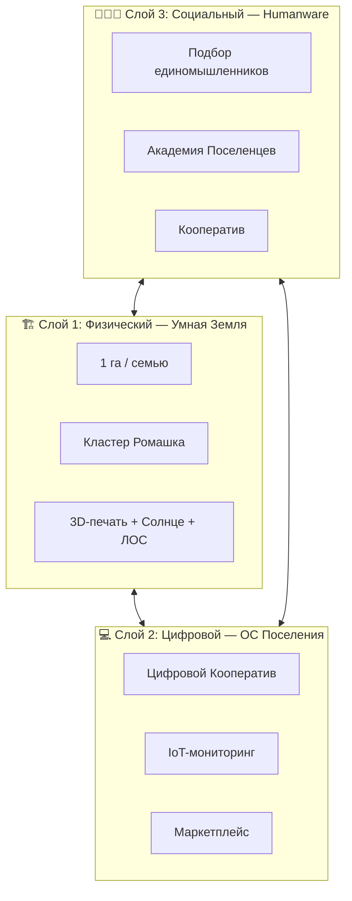
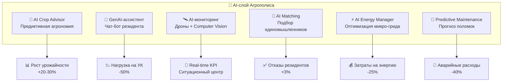
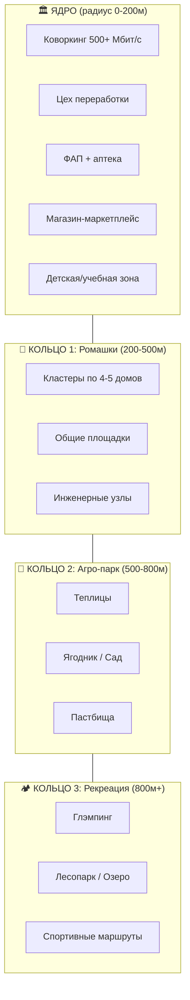
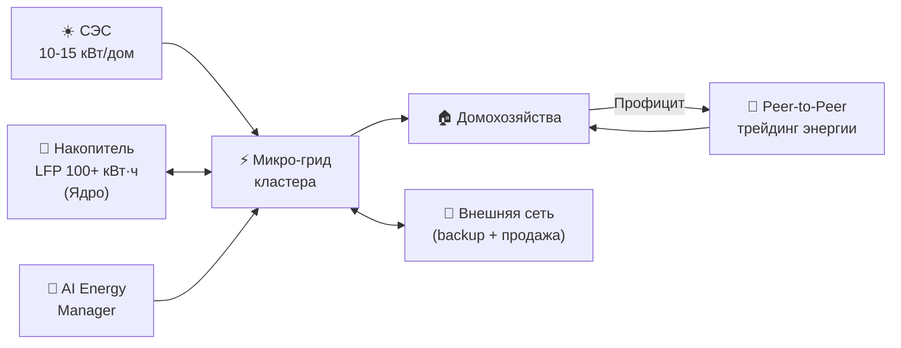

# 3. Описание концепции: Архитектура Smart Habitat

## Навигация
- Вход: [README.md](README.md) · [Манифест_Питчбук_Родовое_Поместье.md](Манифест_Питчбук_Родовое_Поместье.md) · [ТЭО_Родовое_Поместье_План_разделов.md](ТЭО_Родовое_Поместье_План_разделов.md)
- Проверка: [ИСТОЧНИКИ_И_БЕНЧМАРКИ.md](ИСТОЧНИКИ_И_БЕНЧМАРКИ.md) · [Приложения_Библиотека_Технологий/](Приложения_Библиотека_Технологий/)
- Переход: [← Резюме](ТЭО_Родовое_Поместье_Раздел_2_Резюме_проекта.md) · [Следующий →](ТЭО_Родовое_Поместье_Раздел_4_Анализ_рынка_и_зарубежных_аналогов.md)

---

## 3.1. Ключевая метафора: «Слоеный пирог»
Концепция «Агрополис» реализуется через интеграцию трех независимых, но сопряженных слоев. Это позволяет работать с разными типами рисков и инвесторов.

### Слой 1: Физический (Hardware) — «Умная Земля»
*Задача: Создание автономной биосферной единицы.*
*   **Землепользование:** 1 га на семью + 20 га агро-парк (буферная зона).
*   **Планировка:** Кластеры «Ромашка» (5 участков вокруг инженерного узла) снижают протяженность сетей в 3 раза по сравнению с линейной застройкой.
*   **Технологии:** 3D-печать домов (скорость), ЛОС замкнутого цикла, солнечная генерация.

### Слой 2: Цифровой (Software) — «Операционная система поселения»
*Задача: Управление ресурсами и снижение транзакционных издержек.*
*   **Платформа Цифрового Кооператива:** Голосования, бюджет, реестр прав.
*   **IoT-мониторинг:** Датчики влажности, качества воздуха, расхода энергии.
*   **Маркетплейс:** Сбыт продукции кооператива без посредников.

### Слой 3: Социальный (Humanware) — «Социальная ОС»
*Задача: Отбор, слаживание и капитализация человеческого потенциала.*
*   **Триада устойчивости:**
    1.  **Подбор единомышленников:** Ценностно-компетентностный мэтчинг для формирования устойчивых домохозяйств.
    2.  **Академия Поселенцев (Обучение):** Получение Hard Skills (дом, сад, ремесло).
    3.  **Кооператив (Действие):** Совместная экономическая деятельность.

---

## 3.2. Социальная Операционная Система: Технология «Подбор Единомышленников»
Мы интегрируем в проект уникальную технологию ценностно-компетентностного мэтчинга, направленную на формирование устойчивых первичных ячеек (домохозяйств). Это не сайт знакомств, это **инкубатор семейных стартапов**.

### 1. Философия: Ценностный мэтчинг
Мы замещаем потребительский подход к отношениям («найди того, кто сделает тебя счастливым») на созидательный («найди партнера для общего дела»).
*   **Принцип:** Любовь — это энергия совместного действия.
*   **Механика:** Пары формируются не на основе фото, а на основе совпадения ценностей и взаимодополняемости навыков (Компетентный строитель + Агроном = Устойчивое хозяйство).

### 2. Паспорт Компетенций (Цифровой Профиль)
Входной билет в поселение — цифровое портфолио, верифицированное через платформу Академии Поселенцев (цифровой рейтинг участника).
*   **Hard Skills (60%):** Строительство, агрономия, инженерия, ремесла. *Доказательство: видео-отчеты реальных проектов.*
*   **Soft Skills (40%):** Договороспособность, стрессоустойчивость, управление конфликтами. *Доказательство: отзывы менторов и «Слет Созидателей».*

### 3. Воронка отбора: «Иммерсивная стажировка»
Путь резидента выглядит как игровой процесс (Геймификация):
1.  **Уровень 0 (Искатель):** Регистрация, тест ценностей.
2.  **Уровень 1 (Практик):** Прохождение онлайн-курсов Академии, загрузка первого портфолио навыков.
3.  **Уровень 2 (Мастер):** Допуск к **«Слету Созидателей»** — оффлайн-интенсиву (3 дня), где команды решают реальные задачи (построить навес, посадить сад) в условиях ограниченного времени. Только успешное прохождение Слета открывает доступ к Земле.

**Результат:** Мы получаем резидентов с подтвержденной квалификацией и проверенной совместимостью. Риск конфликтов и отказа от проекта стремится к нулю.

---

## 3.3. Принципы строительства
1.  **Технологический минимализм:** Не внедряем сложные решения (водород), пока не работают базовые (септик).
2.  **Этапность:** Сначала инженерное ядро и дороги, потом жилье.
3.  **Стандартизация:** Единый архитектурный код (дизайн-код) для сохранения капитализации недвижимости.
4.  **BIM-to-Field Pipeline:** Каждый дом проектируется в BIM (Revit / BlenderBIM). Модель автоматически экспортируется в: (a) смету для банка, (b) заказ домокомплекта на производство, (c) 3D-визуализацию для резидента, (d) данные для Digital Twin территории. Снижение ошибок проектирования — 30-40% (NIBS, 2024).
5.  **Дизайн-код «Умная деревня»:** Регламент фасадных решений, высотности, материалов и озеленения. Архитектурный совет кластера утверждает все проекты. Цель — визуальная гармония + рост капитализации +20-30% по сравнению с хаотичной застройкой (Urban Land Institute, 2023).

---

## 3.4. AI-интеграция: Интеллектуальный слой экосистемы
*Мега-тренд 2025–2027.* Искусственный интеллект — не «модная нашлёпка», а ядро операционной эффективности кластера.

### AI-модули первой очереди (MVP)

| AI-модуль | Функция | Входные данные | Влияние на KPI | Сложность | Срок |
| :--- | :--- | :--- | :--- | :--- | :--- |
| **AI Crop Advisor** | Предиктивная аналитика урожайности: «Что посадить на участке 47?» → Малину, урожай через 14 мес., маржа 180% | IoT-датчики почвы, метео, спутниковые снимки, рыночные цены | +20-30% урожайность, +15% маржинальность | Средняя | 6 мес. |
| **GenAI-ассистент** | Чат-бот для резидентов: строительство, агрономия, право, бытовые вопросы | RAG на базе документации кластера + LLM (Yandex GPT / GigaChat) | Нагрузка на УК -50%, время ответа <30 сек | Низкая (API) | 2 мес. |
| **AI-мониторинг территории** | Дроны + Computer Vision: состояние посадок, стройки, техники, пожарная безопасность | LIDAR/RGB снимки, real-time видеопоток | Real-time KPI для Ситуационного центра | Высокая | 12 мес. |
| **AI Matching** | NLP-анализ ценностей + предиктивная совместимость при подборе резидентов | Анкеты, результаты Слёта, история взаимодействий | Снижение отказов с 10% до <3% | Средняя | 4 мес. |
| **AI Energy Manager** | Оптимизация распределения энергии: солнце + сеть + накопитель + потребление | Smart Meter данные, метеопрогноз, тарифная сетка | Снижение затрат на энергию -25% | Средняя | 6 мес. |
| **Predictive Maintenance** | Прогнозирование поломок ЛОС, насосов, СЭС, скважин | Датчики вибрации/температуры/давления, история ремонтов | Снижение аварийных расходов -40% | Средняя | 8 мес. |

> **Позиционирование:** С AI-слоем проект звучит как **PropTech/AgriTech стартап** ($100B+ глобальный рынок), а не как «дачный посёлок».

---

## 3.5. Регенеративное земледелие: Beyond Organic
*«Органика» — тренд 2015. В 2026 мейнстрим — **regenerative agriculture**: не просто «не навредить», а **восстановить** экосистему.*

### Принципы регенеративного подхода
1.  **No-till (нулевая обработка):** Минимальное нарушение почвенного слоя → сохранение микробиома, снижение эрозии на 60% (Rodale Institute, 2023).
2.  **Покровные культуры (Cover Crops):** Круглогодичное покрытие почвы живой растительностью → фиксация азота, подавление сорняков.
3.  **Агролесоводство (Food Forests):** Многоярусные посадки: орехи (верхний ярус) → фрукты (средний) → ягоды (нижний) → грибы (почва). Максимальная продуктивность на м².
4.  **Пастбищная ротация (Mob Grazing):** Управляемый выпас для стимуляции роста трав и секвестрации CO₂.
5.  **Компостирование замкнутого цикла:** Все органические отходы кластера → компост → почва → урожай.

### Цифровой паспорт здоровья почвы (Soil Health Passport)
Каждый участок получает **ежегодно обновляемый цифровой паспорт**:
*   **Гумус** (% органического вещества) — целевой прирост +1% за 5 лет.
*   **Микробиом** (индекс биоразнообразия почвенной микрофлоры).
*   **Водоудержание** (мм/м² — способность почвы удерживать влагу).
*   **Углерод** (тонны CO₂-эквивалента, секвестрированные в почве).

> **Монетизация:** Участки с растущим Soil Health Score → premium при продаже **carbon credits** и выходе на рынок **biodiversity credits** ($5B к 2030, WEF).

---

## 3.6. «15-Minute Settlement» — сельский стандарт доступности
*Адаптация концепции Carlos Moreno (Парижская мэрия, C40 Cities) для сельского поселения.*

### Принцип
Все ключевые функции жизни — **работа, учёба, здоровье, досуг, питание, торговля** — в пределах **15 минут пешком или на велосипеде** от любого дома кластера.

### Планировочное решение

| Функция | Расстояние от дома | Время (пешком) | Решение |
| :--- | :--- | :--- | :--- |
| **Работа** | 0-500м | 0-7 мин | Коворкинг в Ядре / Home Office |
| **Школа (начальная)** | 0-500м | 0-7 мин | Учебная зона Ядра + онлайн-школы |
| **Здоровье** | 0-300м | 0-4 мин | ФАП в Ядре, телемедицина 24/7 |
| **Магазин** | 0-300м | 0-4 мин | Маркетплейс Ядра + доставка |
| **Спорт** | 0-800м | 0-10 мин | Площадки + маршруты |
| **Природа/рекреация** | 0-800м | 0-10 мин | Лесопарк, озеро |

> **Эффект:** Снижение зависимости от автомобиля → OPEX семьи сокращается на 15-20 тыс. руб./мес. Проект позиционируется как **урбанистическая инновация**, а не «деревня».

---

## 3.7. Энергетическое сообщество (Energy Community)
*Доминирующий тренд в ЕС (Директива RED III, 2023). В РФ — начало формирования (ФЗ о микрогенерации, 15 кВт, с 2019).*

### Архитектура микро-грида

### Экономика энергосообщества
*   **CAPEX:** СЭС 10 кВт = ~500 тыс. руб./дом (цены снизились на 40% за 2023-2025).
*   **Батарейное хранилище (LFP):** ~300 тыс. руб. на Ядро (100 кВт·ч).
*   **Экономия:** 70-80% электроэнергии — собственная генерация. OPEX на электричество: 500-1000 руб./мес. вместо 3-5 тыс.
*   **Продажа излишков:** В сеть или соседям через P2P-контракт. Доход — до 3-5 тыс. руб./мес. летом.
*   **Окупаемость СЭС:** 5-7 лет (при текущих тарифах).
*   **AI Energy Manager** оптимизирует: когда накапливать, когда продавать, когда потреблять из сети (ночной тариф).

---

## 3.8. Цифровой двойник территории (Digital Twin)
*От статичного генплана — к живой 3D-модели, обновляемой в реальном времени.*

### Что включает Digital Twin
1.  **3D-рельеф территории** на основе LIDAR / спутниковых DEM (открытые данные Copernicus).
2.  **BIM-модели всех зданий** — автоматический импорт из проектной документации.
3.  **Real-time overlay:** IoT-данные (энергия, вода, почва, погода) накладываются на 3D-карту.
4.  **Симуляция застройки:** Показать инвестору / чиновнику: «Вот так будет выглядеть кластер через 1 / 3 / 5 лет».
5.  **Аналитический слой:** Heatmap заполняемости, маршруты, нагрузки на сети.

### Технологический стек
| Компонент | Инструмент | Лицензия |
| :--- | :--- | :--- |
| 3D-движок | Cesium.js / Three.js | Open Source |
| Геоданные | QGIS + PostGIS | Open Source |
| BIM → 3D | IFC.js / BlenderBIM | Open Source |
| IoT-интеграция | MQTT / InfluxDB / Grafana | Open Source |
| Хостинг | VPS / Яндекс Cloud | Коммерческий |

> **Для инвестора:** Digital Twin = доказательство технологической зрелости команды. «Покажи, а не рассказывай.»
