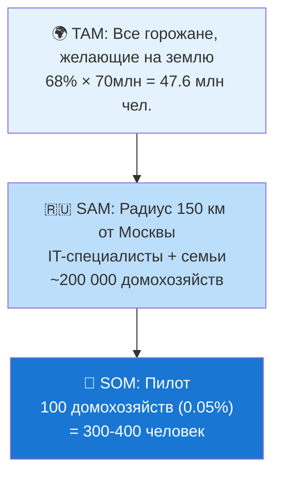

# 📊 4. Анализ рынка: Лучшие практики и российский опыт

## Навигация

- Вход: [README.md](README.md) · [Манифест_Питчбук_Родовое_Поместье.md](Манифест_Питчбук_Родовое_Поместье.md) · [ТЭО_Родовое_Поместье_План_разделов.md](ТЭО_Родовое_Поместье_План_разделов.md)
- Проверка: [ИСТОЧНИКИ_И_БЕНЧМАРКИ.md](ИСТОЧНИКИ_И_БЕНЧМАРКИ.md) · [Приложения_Библиотека_Технологий/](Приложения_Библиотека_Технологий/)
- Переход: [← Концепция](ТЭО_Родовое_Поместье_Раздел_3_Описание_концепции.md) · [Следующий →](ТЭО_Родовое_Поместье_Раздел_5_Финансовая_модель.md)

---

## 🔬 4.1. Методология: Анализ → Адаптация → Суверенизация

Мы изучаем успешные мировые практики, но полностью перерабатываем их с учетом российской правовой базы, климатических условий и ценностей (Стратегия пространственного развития РФ).

### Азиатская модель жилищного развития (опыт госпрограмм)

- **Суть:** Долгосрочная аренда с государственной поддержкой, механизмы накопления, защита от спекуляций.
- **Берем (Adapt):** Принцип долгосрочного землепользования с правом выкупа. Механизм приоритетного выкупа кооперативом.
- **Отвергаем (Reject):** чрезмерное администрирование и высокую плотность городской застройки, не свойственную русскому простору.

### Кооперативные агро-технологические хозяйства (опыт Ближнего Востока)

- **Суть:** Аграрные объединения, трансформировавшиеся в технологические кластеры.
- **Берем (Adapt):** Сочетание агро-бизнеса и высокотехнологичных производств. Автоматизация процессов.
- **Отвергаем (Reject):** Отказ от частной собственности. Мы сохраняем традиционный уклад: «Мой дом — моя крепость» + «Наш кооператив».

### Концепция «Агро-Городов» (мировая практика Agrihoods)

- **Суть:** Девелоперские проекты интегрированные с агро-производством.
- **Берем (Adapt):** Маркетинг «жизни на земле», профессиональное управление агро-ядром (агроном-технолог).
- **Отвергаем (Reject):** Элитарность и закрытость. Наша цель — доступность для массового жителя и решение демографических задач.

---

## ⚠️ 4.2. Анализ проблематики: Системный кризис семьи

Мы считаем, что главный риск для поселения — не климат и не дороги, а **социальная эрозия**. Без решения демографической проблемы строительство превращается в создание «спальных гетто».

### ⚠️ Кризис Института Семьи (Why Now?)

- **Статистика разводов:** По данным Росстата, распадается 7 из 10 браков. В условиях автономного хозяйства развод = банкротство домохозяйства.
- **Потребительская модель:** Ожидание, что партнер «обязан сделать счастливым», ведет к скорым разочарованиям при столкновении с реальным трудом на земле.
- **Дефицит навыков:** Поколение «зумеров» и «миллениалов» часто не обладает Hard Skills (стройка, агрономия), необходимыми для выживания вне города.

**Вывод:** Использовать стандартные методы заселения (продажа всем подряд) — значит заложить мину замедленного действия. Нам нужна **технология подбора единомышленников и формирования устойчивых домохозяйств**. Эту задачу решает платформа **Gravita+ (Gravita+)** — Биржа Компетенций и система осознанного выбора партнёра по созиданию. Подробнее: [Gravita+/README.md](../../../../Gravita+/README.md).

---

## 🎯 4.3. Рыночная ниша (Стратегия развития)

Мы создаем продукт на стыке пяти рынков, формируя новую категорию:

1. **Рынок децентрализованного производства и инноваций (FabLab, микрозаводы, IT-хабы):** создание высокодоходных рабочих мест.
2. **Рынок загородной недвижимости:** Домовладение как актив, приносящий доход.
3. **Рынок органических продуктов и экосистемных услуг:** Продовольственная безопасность, сбыт излишков, повышение качества почв и воды, подтверждаемая экологическая управляемость проекта.
4. **Рынок внутреннего туризма и транспорта:** Среда для обучения, агротуризма, рекреации и смарт-логистики.
5. **Рынок креативной экономики и IT:** Среда для удаленщиков и распределенных команд.

---

## 👥 4.4. Целевая аудитория: Портрет резидента

### Сегмент № 1 (ядро): IT-специалисты с семьями

- **Возраст:** 28–40 лет. **Доход:** 200–400 тыс. руб./мес.
- **Мотивация:** Экология для детей, простор, свобода от городской суеты. Но без потери комфорта.
- **Боль:** «Хочу на землю, но боюсь, что будет как в деревне: ни интернета, ни сообщества».
- **Ипотека:** IT-ипотека 5% или семейная 6%.
- **Компании с полным remote:** Яндекс, VK, Тинькофф, Ozon, Касперский, зарубежные компании (для релоцированных).

### Сегмент № 2: Молодые семьи с маткапиталом

- **Возраст:** 25–35 лет. **Доход:** 80–180 тыс. руб./мес. (суммарно).
- **Мотивация:** Собственное жильё по доступной цене, среда для детей.
- **Ипотека:** Сельская 3% + маткапитал на первоначальный взнос.

### Сегмент № 3: Предпенсионеры / дауншифтеры

- **Возраст:** 45–60 лет. **Финансы:** Накопления + продажа городской квартиры.
- **Мотивация:** Здоровье, смысл, наследие детям («Родовой капитал»).

### Сегмент № 4 (новый): Креативные профессионалы

- **Возраст:** 25–45 лет. **Доход:** 100–300 тыс. руб./мес. (проектный/фриланс).
- **Профиль:** Дизайнеры, художники, музыканты, YouTube-блогеры, ремесленники, писатели.
- **Мотивация:** Вдохновляющая среда, пространство для мастерской, контент («жизнь на земле» = уникальный контент на миллионы просмотров).
- **Боль:** «В городе всё одинаковое, нет вдохновения, аренда мастерской съедает 45% дохода».
- **Магнит:** FabLab, арт-резиденция, контент-студия, природные локации для съёмок.

### Сегмент № 5 (новый): «Серебряное поколение» (активные пенсионеры 60+)

- **Возраст:** 60–75 лет. **Финансы:** Пенсия + сбережения + помощь детей.
- **Мотивация:** Здоровье и долголетие, близость к детям/внукам, передача знаний и опыта.
- **Роль в кластере:** Наставники, хранители культуры, мультипоколенческая интеграция (бабушки/дедушки как «социальный клей»).
- **Модель:** Мини-дом на участке детей («дом бабушки» — Accessory Dwelling Unit, ADU — тренд США 2024-2026).

---

## 🌐 4.5. PESTEL-анализ: Внешняя среда

| Фактор | Описание | Влияние | Реакция проекта |
| :--- | :--- | :---: | :--- |
| **P** (Political) | Нацпроекты «Демография», «Жильё». Господдержка сельских территорий. | 🟢 Позитив | SIB, гранты, земля без торгов |
| **E** (Economic) | КС 21%, инфляция 7-9%. Но: льготные ипотеки 3-6%. | 🟡 Смешанный | Льготная ипотека как конкурентный козырь |
| **S** (Social) | 68% хотят на землю. Тренд на экологичность, сообщество, здоровье. | 🟢 Позитив | Продукт закрывает все 3 запроса |
| **T** (Technology) | AI, IoT, ВИЭ, 3D-печать домов, ЦФА — доступны и дешевеют. | 🟢 Позитив | 6 AI-модулей, IoT-Диспетчеризация, BIM |
| **E** (Environmental) | Запрос на экологическую управляемость, восстановление почв и ресурсную эффективность. | 🟢 Позитив | Мониторинг воды, энергии, почв и строительного следа; экологическая отчётность по запросу. |
| **L** (Legal) | ФЗ-259 о ЦФА. Нет закона о родовых поместьях, но есть ГК РФ + ЗК РФ. | 🟡 Смешанный | Работаем в рамках действующего права |

> **Позиция:** 4 из 6 факторов PESTEL — **устойчиво позитивные**. Для проектов с земельной составляющей это скорее нетипично и требует аккуратной работы с правовыми и инфраструктурными рисками.

---

## ⚖️ 4.6. Подробный benchmarking: DeepTech-Хаб vs аналоги

| Параметр | **DeepTech-Хаб (проект)** | **Обычный КП** | **Экопоселение** | **Serenbe (USA)** | **Кибуц 2.0 (Израиль)** |
| :--- | :--- | :--- | :--- | :--- | :--- |
| **Рабочие места** | IT + FabLab + Кооп + Агро | Нет | Минимум | Да | Да |
| **Управление** | Цифровой кооператив + УК по SLA | УК (непрозр.) | Самоуправление | Девелопер | Кооператив / Совет |
| **Доход резидента** | Реальный сектор + IT + Агро | Нет | Агро (мин.) | Агро + услуги | Агро + R&D |
| **Отбор резидентов** | Пре-квалификация (Хард/Софт скиллы) | Нет | Неформальный | Нет | Да |
| **AI-интеграция** | 6 AI-модулей (Agri, Пром, Саппорт) | Нет | Нет | Нет | Частично |
| **ESG-комплаенс** | Экологический мониторинг и ESG-отчётность | Нет | Нет | Частично | Да |
| **Потенциал капитализации (5 лет)** | Сценарно: выше типового КП при выполнении предпосылок (статусы/инфраструктура/спрос) | ориентир: +30–50% | ориентир: −50%…0% | ориентир: +100–200% | ориентир: +50–100% |
| **Входной барьер** | 3-8 млн руб. + Компетенции | 5-15 млн | 0.5-3 млн | $300K+ | Н/П |
| **Инфраструктура** | Smart Grid + Вода + FabLab | Скважина/Сети | Нет | Центр.сети + Эко | Да |
| **Креативная экономика** | Встроенный коворкинг и ЦОД | Нет | Нет | Частично | Нет |

> **Вывод:** Проект формирует **редкую комбинацию**: доступность по льготной ипотеке + интегрированная кооперативная экономика + прозрачные цифровые протоколы управления + IT/производственный контур. На рынке РФ подобные сочетания встречаются ограниченно; сопоставимость и эффект требуют верификации по выбранному региону, правовой схеме и параметрам пилота.

---

## 📏 4.7. Размер рынка (TAM / SAM / SOM)

| Уровень | Размер | Расчёт |
| :--- | :--- | :--- |
| **TAM** | ~47.6 млн чел. | 68% горожан РФ (ВЦИОМ) × 70 млн гор. |
| **SAM** | ~200 000 домох. | IT-удалёнщики + семьи 25-45 лет, доход >150тыс., радиус 150 км от Москвы |
| **SOM (пилот)** | 100 домох. | 0.05% SAM — реалистичная цель на 5 лет |
| **SOM (масштаб)** | 1 000+ домох. | 10 кластеров по 100 (франшиза, 10 лет) |

---

## 🌍 4.8. Глобальный инвестиционный аргумент: DeepTech-Хаб vs суперхабы

*Для институциональных инвесторов и ЛПР (лиц, принимающих решения) — сравнительный анализ направлений для парковки и приумножения крупного капитала.*

### Почему суперхабы теряют часть инвестиционной привлекательности

После десятилетий роста классические финансовые суперхабы вошли в фазу структурной турбулентности. Риски, которые раньше казались теоретическими, стали реальностью 2022–2026 гг.:

| Событие | Год | Хаб | Последствие для инвестора |
| :--- | :--- | :--- | :--- |
| Рост санкционного давления на транзакции через ОАЭ | 2022–2024 | Дубай (DIFC) | Задержки и блокировки международных расчётов |
| Рекордное наводнение в Дубае | Апрель 2024 | Дубай | Аэропорт закрыт, бизнес-центры затоплены; актив = недоступен |
| Геополитические обострения в Персидском заливе | 2024–2025 | Оман, Бахрейн, Катар | Угрозы логистике через Ормузский пролив |
| Эскалация военно-политической напряжённости в зоне Залива | 2025–2026 | Дубай, Абу-Даби, Катар, Бахрейн | Реальная угроза перебоев в логистике и страховании активов; приостановка ряда M&A-сделок; рост страховых премий для активов в регионе |
| Ужесточение комплаенса для капиталов из СНГ | 2023–2025 | Сингапур | Перестройка структуры активов; часть позиций заморожена |

> **Ключевой вывод:** концентрация даёт высокую эффективность в спокойное время, но повышает чувствительность к системным шокам. Инвестор в суперхабе принимает риск, который трудно диверсифицировать внутри самого хаба.

---

### 4.8.1. Персидский залив — 2026: анатомия регионального риска

*Данный раздел не содержит оценок политических позиций сторон. Приводится исключительно инвестиционно-аналитический взгляд на инфраструктурные и операционные риски для бизнеса и капитала, размещённого в регионе.*

Начиная с 2024 года Персидский залив переживает заметный рост военно-политической напряжённости. Для инвесторов и корпораций, имеющих активы, филиалы или представительства в ОАЭ (Дубай, Абу-Даби), Катаре (Доха), Бахрейне или Омане, это формирует новую реальность повышенного регионального инфраструктурного риска:

| Категория риска | Конкретный механизм | Влияние на активы в регионе |
| :--- | :--- | :--- |
| **Угроза свободе судоходства** | Ормузский пролив — единственный морской выход из Залива. В условиях обострения его полное или частичное закрытие реалистично. Через пролив проходит ≈20% мировой торговли нефтью. | Резкий рост логистических тарифов; возможная временная недоступность зарубежных активов; срыв цепочек поставок для производств, размещённых в зоне. |
| **Страховые и операционные ограничения** | Lloyds и ведущие страховщики уже ввели надбавки «war risk» для судов и объектов инфраструктуры в регионе. Ряд перестраховщиков приостановил или ужесточил условия. | Рост OPEX и CAPEX для всех объектов в регионе; удорожание строительства и запуска новых проектов. |
| **Авиационные и логистические риски** | Международные авиакомпании периодически вводили ограничения на полёты в воздушном пространстве зоны конфликта. Дубайский хаб DXB — крупнейший по пассажиропотоку — находится в зоне потенциальной редукции. | Разрывы в цепочках снабжения, перебои в деловых поездках, форс-мажор для арендаторов и партнёров. |
| **Юрисдикционный риск** | В случае введения экстренного правового режима активы в ОАЭ, Катаре, Бахрейне могут быть временно заморожены или ограничены в распоряжении. | Ликвидность инвестиций под угрозой; сделки купли-продажи и вывода прибыли могут быть приостановлены. |
| **Репутационный и комплаенс-риск** | Ужесточение международного KYC/AML-контроля транзакций через банки региона. Компании, сохраняющие офисы и корсчета в зоне конфликта, попадают под усиленную проверку. | Заморозка корреспондентских отношений; замедление международных расчётов. |

> **Принципиальная разница для инвестора:** Ни один из перечисленных рисков не является управляемым на уровне частного инвестора.  
> Выбор региона — это ставка на стабильность всего геополитического контура, а не только на качество конкретного объекта.

#### Позиция DeepTech-Хаба в этом контексте

Проект изначально **проектируется вне зон геополитической турбулентности**. Распределённая сеть кластеров на территории России:

- Находится в **стратегическом удалении** от горячих точек — ни один локальный конфликт не способен физически заблокировать доступ к активам.
- Работает в **собственной правовой юрисдикции** инвестора (ЗПИФ под ГК РФ) — без иностранного права, без риска экстерриториальных ограничений.
- Не зависит от **транзитных проливов** или зарубежных логистических хабов — инфраструктура самодостаточна по ресурсам (энергия, вода, продовольствие).
- Использует **Северный морской путь** как альтернативный глобальный маршрут в случае закрытия классических южных логистических коридоров.
- Генерирует **денежный поток в рублях** — отсутствует валютный и конвертационный риск, характерный для зарубежных хабов.

> **Итог:** каждое обострение в Персидском заливе усиливает значимость альтернативных площадок с более предсказуемой инфраструктурной и юридической архитектурой. На этом фоне предложение DeepTech-Хаба выглядит более обоснованным для капитала, который ищет долгий горизонт размещения.

---

### Сравнительная матрица: куда направить крупный капитал в 2026–2031?

| Критерий | **Дубай / Доха / Манама** | **Сингапур** | **DeepTech-Хаб (сеть, Россия)** |
| :--- | :---: | :---: | :---: |
| **Юрисдикционный риск** | 🔴 Высокий | 🟡 Средний | 🟢 Низкий (родная юрисдикция) |
| **Климатический риск** | 🔴 Критический (жара, TW-события, наводнения) | 🟡 Высокий (тропики) | 🟢 Низкий (умеренный климат РФ) |
| **Геополитическая уязвимость** | 🔴 Высокая (Ормуз / Баб-эль-Мандеб) | 🟡 Средняя | 🟢 Стратегическая глубина территории |
| **Реальный денежный поток** | 🟡 Аренда недвижимости (волатильность) | 🟡 Дивиденды (высокий OPEX) | 🟢 Сервисы Ядра, MaaS/EaaS и производственные контуры |
| **Природный ресурс** | 🔴 Пустыня (нет воды, нет зелени) | 🔴 Синтетический остров | 🟢 Леса, реки, чернозём, биоразнообразие |
| **Масштабируемость** | 🔴 Один точечный хаб | 🔴 Один остров | 🟢 1/8 суши — бесконечный потенциал |
| **Правовая прозрачность** | 🟡 Чужое право / языковой барьер | 🟡 Чужое право | 🟢 ГК РФ / ЗПИФ / ГЧП |
| **Стоимость входа (инфра)** | 🔴 –10M за объект класса А | 🔴 –15M за объект | 🟢 3–15 млн ₽ за полноценный узел |
| **Отказоустойчивость (fault-tolerance)** | 🔴 Нет (Single Point of Failure) | 🔴 Нет | 🟢 Сеть: 1 узел из N выходит — портфель не страдает |

---

### Россия как мировой плацдарм: уникальные ресурсные преимущества

Ни одна страна мира не обладает таким сочетанием ресурсов для построения **распределённой сетевой инфраструктуры сохранения и приумножения капитала**:

| Ресурс | Конкурентный факт | Значение для DeepTech-Хаб |
| :--- | :--- | :--- |
| **Территория** | 17.1 млн км² (1/8 суши). Плотность: 8.6 чел/км² | Максимальное рассеяние узлов; расстояние — это архитектурная защита |
| **Энергоресурсы** | Избыточная генерация; э/э для пром. — одна из самых доступных в мире | OPEX ЦОД и FabLab в разы ниже, чем в ОАЭ или Сингапуре |
| **Климат** | Умеренный-субарктический | PUE дата-центров 1.1–1.15 (vs 1.4–1.5 в тропиках) → экономия 30–40% на охлаждении |
| **Пресная вода** | ~20% мировых запасов | Автономное водоснабжение каждого кластера без дефицита |
| **Природа** | Тайга, чернозём, реки, северное сияние | Невоспроизводимый биосферный актив: high-tech в первозданной экзотике |
| **Логистика** | Сеть ЖД, федеральные трассы, Севморпуть | Масштабирование сети кластеров без ограничений |
| **Технологический суверенитет** | Локальный стек, ЗПИФ, ГЧП | Нет зависимости от иностранных платформ и регуляторики |

> **Итог для инвестора:** вложение капитала в сеть DeepTech-Хабов — это ставка на физический блокчейн (Physical Blockchain), обеспеченный реальными ресурсами, сетевой отказоустойчивостью и знакомой юрисдикцией. Это не просто загородная недвижимость, а долгосрочный инфраструктурный актив с редким сочетанием природной базы, технологического контура и правовой определённости.

---

*Источники и бенчмарки: [ИСТОЧНИКИ_И_БЕНЧМАРКИ.md](ИСТОЧНИКИ_И_БЕНЧМАРКИ.md) · [Раздел 5 — Финмодель](ТЭО_Родовое_Поместье_Раздел_5_Финансовая_модель.md) · [Раздел 10 — Риски](ТЭО_Родовое_Поместье_Раздел_10_Риски_и_пути_их_минимизации.md)*

