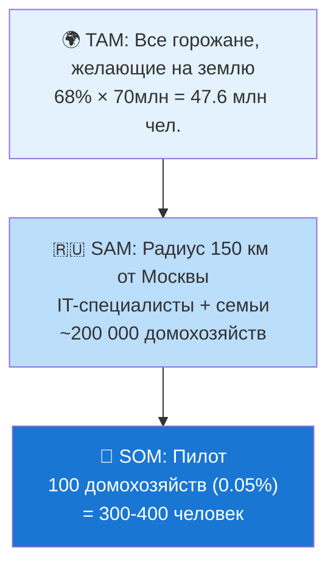

# 4. Анализ рынка: Лучшие практики и российский опыт

## Навигация
- Вход: [README.md](README.md) · [Манифест_Питчбук_Родовое_Поместье.md](Манифест_Питчбук_Родовое_Поместье.md) · [ТЭО_Родовое_Поместье_План_разделов.md](ТЭО_Родовое_Поместье_План_разделов.md)
- Проверка: [ИСТОЧНИКИ_И_БЕНЧМАРКИ.md](ИСТОЧНИКИ_И_БЕНЧМАРКИ.md) · [Приложения_Библиотека_Технологий/](Приложения_Библиотека_Технологий/)
- Переход: [← Концепция](ТЭО_Родовое_Поместье_Раздел_3_Описание_концепции.md) · [Следующий →](ТЭО_Родовое_Поместье_Раздел_5_Финансовая_модель.md)

---

## 4.1. Методология: Анализ → Адаптация → Суверенизация
Мы изучаем успешные мировые практики, но полностью перерабатываем их с учетом российской правовой базы, климатических условий и ценностей (Стратегия пространственного развития РФ).

### Азиатская модель жилищного развития (опыт госпрограмм)
*   **Суть:** Долгосрочная аренда с государственной поддержкой, механизмы накопления, защита от спекуляций.
*   **Берем (Adapt):** Принцип долгосрочного землепользования с правом выкупа. Механизм приоритетного выкупа кооперативом.
*   **Отвергаем (Reject):** Избыточный контроль и высокую плотность городской застройки, не свойственную русскому простору.

### Кооперативные агро-технологические хозяйства (опыт Ближнего Востока)
*   **Суть:** Аграрные объединения, трансформировавшиеся в технологические кластеры.
*   **Берем (Adapt):** Сочетание агро-бизнеса и высокотехнологичных производств. Автоматизация процессов.
*   **Отвергаем (Reject):** Отказ от частной собственности. Мы сохраняем традиционный уклад: «Мой дом — моя крепость» + «Наш кооператив».

### Концепция «Агро-Городов» (мировая практика Agrihoods)
*   **Суть:** Девелоперские проекты интегрированные с агро-производством.
*   **Берем (Adapt):** Маркетинг «жизни на земле», профессиональное управление агро-ядром (агроном-технолог).
*   **Отвергаем (Reject):** Элитарность и закрытость. Наша цель — доступность для массового жителя и решение демографических задач.

---

## 4.2. Анализ проблематики: Системный кризис семьи
Мы считаем, что главный риск для поселения — не климат и не дороги, а **социальная эрозия**. Без решения демографической проблемы строительство превращается в создание «спальных гетто».

### ⚠️ Кризис Института Семьи (Why Now?)
*   **Статистика разводов:** По данным Росстата, распадается 7 из 10 браков. В условиях автономного хозяйства развод = банкротство домохозяйства.
*   **Потребительская модель:** Ожидание, что партнер «обязан сделать счастливым», ведет к скорым разочарованиям при столкновении с реальным трудом на земле.
*   **Дефицит навыков:** Поколение «зумеров» и «миллениалов» часто не обладает Hard Skills (стройка, агрономия), необходимыми для выживания вне города.

**Вывод:** Использовать стандартные методы заселения (продажа всем подряд) — значит заложить мину замедленного действия. Нам нужна **технология подбора единомышленников и формирования устойчивых домохозяйств**.

---

## 4.3. Рыночная ниша (Стратегия развития)
Мы создаем продукт на стыке трех рынков, формируя новую категорию:
1.  **Рынок загородной недвижимости:** Домовладение как актив, приносящий доход.
2.  **Рынок органических продуктов:** Продовольственная безопасность семьи и сбыт излишков.
3.  **Рынок внутреннего туризма:** Среда для обучения, агротуризма и рекреации.

---

## 4.4. Целевая аудитория: Портрет резидента

### Сегмент № 1 (ядро): IT-специалисты с семьями
*   **Возраст:** 28–40 лет. **Доход:** 200–400 тыс. руб./мес.
*   **Мотивация:** Экология для детей, простор, свобода от городской суеты. Но без потери комфорта.
*   **Боль:** «Хочу на землю, но боюсь, что будет как в деревне: ни интернета, ни сообщества».
*   **Ипотека:** IT-ипотека 5% или семейная 6%.
*   **Компании с полным remote:** Яндекс, VK, Тинькофф, Ozon, Касперский, зарубежные компании (для релоцированных).

### Сегмент № 2: Молодые семьи с маткапиталом
*   **Возраст:** 25–35 лет. **Доход:** 80–180 тыс. руб./мес. (суммарно).
*   **Мотивация:** Собственное жильё по доступной цене, среда для детей.
*   **Ипотека:** Сельская 3% + маткапитал на первоначальный взнос.

### Сегмент № 3: Предпенсионеры / дауншифтеры
*   **Возраст:** 45–60 лет. **Финансы:** Накопления + продажа городской квартиры.
*   **Мотивация:** Здоровье, смысл, наследие детям («Родовой капитал»).

---

## 4.5. Подробный benchmarking: Агрополис vs аналоги

| Параметр | **Агрополис** | **Обычный КП** | **Экопоселение** | **Serenbe (USA)** | **Кибуц 2.0 (Израиль)** |
| :--- | :--- | :--- | :--- | :--- | :--- |
| **Рабочие места** | Коворкинг + агро + кооп | Нет | Минимум | Да | Да |
| **Управление** | Цифровой кооператив | УК (непрозр.) | Самоуправление (хаос) | Девелопер | DAO |
| **Доход от участка** | Агро + туризм + carbon | Нет | Агро (мин.) | Агро + ресторан | Агро + R&D |
| **Отбор резидентов** | Академия + Слёт | Нет | Неформальный | Нет | Да |
| **AI-интеграция** | 6 AI-модулей | Нет | Нет | Нет | Частично |
| **ESG-отчётность** | GRI + Carbon credits | Нет | Нет | Частично | Да |
| **Рост стоимости (5 лет)** | x3-5 | x1.3-1.5 | x0.5-1.0 | x2-3 | x1.5-2.0 |
| **Доступность (вход)** | 3-8 млн руб. | 5-15 млн | 0.5-3 млн | $300K+ | Н/П |
| **Масштабируемость** | Франшиза (Open Source) | Да | Нет | Да | Ограниченно |

> **Вывод:** Агрополис занимает **уникальную нишу**: доступность экопоселения + экономика кибуца + технологии Serenbe + AI-слой. **Аналогов в РФ нет.**

---

## 4.6. Размер рынка (TAM / SAM / SOM)

| Уровень | Размер | Расчёт |
| :--- | :--- | :--- |
| **TAM** | ~47.6 млн чел. | 68% горожан РФ (ВЦИОМ) × 70 млн гор. | 
| **SAM** | ~200 000 домох. | IT-удалёнщики + семьи 25-45 лет, доход >150тыс., радиус 150 км от Москвы |
| **SOM (пилот)** | 100 домох. | 0.05% SAM — реалистичная цель на 5 лет |
| **SOM (масштаб)** | 1 000+ домох. | 10 кластеров по 100 (франшиза, 10 лет) |
