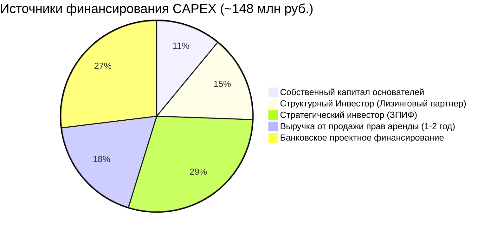

# 5. Финансовая модель: Архитектура доходности

## Навигация
- Вход: [README.md](README.md) · [Манифест_Питчбук_Родовое_Поместье.md](Манифест_Питчбук_Родовое_Поместье.md) · [ТЭО_Родовое_Поместье_План_разделов.md](ТЭО_Родовое_Поместье_План_разделов.md)
- Проверка: [ИСТОЧНИКИ_И_БЕНЧМАРКИ.md](ИСТОЧНИКИ_И_БЕНЧМАРКИ.md) · [Приложения_Библиотека_Технологий/](Приложения_Библиотека_Технологий/)
- Переход: [← Рынок](ТЭО_Родовое_Поместье_Раздел_4_Анализ_рынка_и_зарубежных_аналогов.md) · [Следующий →](ТЭО_Родовое_Поместье_Раздел_6_Дом_в_ипотеку.md)

---

## 5.1. Три контура денежных потоков (Архитектура бюджета)
Финансовая устойчивость кластера обеспечивается разделением потоков на три независимых, но сообщающихся контура.

> Дисклеймер: все численные значения в разделе — **пример расчётной модели** для обсуждения структуры доходов/расходов и чувствительности. Они требуют пересчёта под выбранный регион, состав инфраструктурного ядра, коммерческие предложения поставщиков и юридическую схему. Не является офертой.

### Контур А: УК «Инфраструктура» (Оператор и Лизингодатель сервисов Ядра)
*Бизнес-модель:* Девелопмент территорий (продажа земельных участков резидентам под частную собственность) + эксплуатация внешнего инфраструктурного ядра (HaaS) + аренда оборудования.
*   **Доходы:** Продажа земельных участков (cash-in для реинвестирования в ядро), сдача в аренду коммерческих площадей FabLab и compute/ЦОД, сервисные платежи (Smart Grid, безопасность, логистика), лизинг тяжелого оборудования и станков для резидентов.
*   **Расходы:** Строительство дорог, ЛОС, энергосетей, закупка оборудования в лизинговый пул, обслуживание зон общего пользования.
*   **КПЭ:** стабильный cash-flow от сервисного портфеля HaaS, рост капитализации базового актива (Ядра), обеспечение бесперебойности.

### Контур Б: Кооператив/Синдикат DeepTech-Хаба (Производственный контур)
*Бизнес-модель:* Пром-хаб + Платформа сбыта (B2B/B2C) + Венчурный строитель + Шеринг-оператор.
*   **Доходы:**
    1.  Комиссия с продаж аппаратных решений, ПО и фермерской продукции (10-15%).
    2.  **B2B Лизинг и прокат** тяжелой техники, ЧПУ-станков, серверных стоек и логистических дронов (MaaS и Haas - Hardware as a Service).
    3.  **B2B сервисы:** R&D контракты, сдача в аренду серверных вычислительных мощностей, коворкинга.
    4.  Монетизация углеродных квот (продажа на углеродной бирже излишков абсорбции лесополосы).
*   **Расходы:** Зарплата технологов модераторов FabLab, обслуживание лизингового парка оборудования, логистика, ESG-аудит (GHG/GRI).
*   **КПЭ:** Постоянное снижение себестоимости резидентов (OPEX) за счет шеринга и рост совокупной лизинговой выручки.

### Контур В: Домохозяйство (Резидент-Предприниматель)
*Бизнес-модель:* Владелец собственного поместья-оплота (снижение жилищного риска) + Центр генерации добавленной стоимости на внешней инфраструктуре Ядра.
*   **Доходы:** Зарплата (IT/Инжиниринг), дивиденды Синдиката, роялти за интеллектуальную собственность, продажа товаров, выращенных на собственной земле или произведенных в цехах HaaS.
*   **Расходы:** Покупка земли/дома в собственность (единоразовый CAPEX или классическая ссуда), абонентская плата УК за внешние сервисы (дороги, охрана, внешние сети), HaaS-платежи за пользование цехами и оборудованием Ядра.
*   **КПЭ:** SROI семьи, рост капитализации личного актива (Частная недвижимость + Земля + Интеллектуальный портфель).

---

## 5.2. Сценарное моделирование (Sensitivity Analysis)
Модель прошла стресс-тест по трем сценариям развития на горизонте 7 лет.

| Параметр | **Пессимистичный (Сценарий выживания)** | **Базовый (Рабочий план)** | **Оптимистичный (Ажиотажный спрос)** |
| :--- | :--- | :--- | :--- |
| **Скорость заселения** | 10 домов/год | 30 домов/год | 60 домов/год (Очередь) |
| **Цена продукции** | -15% от рынка (демпинг) | Рыночная | +30% (Премиум бренд) |
| **Гранты/Субсидии** | 0 руб. | 20% от CAPEX | 40% от CAPEX |
| **Выход на окупаемость (УК)** | 9 лет | **5.5 лет** | 3.5 года |
| **Доход семьи (на 5 год)** | 80 тыс. руб./мес. | **220 тыс. руб./мес.** | 350 тыс. руб./мес. |

---

## 5.3. Интерактивная модель семьи Соколовых (Симуляция)

### Вводные данные (Базовый сценарий)
*   **Глава семьи:** Senior DevOps Engineer. **Супруга:** Product Manager (в декрете).
*   **Старт:** 1.5 млн руб. (накопления) — снижение порога входа за счет лизинга.
*   **Цель:** Smart-Дом 120м², доходность > 250 тыс. руб. к 3-му году без учета зарплаты в IT.

### Движение средств (Cash Flow)
| Этап | Действие | Финансовый результат (Накопительным итогом) | Источник |
| :--- | :--- | :--- | :--- |
| **Год 0** | **Покупка земли** (1 га) в личную собственность, короткий тестовый период (HaaS-тест-драйв) перед возведением своего капитального дома. | **-1.5 млн руб.** | Личные накопления |
| **Год 1** | Взятие в лизинг (HaaS) серверной стойки в ЦОД хаба, удаленная работа. Построение дома-оплота. | **-0.5 млн руб.** | Зарплата IT + Доход от субаренды стойки |
| **Год 2** | Разработка собственного смарт-модуля через инфраструктуру FabLab (модель HaaS) и сбыт. | **+2.2 млн руб.** (Выход в плюс) | B2B продажи + Зарплата |
| **Год 5** | Дом расширен до 120м². Семья полностью закрепилась на своей земле. Оборудование в цехах выкуплено из лизинга. | **+12.5 млн руб.** (Свободный кэш) | Все источники |

### Рост Капитализации Актива
К 10-му году семья владеет активом (недвижимость + доля в патентах) стоимостью **~25 млн руб.** (ликвидная оценка в развитом IT-кластере), что **при успешной реализации базового сценария** соответствует ~25% годовых на первоначально вложенный капитал.

> **Caveat:** Оценка является модельной и предполагает стабильный спрос, полную заполняемость кластера и развитый вторичный рынок. Фактическая доходность может существенно отличаться.

---

## 5.4. Детализация CAPEX: Инфраструктурный бюджет кластера (100 участков)

### Таблица А: CAPEX инфраструктуры (кластер 150 га, 100 домохозяйств)

| Статья | Ед. изм. | Кол-во | Цена за ед. (тыс. руб.) | Сумма (млн руб.) | Источник/обоснование |
| :--- | :--- | ---: | ---: | ---: | :--- |
| **Земля (аренда/выкуп)** | га | 150 | 100 | 15.0 | Авито/ЦИАН, 150 км от Москвы |
| **Дороги (щебень, 5м шир.)** | км | 8 | 2 500 | 20.0 | РСН, ГЭСН-2025 |
| **ЛЭП (10 кВ + КТП)** | км | 5 | 1 800 | 9.0 | ТУ МОЭСК |
| **Скважина (артезианская)** | шт. | 3 | 1 200 | 3.6 | Подрядчики МО |
| **Водопровод (ПНД)** | км | 6 | 350 | 2.1 | РСН |
| **ЛОС (модульная)** | шт. | 20 | 450 | 9.0 | Топас/Юнилос |
| **СЭС (на Ядро + накопитель)** | кВт | 100 | 50 | 5.0 | Hevel, прайс 2025 |
| **Общинный центр (Ядро)** | м² | 300 | 80 | 24.0 | КП подрядчиков |
| **Связь (оптоволокно до Ядра)** | линия | 1 | 500 | 0.5 | Ростелеком |
| **Проектирование + ИРД** | пакет | 1 | 5 000 | 5.0 | ПИР |
| **Благоустройство (навигация и безопасность)** | пакет | 1 | 4 000 | 4.0 | Ландшафтные КП |
| **Префаб-модули и сервера на баланс УК (для старта лизинга)** | шт. | 10 | 3 000 | 30.0 | Формирование стартового лизингового портфеля |
| **Маркетинг и продвижение (3–5% CAPEX)** | пакет | 1 | — | 4.0 | Лендинг, SMM, роуд-шоу, PR |
| **Юридическое сопровождение** | пакет | 1 | — | 2.5 | Регистрация ЗПИФ, ИРД, лицензии |
| **Оборотный капитал (операционная подушка)** | мес. | 6 | — | 5.0 | 6 мес. OPEX до выхода на BEP |
| **Резерв непредвиденных (10%)** | — | — | — | 14.9 | Стандарт проектного управления |
| **ИТОГО CAPEX (вкл. лизинговый пул)** | — | — | — | **~148.4** | — |

> **CAPEX на 1 участок (сугубо инфра-доля):** (~148.4 − 30.0) / 100 ≈ **1.18 млн руб.** Лизинговые модули формируют отдельный самоокупаемый портфель.

### Таблица Б: Вход домохозяйства (Стартовый бюджет, Лизинг-модель)

| Статья | Сумма (тыс. руб.) | Примечание |
| :--- | ---: | :--- |
| **Выкуп земли в частную собственность (Оплот, 1 га)** | 1 500 | Компенсация базовой цены земли + маржа ЗПИФ |
| **Аванс за дом (каркасный/SIP префаб, 60м²)** | ~500 | 20% первоначальный взнос (стройка на своей земле) |
| **Инженерия участка (скважина + ЛОС + СЭС)** | 800–1 200 | Могут быть включены в тело ипотеки/со-финансирования |
| **Вступительный взнос (Кооператив)** | 100 | Единоразово (дает доступ к HaaS-инфре Ядра) |
| **ИТОГО начальный взнос семьи** | **2 900–3 300** | Порог входа для старта жизни в Ядре |

---

## 5.5. Детализация OPEX: Операционные расходы (в месяц)

### Таблица В: OPEX кластера (УК + Кооператив)

| Статья | Сумма (тыс. руб./мес.) | Примечание |
| :--- | ---: | :--- |
| **Зарплата УК (5 чел.)** | 500 | Директор + агроном + инженер + бухгалтер + HR |
| **Обслуживание дорог** | 80 | Грейдирование, снегоуборка |
| **Обслуживание ЛОС** | 60 | Реагенты + ТО |
| **Электричество (общее)** | 40 | Ядро + освещение + насосы |
| **Интернет + IT-платформа** | 30 | Хостинг + лицензии |
| **Хозяйственные расходы** | 50 | Расходные материалы, мелкий ремонт |
| **Резервный фонд (10%)** | 76 | Накопление |
| **ИТОГО OPEX кластера** | **836** | — |

> **Покрытие:** Сервисный платёж 100 домохозяйств × 8 360 руб./мес. = **836 тыс. руб./мес.** → безубыточность.

### Таблица Г: OPEX домохозяйства (3-й год, базовый сценарий)

| Статья расходов | Сумма (тыс. руб./мес.) |
| :--- | ---: |
| **Сервисный платёж (ЖКХ + УК + ЦОД-контракт)** | 12.4 |
| **Лизинг домокомплекта и оборудования (или Ипотека)** | 45.0 |
| **Электричество (минимизировано за счет микро-СЭС)** | 1.5 |
| **Продукты (автономия 40% через локальный фудмаркет)** | 15.0 |
| **Транспорт (MaaS - аренда электроинструмента)** | 10.0 |
| **Связь и IT-сервисы (оптоволокно + облако)** | 3.5 |
| **Образование (Академия Lifelong Learning)** | 8.0 |
| **ИТОГО OPEX семьи** | **95.4** |

| Статья доходов | Сумма (тыс. руб./мес.) |
| :--- | ---: |
| **Удалённая работа (IT/консалтинг)** | 250.0 |
| **Доход от субаренды серверных мощностей** | 45.0 |
| **B2B контракты и консалтинг внутри Синдиката** | 50.0 |
| **Дивиденды DAO (углеродные квоты + прибыль кластера)** | 15.0 |
| **ИТОГО доход семьи** | **360.0** |

> **Примечание:** Из 360 тыс. руб./мес. **250 тыс. — удалённая зарплата в IT-секторе** (не генерируется хабом напрямую). Доход, создаваемый инфраструктурой кластера, составляет ~110 тыс. руб./мес. 
> **Свободный денежный поток семьи:** 360 − 95.4 = **264.6 тыс. руб./мес.** → Возможность досрочного выкупа активов из лизинга и инвестиций в R&D.

---

## 5.6. Расчёт NPV, IRR и точки безубыточности

### Допущения для расчёта

| Параметр | Значение | Обоснование |
| :--- | ---: | :--- |
| Горизонт планирования | 10 лет | Жизненный цикл 1-й фазы |
| Ставка дисконтирования (*r*) | 18% | КС ЦБ 21% (фев. 2026) минус 3 п.п. — целевой «зелёный» спред¹ |
| Инфляция (ежегодная) | 7% | Прогноз ЦБ 2026-2028 |
| Рост стоимости земли | 10–15%/год | Бенчмарк: Serenbe +12%/год, Agritopia +15%/год (ULI); для РФ — 10% как консервативная оценка² |
| Заполняемость (год 1/3/5) | 15 / 50 / 100 | Консервативный план продаж |

> ¹ **Спред −3 п.п.** — целевой ориентир, достижимый при получении статуса «зелёного» проекта (ППК РЭО, ВЭБ.РФ) или сертификации ESG. До подтверждения статуса пессимистичный сценарий рассчитывается при r = 21%. 
> ² Для РФ отсутствует прямой аналог master-planned communities; 10%/год — ближе к медиане. При пересчёте под конкретный регион рекомендуется использовать данные Росреестра за 5 лет. 
> **Налоговое примечание:** Все CF в модели даны **до налогообложения** и **до обслуживания долга** (pre-tax, pre-financing). Итоговая налоговая нагрузка зависит от юридической обёртки (ИП, кооператив, ЗПИФ, УСН/ОСН) и может составить 6–20% от дохода.

### Расчёт денежного потока (кластер, базовый сценарий)

| Год | Кол-во резидентов | Доходы (млн руб.) | Расходы (млн руб.) | Чистый CF (млн руб.) | Накопительно (млн руб.) |
| :--- | ---: | ---: | ---: | ---: | ---: |
| **0** | 0 | 0 | -106.9 | **-106.9** | -106.9 |
| **1** | 15 | 22.5 + 1.5 = 24.0 | 15.0 | **+9.0** | -97.9 |
| **2** | 30 | 45.0 + 4.0 = 49.0 | 18.0 | **+31.0** | -66.9 |
| **3** | 50 | 75.0 + 8.0 = 83.0 | 22.0 | **+61.0** | -5.9 |
| **4** | 70 | 105.0 + 12.0 = 117.0 | 25.0 | **+92.0** | +86.1 |
| **5** | 100 | 150.0 + 20.0 = 170.0 | 28.0 | **+142.0** | +228.1 |
| **6-10** | 100 | 170.0–200.0/год | 28.0–35.0/год | ~140.0/год | +900+ |

> **Структура доходов:** Продажа прав аренды (×1.5 млн/участок) + Сервисные платежи (×8.36 тыс./мес.) + Комиссия кооператива (15% оборот агро + туризм).

### Итоговые метрики

| Метрика | Базовый сценарий | Пессимистичный | Оптимистичный |
| :--- | ---: | ---: | ---: |
| **NPV (10 лет, r=18%)** | **+187 млн руб.** | +42 млн руб. | +380 млн руб. |
| **IRR** | **28.4%** | 14.2% | 45.1% |
| **Срок окупаемости (простой)** | **3.8 года** | 6.5 лет | 2.4 года |
| **Срок окупаемости (дисконт.)** | **5.1 года** | 8.2 года | 3.2 года |
| **Точка безубыточности** | **38 домохозяйств** | 55 домохозяйств | 25 домохозяйств |
| **ROI (на 5-й год, до налогов)** | **~210%** | ~90% | ~410% |

> **Формула NPV:** $NPV = \sum_{t=0}^{10} \frac{CF_t}{(1+r)^t}$, где $r = 0.18$, $CF_t$ — чистый денежный поток года $t$.
>
> **Формула IRR:** Ставка $r^*$, при которой $NPV = 0$: $\sum_{t=0}^{10} \frac{CF_t}{(1+r^*)^t} = 0$.
>
> **Важно:** IRR 28.4% (базовый) — расчётная ставка **до налогов и обслуживания долга** для модели greenfield-кластера при полной заполняемости к году 5. При сдвиге графика продаж на 1–2 года или CAPEX-overrun +25% IRR снижается до 14–19% (см. п. 5.7 Tornado).

---

## 5.7. Анализ чувствительности (Tornado Chart)

*Какие параметры наиболее сильно влияют на NPV проекта?*

| Фактор | Изменение | Влияние на NPV (млн руб.) | Критичность |
| :--- | :--- | ---: | :--- |
| **Скорость продаж** | -30% (заполнение 70 вместо 100 к 5 году) | -95 | 🔴 Критическая |
| **Цена входа (аренда)** | -20% (1.2 млн вместо 1.5 млн) | -58 | 🔴 Критическая |
| **CAPEX инфраструктуры** | +25% (134 млн вместо 107 млн) | -47 | 🟡 Высокая |
| **Ставка дисконтирования** | +5 п.п. (23% вместо 18%) | -41 | 🟡 Высокая |
| **OPEX кластера** | +30% | -22 | 🟡 Средняя |
| **Гранты/субсидии** | +20% CAPEX покрытие | +38 | 🟢 Позитивная |

> **Вывод:** Ключевые рычаги — **скорость продаж** и **ценообразование**. Управление воронкой (Академия Резидентов) и маркетинг — критически важные для NPV.

---

## 5.8. Структура финансирования (Sources & Uses)

### Инструменты привлечения капитала

| Инструмент | Объём (млн руб.) | Условия | Готовность |
| :--- | ---: | :--- | :--- |
| **Лизинговая программа** | 20-30 | Привлечение лизинговых компаний в Синдикат | Целевая |
| **ЗПИФ проекта (DeepTech-Хаб)** | 40 | Пай от 5 млн руб., параметры — в термшите/регламенте | Регистрация через УК |
| **ЦФА (лизинг-баллы)** | 10-20 | баллизация пула префабов под высокомаржинальный лизинг | Пилот |
| **Краудфандинг** | 2-5 | Микро-инвесторы | Доступно |

---
*Воспроизводимая Python-модель с Monte Carlo симуляцией (1000+ итераций) — см. [Neuro_Estate_Simulation.ipynb](../Neuro_Estate_Simulation.ipynb). Визуализации: waterfall, tornado chart, distribution plots.*

---

## 5.9. Страховая стратегия (Insurance Framework)
*Комплексное страхование — обязательный элемент ESG-проекта.*

| Объект страхования | Вид страхования | Ориентир. стоимость | Партнёр |
| :--- | :--- | ---: | :--- |
| **Инфраструктура кластера** | Комплексное имущественное | 0.3-0.5% от стоимости | РГС, СОГАЗ |
| **Строительно-монтажные риски (СМР)** | Ответственность подрядчика | 0.5-1.0% от контракта | АльфаСтрахование |
| **Урожай** | Параметрическое (на основе IoT/метео) | 3-5% от ожидаемого урожая | РесО, НСА |
| **Ответственность УК** | OC директоров (D&O) | 200-500 тыс. р./год | Любой крупный страховщик |
| **Кибер-риски** | Кибер-страхование (платформа + ПДн) | 100-300 тыс. р./год | AIG, Альфа |

> **Инновация:** Параметрическое страхование урожая на основе IoT-данных (AI Crop Advisor) — выплата автоматически при срабатывании триггера (засуха, заморозки). **InsurTech-компонент** усиливает позиционирование как технологического проекта.

---

## 5.10. Инвестиционный тезис: ESG-премия и глобальное позиционирование

> **Для институционального инвестора:** Distributed DeepTech-активы — новый класс «антихрупких» вложений, не зависящих ни от юрисдикции суперхаба, ни от рыночного цикла недвижимости. Это **физический Bitcoin**, обеспеченный землёй, инфраструктурой, водой и IP.

### Почему наш актив оценивается выше рынка (Premium Valuation Drivers)

| Фактор Premium | Рыночный бенчмарк | Наш актив | Источник |
| :--- | :--- | :--- | :--- |
| **ESG-рейтинг (устойчивость)** | Средний КП: 0-2 SDG | 10 UN SDGs → +15-25% к стоимости | MSCI ESG Research 2025 |
| **Distributed resilience** | Мегаполис/суперхаб: Single Point of Failure | Fault-tolerant сеть: потеря узла ≠ потеря портфеля | Taleb, 2012; наш RC-расчёт |
| **Юрисдикционная независимость** | Дубай DIFC / Сингапур: санкционный риск | ЗПИФ под РФ-правом, DAO-реестр, нет иностранного SD | ФЗ-156, ФЗ-259 |
| **Реальный актив vs деривативы** | Акции/облигации: инфляция съедает | Земля + IP + инфраструктура: реальный актив с генерирующим потоком | Knight Frank 2026 |
| **Холодный климат для eDC** | Дубай PUE: 1.4-1.6 (охлаждение дорого) | Россия PUE: 1.1-1.15 → -25-30% OPEX ЦОД | Росатом ЦОД-кластер, 2024 |
| **Agrihood premium** | Обычный КП: +3-5% капитализация/год | Serenbe (Atlanta): x2.8 за 15 лет | Urban Land Institute 2023 |
| **RWA-баллизация (ранний игрок)** | Традиционный ЗПИФ: нет ликвидности | ЗПИФ+ЦФА: пай как ликвидный балл | Deloitte RWA Report 2025 |

### Сравнительная доходность: Куда вложить 50 млн руб. в 2026?

| Инструмент | Real Return (5 лет) | Ликвидность | Безопасность | Наш рейтинг |
| :--- | :--- | :--- | :--- | :---: |
| **Депозит ТОП-банк (21% КС)** | ~18-19% номинально, реально ~8-10% после инфляции | 🟡 Средняя | 🟡 ЦБ-зависимость | 3/5 |
| **ОФЗ/облигации** | 15-18% номинально | 🟢 Высокая | 🟢 | 3/5 |
| **Дубай Real Estate** | 8-12% | 🔴 Ограничена (санкции) | 🔴 Санкционный риск | 2/5 |
| **Московская недвижимость** | 7-12% | 🟡 Средняя | 🟡 Концентрация | 2/5 |
| **Акции (индекс МосБиржи)** | 15-25% вол., непредсказуемо | 🟢 Высокая | 🔴 Высокая волатильность | 2/5 |
| **DeepTech-Хаб ЗПИФ** | **IRR 28.4%** (расч. модель, 10 лет) | 🟡 Вторичный рынок ЗПИФ | 🟢 Distributed fault-tolerant | **5/5** |

> **Вывод:** DeepTech-Хаб предлагает наибольший потенциал реальной доходности с принципиально новым профилем риска — распределённый, антихрупкий, юрисдикционно независимый. Это не «ещё один КП» — это **новый класс активов**.

