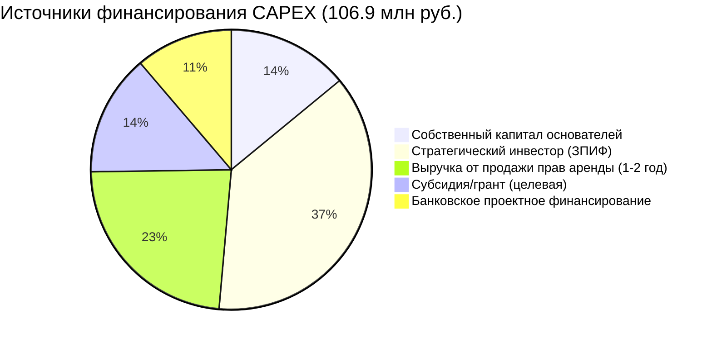

# 5. Финансовая модель: Архитектура доходности

## Навигация
- Вход: [README.md](README.md) · [Манифест_Питчбук_Родовое_Поместье.md](Манифест_Питчбук_Родовое_Поместье.md) · [ТЭО_Родовое_Поместье_План_разделов.md](ТЭО_Родовое_Поместье_План_разделов.md)
- Проверка: [ИСТОЧНИКИ_И_БЕНЧМАРКИ.md](ИСТОЧНИКИ_И_БЕНЧМАРКИ.md) · [Приложения_Библиотека_Технологий/](Приложения_Библиотека_Технологий/)
- Переход: [← Рынок](ТЭО_Родовое_Поместье_Раздел_4_Анализ_рынка_и_зарубежных_аналогов.md) · [Следующий →](ТЭО_Родовое_Поместье_Раздел_6_Дом_в_ипотеку.md)

---

## 5.1. Три контура денежных потоков (Архитектура бюджета)
Финансовая устойчивость кластера обеспечивается разделением потоков на три независимых, но сообщающихся контура.

### Контур А: УК «Инфраструктура» (Оператор)
*Бизнес-модель:* Девелопмент территорий + Ресурсоснабжение.
*   **Доходы:** Продажа прав аренды (входной билет), сервисные платежи (ЖКХ, интернет), аренда коммерческих площадей ядра.
*   **Расходы:** Строительство дорог, сетей, обслуживание ЛОС.
*   **КПЭ:** Рентабельность (IRR) Инвестора > 22%.

### Контур Б: Кооператив «Агрополис» (Сервис и Сбыт)
*Бизнес-модель:* Агро-хаб + Платформа сбыта + **Социальная Экосистема**.
*   **Доходы:**
    1.  Комиссия с продаж продукции (15%).
    2.  Прокат техники (шеринг).
    3.  **Экосистемные сервисы «Академия Поселенцев»:** Подписка на Лифт Компетенций, билеты на event-туры (Слёт Созидателей), доступ к базе верифицированных партнеров.
*   **Расходы:** Зарплата агрономов и менторов, логистика, event-менеджмент.
*   **КПЭ:** Безубыточность (модель НКО) — вся прибыль реинвестируется в развитие сервисов.

### Контур В: Домохозяйство (Семья)
*Бизнес-модель:* Микро-предприятие + Капитализация актива.
*   **Доходы:** Зарплата (удаленка), продажа продукции в Кооператив, кооперативные выплаты, эко-туризм.
*   **Расходы:** Взнос в Кооператив, стройка, жизнь.
*   **КПЭ:** Рост "Родового Капитала" > Инфляции.

---

## 5.2. Сценарное моделирование (Sensitivity Analysis)
Модель прошла стресс-тест по трем сценариям развития на горизонте 7 лет.

| Параметр | **Пессимистичный (Сценарий выживания)** | **Базовый (Рабочий план)** | **Оптимистичный (Ажиотажный спрос)** |
| :--- | :--- | :--- | :--- |
| **Скорость заселения** | 10 домов/год | 30 домов/год | 60 домов/год (Очередь) |
| **Цена продукции** | -15% от рынка (демпинг) | Рыночная | +30% (Премиум бренд) |
| **Гранты/Субсидии** | 0 руб. | 20% от CAPEX | 40% от CAPEX |
| **Выход на окупаемость (УК)** | 9 лет | **5.5 лет** | 3.5 года |
| **Доход семьи (на 5 год)** | 80 тыс. руб./мес. | **220 тыс. руб./мес.** | 350 тыс. руб./мес. |

---

## 5.3. Интерактивная модель семьи Соколовых (Симуляция)

### Вводные данные (Базовый сценарий)
*   **Старт:** 4 млн руб. (продажа «однушки» + мат.капитал).
*   **Цель:** Дом 100м² + доход 150 тыс. руб. к 3-му году.

### Движение средств (Cash Flow)
| Этап | Действие | Финансовый результат (Накопительным итогом) | Источник |
| :--- | :--- | :--- | :--- |
| **Год 0** | Покупка права аренды (1 га), установка модуля-префаб (60м²). | **-3.5 млн руб.** | Личные накопления |
| **Год 1** | Закладка сада, установка теплицы. Удаленная работа. | **-0.5 млн руб.** (Дефицит покрыт резервом) | Зарплата + Огород |
| **Год 2** | Запуск глэмпинга (2 домика). Первая товарная ягода. | **+0.8 млн руб.** (Выход в плюс) | Туризм + Агро |
| **Год 5** | Расширение дома. Получение углеродных выплат. | **+5.2 млн руб.** (Свободный кэш) | Все источники |

### Рост Капитализации Актива
К 10-му году семья владеет активом стоимостью **18 млн руб.** (ликвидная оценка участка в развитом кластере), что эквивалентно 20% годовых на вложенный капитал.

---

## 5.4. Детализация CAPEX: Инфраструктурный бюджет кластера (100 участков)

### Таблица А: CAPEX инфраструктуры (кластер 150 га, 100 домохозяйств)

| Статья | Ед. изм. | Кол-во | Цена за ед. (тыс. руб.) | Сумма (млн руб.) | Источник/обоснование |
| :--- | :--- | ---: | ---: | ---: | :--- |
| **Земля (аренда/выкуп)** | га | 150 | 100 | 15.0 | Авито/ЦИАН, 150 км от Москвы |
| **Дороги (щебень, 5м шир.)** | км | 8 | 2 500 | 20.0 | РСН, ГЭСН-2025 |
| **ЛЭП (10 кВ + КТП)** | км | 5 | 1 800 | 9.0 | ТУ МОЭСК |
| **Скважина (артезианская)** | шт. | 3 | 1 200 | 3.6 | Подрядчики МО |
| **Водопровод (ПНД)** | км | 6 | 350 | 2.1 | РСН |
| **ЛОС (модульная)** | шт. | 20 | 450 | 9.0 | Топас/Юнилос |
| **СЭС (на Ядро + накопитель)** | кВт | 100 | 50 | 5.0 | Hevel, прайс 2025 |
| **Общинный центр (Ядро)** | м² | 300 | 80 | 24.0 | КП подрядчиков |
| **Связь (оптоволокно до Ядра)** | линия | 1 | 500 | 0.5 | Ростелеком |
| **Проектирование + ИРД** | пакет | 1 | 5 000 | 5.0 | ПИР |
| **Благоустройство (озеленение, навигация)** | пакет | 1 | 4 000 | 4.0 | Ландшафтные КП |
| **Резерв непредвиденных (10%)** | — | — | — | 9.7 | Стандарт проектного управления |
| **ИТОГО CAPEX инфраструктуры** | — | — | — | **106.9** | — |

> **CAPEX на 1 участок (инфра-доля):** 106.9 / 100 ≈ **1.07 млн руб.**

### Таблица Б: CAPEX домохозяйства (вход резидента)

| Статья | Сумма (тыс. руб.) | Примечание |
| :--- | ---: | :--- |
| **Право аренды участка (1 га)** | 1 500 | Компенсация CAPEX инфра + маржа УК |
| **Дом (каркасный/SIP, 60–100 м²)** | 2 500–4 500 | БЗМК/ДомКлик, без отделки |
| **Инженерия участка (скважина + ЛОС + СЭС)** | 800–1 200 | Пакетная скидка от кооператива |
| **Вступительный взнос (Кооператив)** | 100 | Единоразово |
| **ИТОГО вход для семьи** | **4 900–7 300** | Покрывается ипотекой (Раздел 6) |

---

## 5.5. Детализация OPEX: Операционные расходы (в месяц)

### Таблица В: OPEX кластера (УК + Кооператив)

| Статья | Сумма (тыс. руб./мес.) | Примечание |
| :--- | ---: | :--- |
| **Зарплата УК (5 чел.)** | 500 | Директор + агроном + инженер + бухгалтер + HR |
| **Обслуживание дорог** | 80 | Грейдирование, снегоуборка |
| **Обслуживание ЛОС** | 60 | Реагенты + ТО |
| **Электричество (общее)** | 40 | Ядро + освещение + насосы |
| **Интернет + IT-платформа** | 30 | Хостинг + лицензии |
| **Хозяйственные расходы** | 50 | Расходные материалы, мелкий ремонт |
| **Резервный фонд (10%)** | 76 | Накопление |
| **ИТОГО OPEX кластера** | **836** | — |

> **Покрытие:** Сервисный платёж 100 домохозяйств × 8 360 руб./мес. = **836 тыс. руб./мес.** → безубыточность.

### Таблица Г: OPEX домохозяйства (3-й год, базовый сценарий)

| Статья расходов | Сумма (тыс. руб./мес.) |
| :--- | ---: |
| **Сервисный платёж (ЖКХ + УК)** | 8.4 |
| **Ипотека (если есть, 6%, 20 лет)** | 28.6 |
| **Электричество (собственная СЭС → минимум)** | 1.0 |
| **Продукты (при автономии 60%)** | 12.0 |
| **Транспорт** | 8.0 |
| **Связь** | 1.5 |
| **Образование детей** | 5.0 |
| **Прочее** | 5.0 |
| **ИТОГО OPEX семьи** | **69.5** |

| Статья доходов | Сумма (тыс. руб./мес.) |
| :--- | ---: |
| **Удалённая работа (IT/консалтинг)** | 150.0 |
| **Агро-продукция (через кооператив)** | 35.0 |
| **Агротуризм (глэмпинг, мастер-классы)** | 25.0 |
| **Кооперативные выплаты** | 10.0 |
| **ИТОГО доход семьи** | **220.0** |

> **Свободный денежный поток семьи:** 220 - 69.5 = **150.5 тыс. руб./мес.** → Накопление «Родового капитала».

---

## 5.6. Расчёт NPV, IRR и точки безубыточности

### Допущения для расчёта

| Параметр | Значение | Обоснование |
| :--- | ---: | :--- |
| Горизонт планирования | 10 лет | Жизненный цикл 1-й фазы |
| Ставка дисконтирования (*r*) | 18% | Ключевая ставка ЦБ 21% (фев. 2026) — спред 3% за «зелёный» актив |
| Инфляция (ежегодная) | 7% | Прогноз ЦБ 2026-2028 |
| Рост стоимости земли | 15%/год | Бенчмарк: Serenbe +12%/год, Agritopia +15%/год (ULI) |
| Заполняемость (год 1/3/5) | 15 / 50 / 100 | Консервативный план продаж |

### Расчёт денежного потока (кластер, базовый сценарий)

| Год | Кол-во резидентов | Доходы (млн руб.) | Расходы (млн руб.) | Чистый CF (млн руб.) | Накопительно (млн руб.) |
| :--- | ---: | ---: | ---: | ---: | ---: |
| **0** | 0 | 0 | -106.9 | **-106.9** | -106.9 |
| **1** | 15 | 22.5 + 1.5 = 24.0 | 15.0 | **+9.0** | -97.9 |
| **2** | 30 | 45.0 + 4.0 = 49.0 | 18.0 | **+31.0** | -66.9 |
| **3** | 50 | 75.0 + 8.0 = 83.0 | 22.0 | **+61.0** | -5.9 |
| **4** | 70 | 105.0 + 12.0 = 117.0 | 25.0 | **+92.0** | +86.1 |
| **5** | 100 | 150.0 + 20.0 = 170.0 | 28.0 | **+142.0** | +228.1 |
| **6-10** | 100 | 170.0–200.0/год | 28.0–35.0/год | ~140.0/год | +900+ |

> **Структура доходов:** Продажа прав аренды (×1.5 млн/участок) + Сервисные платежи (×8.36 тыс./мес.) + Комиссия кооператива (15% оборот агро + туризм) + Carbon credits (с 5-го года).

### Итоговые метрики

| Метрика | Базовый сценарий | Пессимистичный | Оптимистичный |
| :--- | ---: | ---: | ---: |
| **NPV (10 лет, r=18%)** | **+187 млн руб.** | +42 млн руб. | +380 млн руб. |
| **IRR** | **28.4%** | 14.2% | 45.1% |
| **Срок окупаемости (простой)** | **3.8 года** | 6.5 лет | 2.4 года |
| **Срок окупаемости (дисконт.)** | **5.1 года** | 8.2 года | 3.2 года |
| **Точка безубыточности** | **38 домохозяйств** | 55 домохозяйств | 25 домохозяйств |
| **ROI (на 5-й год)** | **213%** | 89% | 412% |

> **Формула NPV:** $NPV = \sum_{t=0}^{10} \frac{CF_t}{(1+r)^t}$, где $r = 0.18$, $CF_t$ — чистый денежный поток года $t$.
>
> **Формула IRR:** Ставка $r^*$, при которой $NPV = 0$: $\sum_{t=0}^{10} \frac{CF_t}{(1+r^*)^t} = 0$.

---

## 5.7. Анализ чувствительности (Tornado Chart)

*Какие параметры наиболее сильно влияют на NPV проекта?*

| Фактор | Изменение | Влияние на NPV (млн руб.) | Критичность |
| :--- | :--- | ---: | :--- |
| **Скорость продаж** | -30% (заполнение 70 вместо 100 к 5 году) | -95 | 🔴 Критическая |
| **Цена входа (аренда)** | -20% (1.2 млн вместо 1.5 млн) | -58 | 🔴 Критическая |
| **CAPEX инфраструктуры** | +25% (134 млн вместо 107 млн) | -47 | 🟡 Высокая |
| **Ставка дисконтирования** | +5 п.п. (23% вместо 18%) | -41 | 🟡 Высокая |
| **OPEX кластера** | +30% | -22 | 🟡 Средняя |
| **Carbon credits** | 0 руб. (рынок не заработал) | -15 | 🟢 Низкая |
| **Гранты/субсидии** | +20% CAPEX покрытие | +38 | 🟢 Позитивная |

> **Вывод:** Ключевые рычаги — **скорость продаж** и **ценообразование**. Управление воронкой (Академия Поселенцев) и маркетинг — критически важные для NPV.

---

## 5.8. Структура финансирования (Sources & Uses)

### Инструменты привлечения капитала

| Инструмент | Объём (млн руб.) | Условия | Готовность |
| :--- | ---: | :--- | :--- |
| **ЗПИФ «Агрополис»** | 40-60 | Пай от 5 млн руб., доходность целевая 18%+ | Регистрация через УК |
| **Green Bond (Зелёные облигации)** | 20-30 | Стандарт ВЭБ.РФ, целевое — инфраструктура | Перспектива (год 2+) |
| **Social Impact Bond (SIB)** | 10-30 | Регион платит за результат: СКР > 2.0 → компенсация 30% CAPEX | Пилот (уникально для РФ) |
| **ЦФА (земельные токены)** | 10-20 | ФЗ-259, каждый пай = цифровой актив | Перспектива |
| **Краудфандинг (Planeta.ru)** | 2-5 | Микро-инвесторы от 10 000 руб. | Доступно |

---
*Воспроизводимая Python-модель с Monte Carlo симуляцией (1000+ итераций) — см. [Neuro_Estate_Simulation.ipynb](../Neuro_Estate_Simulation.ipynb). Визуализации: waterfall, tornado chart, distribution plots.*
