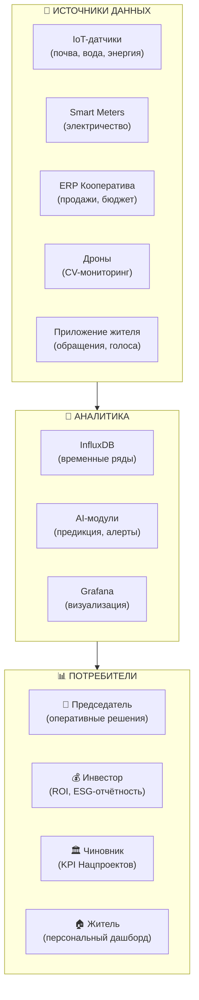

# 7. КПЭ и Панель Управления Проектом

## Навигация

- Вход: [README.md](README.md) · [Манифест_Питчбук_Родовое_Поместье.md](Манифест_Питчбук_Родовое_Поместье.md) · [ТЭО_Родовое_Поместье_План_разделов.md](ТЭО_Родовое_Поместье_План_разделов.md)
- Проверка: [ИСТОЧНИКИ_И_БЕНЧМАРКИ.md](ИСТОЧНИКИ_И_БЕНЧМАРКИ.md) · [Приложения_Библиотека_Технологий/](Приложения_Библиотека_Технологий/)
- Переход: [← Ипотека](ТЭО_Родовое_Поместье_Раздел_6_Дом_в_ипотеку.md) · [Следующий →](ТЭО_Родовое_Поместье_Раздел_8_Правовые_схемы_реализации.md)

---

## 7.1. Концепция: Кластер как Дата-центр

Мы уходим от декларативных отчетов к **Математически точному управлению**. Управление развитием территории осуществляется через единый **Ситуационный Центр (IoT-Диспетчеризация)**, куда стекаются данные из трех источников:

1. **IoT-слой:** Телеметрия оборудования, Smart Grid датчики, энергопотребление ЦОД и станков с ЧПУ, климатические станции.
2. **ERP Синдиката:** Данные о продажах B2B/B2C, отгрузках, налогах, сервисных потоках и экономике эксплуатации.
3. **Приложение Резидента / Цифровой Кооператив:** заявки, голосования, обращения, бронирование общих активов, показатели эффективности R&D-команд.

## 7.1.1. KPI готовности к пилоту (Proof Dashboard)

До масштабирования проект должен уметь управлять не только «будущими эффектами», но и собственной степенью готовности.

| Метрика готовности | Целевой ориентир | Зачем нужна |
| :--- | :--- | :--- |
| **Data Room completeness** | >70% критичных папок заполнено | Инвестор и эксперт быстро видят состояние проекта |
| **Evidence coverage** | >80% ключевых тезисов имеют подтверждение | Снижение риска «перепродажи идеи» |
| **Named owners / RACI** | 100% потоков назначены | Исполнимость и персональная ответственность |
| **LoI / резервы / депозиты** | 5+ по пилоту | Подтверждение спроса |
| **Node Zero uptime** | >99% на тестовом периоде | Доказательство инженерной жизнеспособности |

## 7.2. Матрица целевых показателей (КПЭ 2.0)

> Примечание: значения в KPI-матрице ниже — **целевые ориентиры/гипотезы управления** для пилота и последующего масштабирования. Итоговые целевые значения фиксируются после пилота, рыночной валидации тарифов и независимого аудита данных.

### Блок А: Экономика и Инвестиции

| Метрика | Цель | Инструмент измерения | Частота | Связь с целью (Резюме) |
| :--- | :--- | :--- | :--- | :--- |
| **Окупаемость/доходность (инфраструктура)** | Целевой диапазон — см. финмодель | ERP/управленческий учет | Ежеквартально | Эффективность для инвестора |
| **Доход домохозяйства/команды** | Выше среднего по региону (целевой ориентир) | Данные ФНС (агрег.) + опрос | Ежегодно | Финансовая устойчивость резидента |
| **Продовольственная автономия** | По выбранному сценарию (ориентир) | Отчет отгрузок/потребления | Сезонно | Снижение расходов/рисков |
| **Занятость в реальном секторе (ITI, Пром, Туризм)** | **> 70%** резидентов | Реестр рабочих мест кластера | Ежегодно | Устойчивая локальная экономика |

### Блок Б: Социум и Демография

| Метрика | Цель | Инструмент измерения | Частота | Связь с целью (Резюме) |
| :--- | :--- | :--- | :--- | :--- |
| **Стабильность состава резидентов** | Ретеншн/низкий churn (ориентир) | Реестр резидентов, договоры | Ежеквартально | Устойчивость операционной модели |
| **Качество отбора резидентов** | Низкая доля отказов/отсева (ориентир) | Платформа «Академия Резидентов» | Ежеквартально | Снижение операционных рисков |
| **Паспорт компетенций** | Верифицированные навыки (ориентир) | Реестр цифровых профилей | При заезде | Экономическая устойчивость |
| **Индекс доверия и сотрудничества** | **> 4.5/5** (ср. балл) | Опросы, peer-review, участие в проектах | Ежеквартально | Социальный капитал |

### Блок В: Экология и Среда (ESG)

| Метрика | Цель | Инструмент измерения | Частота | Связь с целью (Резюме) |
| :--- | :--- | :--- | :--- | :--- |
| **Прирост гумуса** | **+1%** за 5 лет | Лаборатория Агро-хаба | Раз в 3 года | Капитализация земли |
| **Биоразнообразие** | Индекс Шеннона **> 2.5** | AI-мониторинг / Наблюдение | Сезонно | Экологическая устойчивость |
| **Инвентаризация ресурсного и экологического следа** | Энергия, вода, отходы, при готовности — углеродный контур | Внутренняя методика + GHG Protocol при необходимости | Ежегодно | Экологическая отчётность и управляемость |
| **Доля реверсивных компонентов в Zero Trace Habitat** | **>70%** по массе в пилотных юнитах | Material passport / BOM | При вводе и демонтаже | Низкий необратимый CAPEX и circularity |
| **Срок восстановления площадки после демонтажа** | **≤ 10 рабочих дней** для пилотного юнита | Recovery SLA / restoration audit | По событию | Проверяемая экологическая обратимость |
| **Неутилизируемый строительный остаток** | **<10%** массы демонтируемого юнита | Акт демонтажа / подрядный отчёт | По событию | Контроль строительного следа |

---

## 7.3. Визуализация: Как это выглядит в приложении

*Прототип интерфейса для Председателя Кооператива:*

> **ГЛАВНЫЙ ЭКРАН**: Карта кластера с цветовой индикацией зон.
>
> - 🔴 Зона 3 (Угроза): Падение влажности почвы ниже 40%. (Действие: Включить капельный полив).
> - 🟢 Зона 1 (Норма): Выручка от туризма за выходные +15% к плану.
> - 🟡 Зона 2 (Внимание): Жалоба жителя №45 на вывоз мусора.
>
> **ВИДЖЕТЫ**:
>
> - 💰 Баланс Фонда: 4.5 млн руб.
> - ⚡ Генерация СЭС: 120 кВт*ч (Профицит).
> - 🧩 Новые резиденты в этом году: 12.

---

## 7.4. Расширенная матрица KPI (Balanced Scorecard)

### Блок Г: Цифровая зрелость и управляемость

| Метрика | Цель | Инструмент измерения | Частота | Связь с целью |
| :--- | :--- | :--- | :--- | :--- |
| **Покрытие IoT-датчиков** | **>80%** участков | Реестр устройств | Ежеквартально | Полнота данных для AI |
| **Uptime платформы** | **>99.5%** | Мониторинг (Zabbix/Grafana) | Real-time | Доверие пользователей |
| **Скорость обработки обращений** | **<2 часа** (медиана) | Helpdesk / GenAI-ассистент | Еженедельно | Качество сервиса |
| **% решений через цифровое голосование** | **>70%** | Платформа Кооператива | Ежеквартально | Вовлечённость жителей |
| **Индекс цифровой грамотности резидентов** | **>7/10** | Тестирование при входе | При заезде | Эффективность цифровых сервисов |
| **Полнота телеметрии по Ядру** | **>95%** критичных узлов | Node Zero / Grafana | Еженедельно | Основа для точных решений |
| **Качество данных** | **<3%** пропусков в критических метриках | Data quality checks | Еженедельно | Защита от управленческих ошибок |

### Блок Д: Инновации и развитие

| Метрика | Цель | Инструмент измерения | Частота | Связь с целью |
| :--- | :--- | :--- | :--- | :--- |
| **Количество IT/пром-стартапов и микро-фабрик** | **>15** к 5-му году | Реестр ИП/самозанятых (реальный сектор) | Ежегодно | Экономическая диверсификация |
| **Доля энергии из ВИЭ** | **>60%** к 5-му году | Smart Meter | Ежемесячно | Снижение зависимости от внешних тарифов и устойчивость энергосообщества |
| **Soil Health Index (средний)** | **+1%** гумуса за 5 лет | Лабораторный анализ | Ежегодно | Регенеративное земледелие |
| **NPS (Net Promoter Score)** | **>60** | Ежегодный опрос | Ежегодно | Репутация, сарафанное радио |
| **Время reconfiguration модуля** | **<72 часов** на перекомпоновку типового ZTH-юнита | Эксплуатационный журнал / подрядчик | По событию | Скорость обновления продуктовой линейки |

### 7.4.1. Специальный KPI-блок для Zero Trace Habitat

Поскольку реверсивная архитектура является отдельной экспериментальной веткой, для неё недостаточно обычных KPI по м², CAPEX и сроку монтажа. Нужны отдельные показатели, доказывающие, что технология действительно соответствует обещанию low-impact и reverse-build.

| KPI | Что показывает инвестору и эксперту |
| :--- | :--- |
| **Material recovery rate** | Какую долю стоимости и материалов можно вернуть в повторное использование |
| **Disassembly readiness** | Есть ли у объекта не просто проект, а реально исполнимый сценарий демонтажа |
| **Recovery time to clean clearing** | Насколько быстро территория возвращается в аккуратное и безопасное состояние |
| **Landscape preservation score** | Сохранились ли посадки, корневые зоны и ключевые элементы благоустройства |

Такой KPI-контур делает Zero Trace Habitat не маркетинговым тезисом, а инженерным экспериментом с проверяемым outcome.

---

## 7.5. IoT-Диспетчеризация: Ситуационный центр v2.0

*Эволюция от текстовых таблиц к трёхмерной управляемой модели.*

### Архитектура панели управления

### Персональный дашборд резидента (экран в мобильном приложении)

> **Мой участок сегодня:**
>
> - ☀️ Солнечная генерация: 12.4 кВт·ч (+8% к вчера)
> - 💧 Полив: Auto-режим ON (влажность 52%)
> - 🍓 Урожай: Малина — готовность 85%, сбор через 3 дня
> - 💰 Баланс кооператива: +18 200 руб. за март
> - 📊 Мой рейтинг: 4.7 / 5.0
> - 🌱 Прирост гумуса: +0.3% за год (в плане)

---
*Методика расчёта каждого показателя детально описана в [ИСТОЧНИКИ_И_БЕНЧМАРКИ.md](ИСТОЧНИКИ_И_БЕНЧМАРКИ.md) (таблица паспортов KPI).*
*Технологический стек IoT-Диспетчеризация — см. [Раздел 3, п. 3.8](ТЭО_Родовое_Поместье_Раздел_3_Описание_концепции.md).*

---

## 7.6. Блок Е: Здоровье и благополучие («Голубая зона»)

*Концепция Blue Zones как KPI-рамка для измерения качества жизни.*

| Метрика | Цель | Среднее по РФ | Инструмент | Частота |
| :--- | :--- | :--- | :--- | :--- |
| **Среднее кол-во шагов/день** | **>8 000** | 5 200 | Фитнес-трекер (опционально) | Ежемесячно |
| **Больничные дни/год** | **<7** | 14 | Опрос + данные ФАП | Ежегодно |
| **Индекс одиночества** | **<10%** | 30%+ | UCLA Loneliness Scale (адапт.) | Ежегодно |
| **Субъективное счастье (1-10)** | **>7.5** | 5.8 | Cantril Ladder | Ежегодно |
| **% детей на свежем воздухе >3ч/день** | **>80%** | ~25% | Опрос родителей | Сезонно |
| **Потребление овощей/фруктов (кг/год)** | **>150** | 60 | Опрос + ERP кооператива | Ежегодно |

> **Позиционирование:** DeepTech-Хаб использует KPI здоровья и благополучия как управленческую рамку (в дополнение к финансам и инфраструктуре). Это соответствует международному тренду **Beyond GDP**.

---

## 7.7. Блок Ж: Сравнительный анализ: Инновационный Хаб vs среднее по региону

*Как DeepTech-Хаб смотрится на фоне средних данных по сельской России.*

| Показатель | Региональная база (ориентир) | DeepTech-Хаб (цель) | Комментарий |
| :--- | :--- | :--- | :--- |
| Доход и занятость | ниже среднего по стране | выше среднего по региону | за счет B2B и доступа к инфраструктуре |
| Инфраструктура связи | ограниченная | инженерный стандарт хаба | требования к работе/производству |
| Энергия и эффективность | зависимость от внешних сетей | микрогрид/энергосервисы по сценарию | поэтапное внедрение |
| Кадры | отток | удержание/приток | за счет отбора и программ резидентства |
| ESG-учёт (опционально) | отсутствует/фрагментарный | методика + аудит | по запросу партнёров/регуляторики |

> **Вывод:** корректное сравнение строится на **аудитируемых метриках** (экономика, эксплуатация, кадры, инфраструктура) и фиксируется после пилота.

