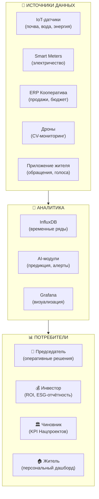

# 7. КПЭ и Панель Управления Проектом

## Навигация
- Вход: [README.md](README.md) · [Манифест_Питчбук_Родовое_Поместье.md](Манифест_Питчбук_Родовое_Поместье.md) · [ТЭО_Родовое_Поместье_План_разделов.md](ТЭО_Родовое_Поместье_План_разделов.md)
- Проверка: [ИСТОЧНИКИ_И_БЕНЧМАРКИ.md](ИСТОЧНИКИ_И_БЕНЧМАРКИ.md) · [Приложения_Библиотека_Технологий/](Приложения_Библиотека_Технологий/)
- Переход: [← Ипотека](ТЭО_Родовое_Поместье_Раздел_6_Дом_в_ипотеку.md) · [Следующий →](ТЭО_Родовое_Поместье_Раздел_8_Правовые_схемы_реализации.md)

---

## 7.1. Концепция: Агрополис как Дата-центр
Мы уходим от декларативных отчетов к **Объективному контролю**. Управление развитием территории осуществляется через единый **Ситуационный Центр**, куда стекаются данные из трех источников:
1.  **IoT-слой:** Датчики влажности почвы, метеостанции, счетчики энергии (отечественные протоколы).
2.  **ERP Кооператива:** Данные о продажах, отгрузках, налогах.
3.  **Приложение Жителя:** Опросы, голосования Пайщиков, медицинские трекеры (обезличенно).

## 7.2. Матрица целевых показателей (КПЭ 2.0)

### Блок А: Экономика и Инвестиции
| Метрика | Цель | Инструмент измерения | Частота | Связь с целью (Резюме) |
| :--- | :--- | :--- | :--- | :--- |
| **Окупаемость (Инфраструктура)** | **> 18%** | 1C:ERP Управляющей компании | Ежеквартально | Эффективность для Инвестора |
| **Доход домохозяйства** | **120%** от ср. по региону | Данные ФНС (НПД) + Опрос | Ежегодно | Финансовая устойчивость семьи |
| **Продовольственная автономия** | **> 60%** | Отчет отгрузок Кооператива | Сезонно | Снижение семейных расходов |

### Блок Б: Социум и Демография
| Метрика | Цель | Инструмент измерения | Частота | Связь с целью (Резюме) |
| :--- | :--- | :--- | :--- | :--- |
| **Коэффициент рождаемости (СКР)** | **2.5** ребенка/жен | Реестр ЗАГС / Паспортный стол | Ежегодно | Нацпроект «Демография» |
| **Качество отбора резидентов** | **< 5%** отказов | Платформа «Академия Поселенцев» | Ежеквартально | Снижение рисков Инвестора |
| **Паспорт Компетенций** | **> 3** Hard Skills на семью | Реестр цифровых профилей | При заезде | Экономическая устойчивость |
| **Индекс доверия (Reputation)** | **> 4.5/5** (ср. балл) | Цифровой рейтинг участника | Real-time | Социальный капитал |

### Блок В: Экология и Среда (ESG)
| Метрика | Цель | Инструмент измерения | Частота | Связь с целью (Резюме) |
| :--- | :--- | :--- | :--- | :--- |
| **Углеродный баланс** | **Отрицательный** | Дроны + Анализ почв | Ежегодно | Монетизация квот |
| **Прирост гумуса** | **+1%** за 5 лет | Лаборатория Агро-хаба | Раз в 3 года | Капитализация земли |
| **Биоразнообразие** | Индекс Шеннона **> 2.5** | AI-мониторинг / Наблюдение | Сезонно | Экологическая устойчивость |

---

## 7.3. Визуализация: Как это выглядит в приложении
*Прототип интерфейса для Председателя Кооператива:*

> **ГЛАВНЫЙ ЭКРАН**: Карта кластера с цветовой индикацией зон.
> *   🔴 Зона 3 (Угроза): Падение влажности почвы ниже 40%. (Действие: Включить капельный полив).
> *   🟢 Зона 1 (Норма): Выручка от туризма за выходные +15% к плану.
> *   🟡 Зона 2 (Внимание): Жалоба жителя №45 на вывоз мусора.
>
> **ВИДЖЕТЫ**:
> *   💰 Баланс Фонда: 4.5 млн руб.
> *   ⚡ Генерация СЭС: 120 кВт*ч (Профицит).
> *   👶 Рождено в этом году: 12.

---

## 7.4. Расширенная матрица KPI (Balanced Scorecard)

### Блок Г: Цифровая зрелость и управляемость
| Метрика | Цель | Инструмент измерения | Частота | Связь с целью |
| :--- | :--- | :--- | :--- | :--- |
| **Покрытие IoT-датчиков** | **>80%** участков | Реестр устройств | Ежеквартально | Полнота данных для AI |
| **Uptime платформы** | **>99.5%** | Мониторинг (Zabbix/Grafana) | Real-time | Доверие пользователей |
| **Скорость обработки обращений** | **<2 часа** (медиана) | Helpdesk / GenAI-ассистент | Еженедельно | Качество сервиса |
| **% решений через цифровое голосование** | **>70%** | Платформа Кооператива | Ежеквартально | Вовлечённость жителей |
| **Индекс цифровой грамотности резидентов** | **>7/10** | Тестирование при входе | При заезде | Эффективность цифровых сервисов |

### Блок Д: Инновации и развитие
| Метрика | Цель | Инструмент измерения | Частота | Связь с целью |
| :--- | :--- | :--- | :--- | :--- |
| **Количество стартапов/микро-бизнесов** | **>15** к 5-му году | Реестр ИП/самозанятых | Ежегодно | Экономическая диверсификация |
| **Доля энергии из ВИЭ** | **>60%** к 5-му году | Smart Meter | Ежемесячно | Energy DAO, SDG 7 |
| **Soil Health Index (средний)** | **+1%** гумуса за 5 лет | Лабораторный анализ | Ежегодно | Регенеративное земледелие |
| **NPS (Net Promoter Score)** | **>60** | Ежегодный опрос | Ежегодно | Репутация, сарафанное радио |

---

## 7.5. Digital Twin: Ситуационный центр v2.0
*Эволюция от текстовых таблиц к трёхмерной управляемой модели.*

### Архитектура панели управления

### Персональный дашборд резидента (экран в мобильном приложении)
> **Мой участок сегодня:**
> * ☀️ Солнечная генерация: 12.4 кВт·ч (+8% к вчера)
> * 💧 Полив: Auto-режим ON (влажность 52%)
> * 🍓 Урожай: Малина — готовность 85%, сбор через 3 дня
> * 💰 Баланс кооператива: +18 200 руб. за март
> * 📊 Мой рейтинг: 4.7 / 5.0
> * 🌍 CO₂ секвестрировано: 2.4 тонны за год (+12%)

---
*Методика расчёта каждого показателя детально описана в [ИСТОЧНИКИ_И_БЕНЧМАРКИ.md](ИСТОЧНИКИ_И_БЕНЧМАРКИ.md) (таблица паспортов KPI).*
*Технологический стек Digital Twin — см. [Раздел 3, п. 3.8](ТЭО_Родовое_Поместье_Раздел_3_Описание_концепции.md).*
