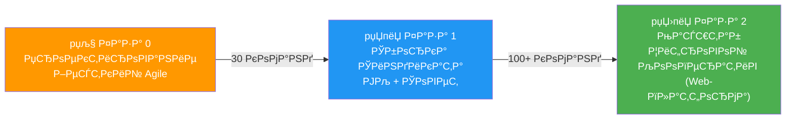
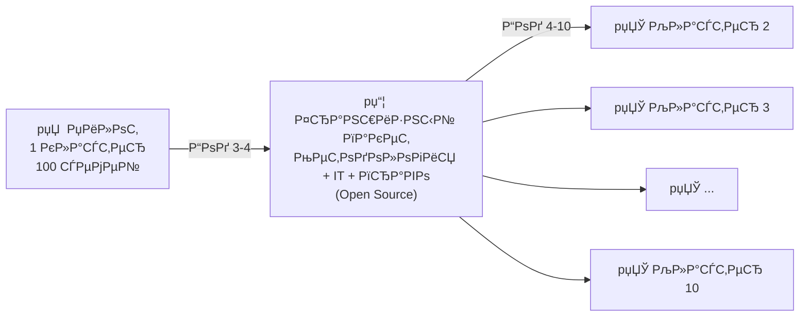
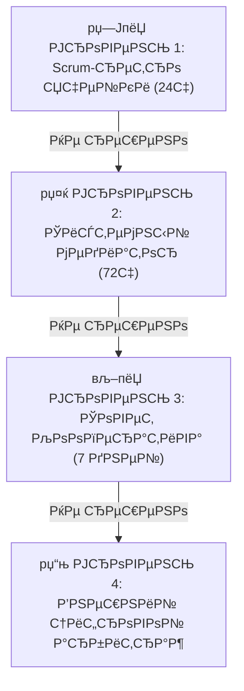

# 9. Организационная структура: Эволюция управления

## Навигация

- Вход: [README.md](README.md) · [Манифест_Питчбук_Родовое_Поместье.md](Манифест_Питчбук_Родовое_Поместье.md) · [ТЭО_Родовое_Поместье_План_разделов.md](ТЭО_Родовое_Поместье_План_разделов.md)
- Проверка: [ИСТОЧНИКИ_И_БЕНЧМАРКИ.md](ИСТОЧНИКИ_И_БЕНЧМАРКИ.md) · [Приложения_Библиотека_Технологий/](Приложения_Библиотека_Технологий/)
- Переход: [← Правовые](ТЭО_Родовое_Поместье_Раздел_8_Правовые_схемы_реализации.md) · [Следующий →](ТЭО_Родовое_Поместье_Раздел_10_Риски_и_пути_их_минимизации.md)

---

## 9.1. Модель «Эволюция» (Стадии роста)

Мы не играем в демократию на этапе котлована. Структура управления меняется по мере зрелости кластера и формирования R&D-команд.

### Фаза 0: Проектирование и запуск (Стройка)

*Тип управления:* **Централизованное управление (Venture Builder).**

- **Главный орган:** ООО «УК Инновационная Среда» (Мастер-Девелопер).
- **Социальный трек:** Запуск глубинного интервью по ценностям «Пре-квалификация». Формирование пула резидентов-инженеров и IT-специалистов.
- **Задача:** Развернуть Smart Grid, ЛОС, ЦОД и каркасы FabLab в срок и в бюджет.
- **Роль жителя:** Кандидат-соинвестор (проходит верификацию). Директивное управление.

#### Штатная структура Фазы 0 (минимальное ядро)

| Роль | FTE | Основные задачи |
| :--- | ---: | :--- |
| **CEO / Проектный директор** | 1 | Стратегия, GR, привлечение инвесторов |
| **CTO / Гл. инженер** | 1 | Smart Grid, ЦОД, FabLab, проектирование |
| **CFO / Фин. директор** | 0.5 | Бюджет, отчётность, ЗПИФ, ЦФА |
| **Юрист (outsource)** | 0.5 | ИРД, договорная база, регистрации |
| **HR / Community manager** | 1 | Пре-квалификация, воронка, Академия |
| **Маркетолог** | 1 | SMM, лендинг, PR, роуд-шоу |
| **Агроном / Эколог** | 0.5 | Мастер-план агро-контура, ESG-аудит |
| **ИТОГО** | **5.5** | ФОТ Фазы 0 (6–12 мес.) |

### Фаза 1: Пилотный Синдикат (Первые 30 команд)

*Тип управления:* **Смешанная модель.**

- **Главный орган:** УК (сохраняет вето по CAPEX) + Совет Кооператива.
- **Социальный трек:** Заселение первых 30 квалифицированных R&D-ячеек.
- **Цифровой инструмент:** Инициативное бюджетирование. Команды защищают гранты на прототипирование, УК их фондирует.
- **Задача:** Отладка производственных цепочек B2B, настройка серверов, получение статуса ОЭЗ.

### Фаза 2: Масштабирование (100+ команд)

*Тип управления:* **Кооперативное управление (Цифровой Кооператив).**

- **Главный орган:** Общее собрание через защищённую цифровую платформу (механики квадратичного голосования — один из вариантов, см. [Radical Markets, Posner & Weyl, 2018]).
- **Социальный трек:** Платформа работает как внешний HR-фильтр. Сборка новых проектных ячеек.
- **УК:** Становится наемным Facility-подрядчиком, жестко привязанным к KPI (Uptime сетей).
- **Задача:** Экспансия франшизы, вывод новых B2B-продуктов, торговля углеродными квотами.

> **Правовой мост:** В РФ цифровое кооперативное управление реализуется внутри легальной обёртки — ПОК / кооператив с цифровым регламентом голосования, закреплённым в уставе. Подробнее — [Раздел 8](ТЭО_Родовое_Поместье_Раздел_8_Правовые_схемы_реализации.md).

## 9.2. Зоны ответственности

| Роль | Функция (Что делает) | Ответственность (За что отвечает) | Ресурс |
| :--- | :--- | :--- | :--- |
| **Оператор (Venture Builder)** | Разворачивает инфраструктуру, привлекает институциональный капитал. | Uptime инфраструктуры (SLA), рост капитализации ЗПИФ. | Капитал Синдиката, сервисная инфраструктура Ядра. |
| **Синдикат (Цифровой Кооператив) (Резиденты)** | Управляет R&D-ячейками, генерирует IP, развивает DeepTech-продукты. | Отбор по ценностям, выполнение roadmap стартапов. | Интеллектуальная собственность, баллы управления. |
| **Цифровая платформа (OS)** | Обеспечивает бюджетирование, заявки, голосования, helpdesk и трекинг договоров доступа к сервисному контуру. | Zero-Trust безопасность, корректность реестров, отказоустойчивость. | Алгоритмы, журнал решений, API и базы данных. |

### 9.2.1. Материализация команды: что должно быть названо до раунда

Концептуальный штат сам по себе не убеждает инвестора. До первого серьёзного раунда должны быть закрыты не только роли, но и конкретные владельцы потоков:

| Поток | Что должно быть материализовано |
| :--- | :--- |
| **Land** | Владелец выбора участка, переговоров и land memo |
| **Legal** | Ответственный за MVP-право, договоры v1 и правовые ограничения |
| **Finance** | Владение финмоделью, CAPEX-book, OPEX-book, stress test |
| **Tech/Ops** | Спецификация Node Zero, телеметрии, SLA и эксплуатации |
| **Commercial/GTM** | Воронка резидентов, LoI, тарифы, пакеты, лендинг |
| **IR/GR** | Data Room, партнёрские переговоры, инвестиционная коммуникация |

### 9.2.2. Ритм управления (Operating Cadence)

| Ритм | Участники | Цель |
| :--- | :--- | :--- |
| **Weekly Ops** | CEO, CTO, COO, finance lead | Статус стройки, риски, заявки, burn rate |
| **Bi-weekly Pilot Board** | Потоки Land/Legal/Tech/Commercial | Закрытие блокеров пилота |
| **Monthly Steering** | Основатели + ключевые эксперты/advisors | Решения по CAPEX, stage-gates, партнёрам |
| **Quarterly DD Review** | IR + legal + finance + external expert | Проверка готовности к следующему раунду |

## 9.3. Пространственно-логическая структура (Физика)

Мастер-план делится на микро-производственные ячейки — **«Ромашки»** (4-5 смарт-домов с общей серверной/инженерной площадью в центре).

- **Смысл:** Минимизация длины оптоволокна и Smart Grid сетей (-60% CAPEX), создание изолированных IP-подсетей для безопасности.
- **Самоуправление:** Каждая ячейка выбирает делегата (Scrum-мастера) в Технический Совет Кооператива.
- **Макро-ритм:** микро-ячейки собираются в более крупные жилые хабы, разделённые агро-буферами и зелёными коридорами. Базовая логика мастер-плана: **«жилой хаб -> агро-буфер -> жилой хаб»**.
- **Принцип «Тихая гавань»:** семейное домовладение и повседневная жизнь не должны смешиваться со шумными производственными, складскими и логистическими контурами. Это повышает качество жизни, снижает социальное трение и упрощает масштабирование сети.

---

## 9.4. Цифровое управление: Технологический стек

### Платформа «Цифровой Кооператив»

| Модуль | Функция | Технология | Статус |
| :--- | :--- | :--- | :--- |
| **Голосования** | Принятие решений пайщиками | Защищённая веб-платформа + эл. подпись | MVP |
| **Бюджет** | Публичный реал-тайм бюджет кооператива | 1С:ERP + дашборд | План |
| **Маркетплейс** | Сбыт B2B-услуг (IT, инжиниринг), промтоваров, туризма и фермерской продукции | Веб-приложение (Next.js) | План |
| **Экологический мониторинг ресурсов** | Мониторинг углеродного следа и "зеленых" активов (номинально для квот) | Интеграция с учетными модулями | План |
| **Реестр прав** | Цифровой реестр паёв, договоров, KPI | ЦФА (ФЗ-259) / постоянный реестр | Персп. |
| **GenAI-ассистент** | Чат-бот для резидентов | RAG + LLM (Yandex GPT / GigaChat) | MVP |
| **IoT-мониторинг** | Датчики почвы, энергии, воды | MQTT + InfluxDB + Grafana | MVP |

### Принципы цифрового кооператива

1. **Квадратичное голосование:** Житель может вложить больше «голосов» в важный вопрос (стоимость голосов растёт квадратично). Защита от «тирании большинства».
1. **Инициативное бюджетирование:** 20% бюджета кооператива распределяется жителями через голосование за проекты («построить детскую площадку» / «купить трактор»).
1. **Прозрачность:** Все финансовые операции видны каждому пайщику в реальном времени.

> **Ограничение пилота:** до выхода на устойчивую эксплуатацию проекту достаточно простого web/mobile-решения с helpdesk, реестром заявок, биллингом и базовыми голосованиями. Избыточная сложность цифрового контура на старте ухудшает исполнимость.

---

## 9.5. Модель масштабирования (Франшиза)

*Как перейти от 1 кластера к 10+.*

| Элемент франшизного пакета | Описание | Лицензия |
| :--- | :--- | :--- |
| **Методология ТЭО** | 11 разделов + приложения с адаптацией под регион | CC BY-SA |
| **IT-платформа** | Цифровой Кооператив, IoT, AI-модули | Open Source (AGPL) |
| **Юридические шаблоны** | Договоры, уставы, регламенты | CC BY-SA |
| **Обучение команды** | Курс «Как запустить DeepTech-Хаб» | Коммерческий |
| **Бренд + маркетинг** | Доступ к сети и репутации | Лицензия бренда |

> **Эффект Open Source:** Вирусное распространение. Любой регион / инициативная группа может форкнуть и адаптировать. Позиция: «creator of a movement, not just a project».

---

## 9.6. Конфликт-менеджмент: Протокол разрешения споров

*По оценкам экспертов, значительная доля экопоселений не достигают устойчивости именно из-за неуправляемых конфликтов. Мы встраиваем систему разрешения в архитектуру.*

### 4-уровневый протокол

| Уровень | Кто решает | SLA | Стоимость | % решённых |
| :--- | :--- | :--- | :--- | :---: |
| **1. Внутри ячейки** | Делегат/Scrum-мастер | 24 часа | Бесплатно | 70% |
| **2. Медиатор** | Обученный специалист (Soft-skills) | 72 часа | В составе членского взноса Кооператива | 20% |
| **3. Совет Кооператива** | Комитет Инвесторов (3 чел.) | 7 дней | В составе членского взноса Кооператива | 8% |
| **4. Внешний арбитраж** | Независимый эксперт | 30 дней | По факту | 2% |

### Превентивные меры

- **Кодекс резидента**: Подписывается при входе. Правила шума, заборов, домашних животных, общих пространств.
- **Еженедельные «Ромашковые встречи»**: 30-минутные стенд-апы внутри микро-кластера (4-5 семей) — выявление напряжённости на ранней стадии.
- **GenAI-ассистент**: Анализ тональности обращений в платформе → AI-алерт HR-директору при росте негатива.

---

## 9.7. План преемственности и Экспертный совет

### Advisory Board (формирование — приоритет Фазы 0)

> На текущем этапе (concept) позиции Advisory Board описаны как целевые профили. Персональные назначения — одна из первых задач при запуске пилота.

| Роль | Целевой профиль | Задача |
| :--- | :--- | :--- |
| **AgriTech-эксперт** | Агроном/учёный с опытом смарт-земледелия | Валидация агро-модели |
| **Финансовый адвайзер** | Опыт ESG/Impact Investing | Привлечение капитала |
| **Юрист земельного права** | Партнёр профильной фирмы | Правовая защита |
| **Представитель сообщества** | Лидер успешного экопоселения | Практический опыт |

### Преемственность управления

- **Key Person Risk:** Для каждой ключевой роли — дублёр («теневой директор»).
- **Vesting:** Опционная программа для УК (vesting 4 года, cliff 1 год) — защита от оттока кадров.
- **Знаниевая база:** Все процессы документированы в вики кооператива (не в голове директора).

