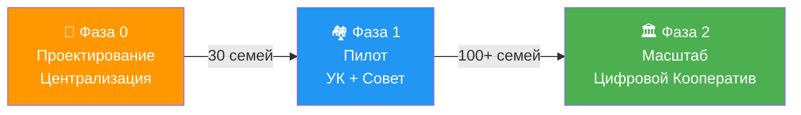
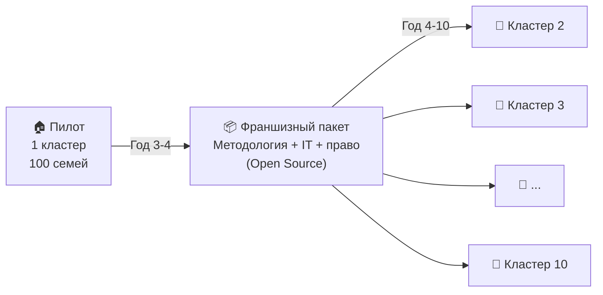

# 9. Организационная структура: Эволюция управления

## Навигация
- Вход: [README.md](README.md) · [Манифест_Питчбук_Родовое_Поместье.md](Манифест_Питчбук_Родовое_Поместье.md) · [ТЭО_Родовое_Поместье_План_разделов.md](ТЭО_Родовое_Поместье_План_разделов.md)
- Проверка: [ИСТОЧНИКИ_И_БЕНЧМАРКИ.md](ИСТОЧНИКИ_И_БЕНЧМАРКИ.md) · [Приложения_Библиотека_Технологий/](Приложения_Библиотека_Технологий/)
- Переход: [← Правовые](ТЭО_Родовое_Поместье_Раздел_8_Правовые_схемы_реализации.md) · [Следующий →](ТЭО_Родовое_Поместье_Раздел_10_Риски_и_пути_их_минимизации.md)

---

## 9.1. Модель «Эволюция» (Стадии роста)
Мы не играем в демократию на этапе котлована. Структура управления меняется по мере зрелости поселения.

### Фаза 0: Проектирование и старт (Стройка)
*Тип управления:* **Централизованное управление (Проектный офис).**
*   **Главный орган:** ООО «Управляющая Компания Агрополис» (Девелопер).
*   **Социальный трек:** Запуск платформы «Подбор Единомышленников» (MVP). Формирование очереди резидентов через Академию.
*   **Задача:** Построить дороги, сети, ядро в срок и в бюджет.
*   **Роль жителя:** Кандидат ( проходит верификацию). Права голоса нет.

### Фаза 1: Пилотный запуск (Первые 30 семей)
*Тип управления:* **Смешанная модель.**
*   **Главный орган:** УК (сохраняет вето по финансовым вопросам) + Совет Кооператива.
*   **Социальный трек:** Проведение первого очного «Слета Созидателей». Заселение первых 30 проверенных пар.
*   **Цифровой инструмент:** Инициативное бюджетирование. Жители предлагают инициативы, УК их одобряет/бюджетирует.
*   **Задача:** Тестирование технологий, формирование костяка сообщества.

### Фаза 2: Масштабирование (100+ семей)
*Тип управления:* **Цифровой Кооператив (Самоуправление).**
*   **Главный орган:** Общее собрание Кооператива (через защищенную платформу голосования).
*   **Социальный трек:** Платформа «Подбор Единомышленников» работает как внешний HR-фильтр (Воронка). Франшиза слётов.
*   **УК:** Становится наемным подрядчиком (Service Company), которого Кооператив может сменить.
*   **Задача:** Эксплуатация, развитие, экспансия модели на новые земли.

## 9.2. Зоны ответственности

| Роль | Функция (Что делает) | Ответственность (За что отвечает) | Ресурс |
| :--- | :--- | :--- | :--- |
| **Оператор (Девелопер)** | Строит инфраструктуру, привлекает инвестиции. | Срыв сроков, перерасход бюджета, качество сетей. | Земля, Деньги инвесторов. |
| **Кооператив (Жители)** | Организует сбыт, обучение, досуг, охрану. | Социальный климат, качество продукции, выполнение КПЭ. | Взносы, % с продаж. |
| **Цифровая Платформа** | Обеспечивает прозрачность решений и финансов. | Достоверность данных, защита от взлома. | Код, Сервера. |

## 9.3. Кластерная структура (Физика)
Поселение делится на микро-единицы — **«Ромашки»** (4-5 домов с общей площадью в центре).
*   **Смысл:** Снижение затрат на сети (-60%) + Соседский контроль (безопасность).
*   **Самоуправление:** Каждая «Ромашка» выбирает делегата в Совет.

---

## 9.4. Цифровое управление: Технологический стек

### Платформа «Цифровой Кооператив»

| Модуль | Функция | Технология | Статус |
| :--- | :--- | :--- | :--- |
| **Голосования** | Принятие решений пайщиками | Защищённая веб-платформа + эл. подпись | MVP |
| **Бюджет** | Публичный реал-тайм бюджет кооператива | 1С:ERP + дашборд | План |
| **Маркетплейс** | Сбыт продукции без посредников | Веб-приложение (Next.js) | План |
| **Реестр прав** | Цифровой реестр паёв, договоров, KPI | ЦФА (ФЗ-259) / постоянный реестр | Персп. |
| **GenAI-ассистент** | Чат-бот для резидентов | RAG + LLM (Yandex GPT / GigaChat) | MVP |
| **IoT-мониторинг** | Датчики почвы, энергии, воды | MQTT + InfluxDB + Grafana | MVP |

### Принципы цифровой демократии
1.  **Квадратичное голосование:** Житель может вложить больше «голосов» в важный вопрос (стоимость голосов растёт квадратично). Защита от «тирании большинства».
2.  **Инициативное бюджетирование:** 20% бюджета кооператива распределяется жителями через голосование за проекты («построить детскую площадку» / «купить трактор»).
3.  **Прозрачность:** Все финансовые операции видны каждому пайщику в реальном времени.

---

## 9.5. Модель масштабирования (Франшиза)
*Как перейти от 1 кластера к 10+.*

| Элемент франшизного пакета | Описание | Лицензия |
| :--- | :--- | :--- |
| **Методология ТЭО** | 11 разделов + приложения с адаптацией под регион | CC BY-SA |
| **IT-платформа** | Цифровой Кооператив, IoT, AI-модули | Open Source (AGPL) |
| **Юридические шаблоны** | Договоры, уставы, регламенты | CC BY-SA |
| **Обучение команды** | Курс «Как запустить Агрополис» | Коммерческий |
| **Бренд + маркетинг** | Доступ к сети и репутации | Лицензия бренда |

> **Эффект Open Source:** Вирусное распространение. Любой регион / инициативная группа может форкнуть и адаптировать. Позиция: «creator of a movement, not just a project».